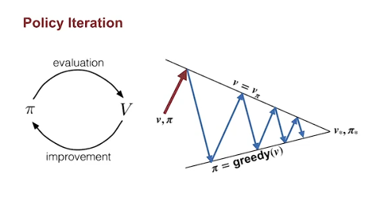
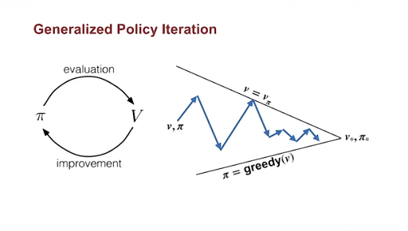
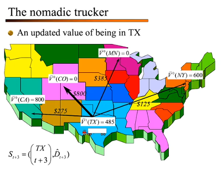

Mobule5 : MDP 동적 프로그래밍 
---
MDP 동적 프로그래밍 

동적 프로그래밍을 정리하기전에 이전까지의 전체적인 강화학습 선택 지도

강화학습 문제
│
├── 환경을 아는가?
│   │
│   ├── YES → Model-based
│   │         └── DP로 직접 풀기
│   │             (가치 반복, 정책 반복)
│   │
│   └── NO → Model-free
│             │
│             ├── 가치함수 학습
│             │   ├── TD Learning
│             │   └── Q-Learning
│             │
│             ├── 정책 직접 학습
│             │   └── Policy Gradient
│             │
│             └── 둘 다
│                 └── Actor-Critic
│
└── 상태공간이 너무 큰가?
    │
    └── YES → 근사(Approximation) 필요
              ├── ADP (지금 강의 내용)
              └── Deep RL (신경망으로 근사)
                  └── DQN, PPO, SAC 등

#  Dynamic Programming — 학습 목표 정리

## Lesson 1: Policy Evaluation (예측 문제)

### 학습 목표

- **Policy Evaluation(정책 평가)**과 **Control(제어)** 의 차이를 이해한다.
- **Dynamic Programming(동적 프로그래밍)** 이 적용되는 환경과 그 **한계** 를 설명한다.
- 주어진 정책 하에서 상태 가치를 추정하는 **반복적 정책 평가(Iterative Policy Evaluation)** 알고리즘의 개요를 설명한다.
- Iterative Policy Evaluation을 직접 적용해 **가치 함수(Value Function)** 를 계산한다.

---

## Lesson 2: Policy Iteration (제어 문제)

### 학습 목표

- **정책 향상 정리(Policy Improvement Theorem)** 를 이해한다.
- 어떤 정책의 가치 함수를 이용해, 주어진 MDP에서 **더 나은 정책** 을 만들어낸다.
- 최적 정책을 찾기 위한 **Policy Iteration 알고리즘** 의 개요를 설명한다.
- **"정책과 가치의 춤(The Dance of Policy and Value)"** 개념을 이해한다.
- Policy Iteration을 직접 적용해 **최적 정책과 최적 가치 함수** 를 계산한다.

---

## Lesson 3: Generalized Policy Iteration (일반화된 정책 반복)

### 학습 목표

- **일반화된 정책 반복(Generalized Policy Iteration, GPI)** 프레임워크를 이해한다.
- GPI의 중요한 예시인 **Value Iteration(가치 반복)** 알고리즘의 개요를 설명한다.
- **동기식(Synchronous)** 과 **비동기식(Asynchronous)** 동적 프로그래밍 방법의 차이를 이해한다.
- 최적 정책을 탐색하는 대안 방법으로 **브루트 포스 탐색(Brute Force Search)** 을 설명한다.
- 가치 함수를 학습하는 대안 방법으로 **몬테카를로(Monte Carlo)** 를 설명한다.
- 최적 정책을 찾는 데 있어 Dynamic Programming과 **부트스트래핑(Bootstrapping)** 이 위 대안들보다 가지는 **장점** 을 이해한다.

---

## 전체 흐름 한눈에 보기

| 단계 | 핵심 주제 | 핵심 질문 |
| :--- | :--- | :--- |
| Lesson 1 | Policy Evaluation | "이 정책이 얼마나 좋은가?" → 가치 함수 계산 |
| Lesson 2 | Policy Iteration | "더 나은 정책을 어떻게 만드는가?" → 평가 + 개선 반복 |
| Lesson 3 | Generalized Policy Iteration | "이 구조를 일반화하면? 다른 방법들과 비교하면?" |

---

## 🔑 미리 알아둘 흐름 요약

이 세 Lesson은 하나의 큰 질문을 단계적으로 풀어가는 구조다.

- *esson 1 은 "주어진 정책이 얼마나 좋은지 **평가**하는 법"을 다뤄. 아직 정책을 바꾸지 않고, 현재 정책의 가치를 반복 계산으로 추정하는 것이 핵심.

- lesson 2 는 그 평가 결과를 이용해 "정책을 **개선**하는 법"으로 넘어가. 평가 → 개선 → 평가 → 개선… 이 사이클이 반복되는 게 Policy Iteration이고, 강의에서는 이걸 **"정책과 가치의 춤"** 이라고 표현.

- Lesson 3 은 이 구조를 추상화해서 **GPI(Generalized Policy Iteration)** 라는 통합 프레임워크로 바라봐. 그리고 DP 대신 쓸 수 있는 대안들(Brute Force, Monte Carlo)과 비교하면서, DP + Bootstrapping이 왜 더 효율적인지 정당화.

> 💡 **한 줄 요약:** "평가할 줄 알고 → 개선할 줄 알고 → 그 구조가 왜 강력한지 이해한다"는 흐름.


---
# Policy Evaluation vs. Control

## 핵심 개념 한눈에 보기

| 구분 | Policy Evaluation (정책 평가) | Control (제어) |
| :--- | :--- | :--- |
| **목적** | 주어진 정책 $\pi$가 **얼마나 좋은지** 측정 | **최대한 많은 보상**을 얻는 정책을 탐색 |
| **결과물** | 상태 가치 함수 $v_\pi$ | 가치 함수를 최대화하는 **최적 정책** $\pi^*$ |
| **RL에서의 위치** | 필수적인 **첫 번째 단계** | 강화학습의 **궁극적인 목표** |

---

## Policy Evaluation — 정책 평가

정책 평가란, 특정 정책 $\pi$에 대한 **상태 가치 함수 $v_\pi$를 결정**하는 작업이다.

어떤 상태 $s$에서 정책 $\pi$를 따랐을 때의 가치는, 그 상태에서 출발해 $\pi$대로 행동했을 때 얻을 수 있는 **기대 수익(Expected Return)** 으로 정의된다.

$$v_\pi(s) = \mathbb{E}_\pi[G_t \mid S_t = s]$$

그리고 수익 $G_t$는 미래 보상의 **할인된 합**이다.

$$G_t = R_{t+1} + \gamma R_{t+2} + \gamma^2 R_{t+3} + \cdots$$

### 풀이 방법

벨만 방정식(Bellman Equation)을 이용하면, $v_\pi$를 구하는 문제가 **각 상태에 대한 연립 일차 방정식**으로 변환된다.

- 이론적으로는 선형대수 방법으로 풀 수 있다.
- 하지만 실제 일반적인 MDP에서는 **Dynamic Programming의 반복적 풀이법**이 훨씬 적합하다.

---

## Control — 제어

Control이란, 정책을 **반복적으로 개선**해서 더 나은 정책을 찾아가는 작업이다.

### 정책 비교 기준

정책 $\pi_2$가 $\pi_1$보다 **같거나 더 좋다**는 것은 아래 조건을 만족할 때이다.

$$v_{\pi_2}(s) \geq v_{\pi_1}(s) \quad \forall s$$

$\pi_2$가 $\pi_1$보다 **엄격히 더 좋다(strictly better)** 는 것은, 위 조건을 만족하면서 **적어도 하나의 상태에서 값이 더 클 때**이다.

### 개선이 불가능해지는 순간 = 최적 정책 도달

> 더 이상 현재 정책보다 엄격히 더 나은 정책이 존재하지 않는다면,
> 현재 정책은 **최적 정책(Optimal Policy)** $\pi^*$와 동등한 것이다.
> 이 시점에서 Control 작업은 완료된 것으로 볼 수 있다.

---

## Dynamic Programming — 동적 프로그래밍

Dynamic Programming(DP)은 위 두 작업(Evaluation + Control)을 **모두 풀기 위한 알고리즘 모음**이다.

### DP의 전제 조건 (적용 가능한 환경)

- 환경의 **다이나믹스 함수 $p$에 접근 가능**해야 한다. 즉, MDP의 모델을 알고 있어야 한다.

### DP의 특징과 한계

| 특징 | 설명 |
| :--- | :--- |
| **벨만 방정식 활용** | Bellman Equation + $p$를 이용해 가치 함수와 최적 정책을 계산한다 |
| **환경과 상호작용 없음** | 실제로 환경과 직접 경험을 쌓지 않고 계산만으로 해결한다 |
| **한계** | 환경 모델 $p$를 반드시 알아야 한다 → 현실에서 모델을 모르는 경우엔 직접 적용 불가하다 |

### DP가 중요한 이유

> 대부분의 강화학습 알고리즘은 **모델 없이 DP를 근사(approximation)한 것**으로 볼 수 있다.
> DP는 다른 RL 알고리즘들을 이해하기 위한 **이론적 토대**이다.

---

## 🔑 핵심 요약

- **Policy Evaluation** → 정책 $\pi$가 주어졌을 때 $v_\pi$를 구하는 것이다. Bellman Equation으로 연립방정식 형태로 변환해 풀 수 있다.

- **Control** → 정책을 반복 개선해서 최적 정책 $\pi^*$에 도달하는 것이다. 더 나아질 수 없을 때 완료된다.

- **Dynamic Programming** → 환경 모델 $p$를 알고 있을 때, 위 두 작업을 모두 해결할 수 있는 알고리즘 군(群)이다. 모델 기반이라는 한계가 있지만, 이후 모든 RL 알고리즘의 이론적 기반이 된다.
---
# 🔄 Iterative Policy Evaluation — 반복적 정책 평가

## 핵심 아이디어

벨만 방정식을 **업데이트 규칙(Update Rule)** 으로 바꾸면, 가치 함수를 반복적으로 정제할 수 있다.

$$v_{k+1}(s) = \sum_a \pi(a|s) \sum_{s', r} p(s', r | s, a) \left[ r + \gamma v_k(s') \right]$$

- $v_0$ 을 임의의 값으로 초기화한 뒤, 위 규칙을 반복 적용한다.
- 매 반복마다 **모든 상태 $s$에 대해 업데이트를 수행**하는 것을 **스윕(Sweep)** 이라고 한다.
- 이 과정을 반복하면 $v_k$는 진짜 가치 함수 $v_\pi$에 **수렴**한다.

---

## 수렴 조건

업데이트 이후에도 가치 함수가 **전혀 변하지 않으면**, 즉

$$v_{k+1}(s) = v_k(s) \quad \forall s$$

가 성립하면, $v_k = v_\pi$이다. 벨만 방정식의 **유일한 해**가 $v_\pi$이기 때문이다.

> 💡 초기값 $v_0$을 어떻게 설정하든, $k \to \infty$ 이면 $v_k \to v_\pi$임이 수학적으로 증명되어 있다.

---

## 구현 방식 — 배열 2개 vs 1개

| 방식 | 설명 | 특징 |
| :--- | :--- | :--- |
| **2-배열 방식** | $V$ (현재값) + $V'$ (업데이트값) 분리 사용 | 업데이트 순서 영향 없음, 구현 단순 |
| **1-배열 방식** | 하나의 배열에서 즉시 덮어쓰기 | 새 값을 바로 활용 → **더 빠르게 수렴** |

두 방식 모두 수렴이 **보장**된다. 여기서는 이해하기 쉬운 **2-배열 방식**을 기준으로 설명한다.

---

## 알고리즘 전체 흐름

```
1. 평가할 정책 π를 입력받는다.
2. V, V' 배열을 0으로 초기화한다. (단말 상태는 항상 0)
3. 아래를 반복한다 (Outer Loop):
   a. δ = 0 으로 초기화
   b. 모든 상태 s에 대해 (Sweep):
      - 벨만 업데이트 규칙으로 V'(s) 계산
      - δ = max(δ, |V'(s) - V(s)|) 로 최대 변화량 추적
   c. V ← V' 로 복사
   d. δ < θ 이면 종료 (θ: 사용자가 정한 수렴 기준값)
4. V를 v_π의 근사값으로 반환한다.
```

- **$\delta$**: 한 스윕에서 발생한 **최대 가치 변화량**
- **$\theta$**: 수렴 판단 기준. 값이 작을수록 정확하지만 반복 횟수가 늘어난다.

---

## 예시 — 4×4 그리드 월드

### 환경 설정

| 항목 | 설정값 |
| :--- | :--- |
| 격자 크기 | 4 × 4 |
| 단말 상태 | 좌상단, 우하단 (동일한 상태) |
| 보상 | 모든 전이에서 $r = -1$ |
| 할인율 | $\gamma = 1$ (미할인, 에피소딕) |
| 행동 | 상/하/좌/우 (4가지, 결정론적) |
| 벽 충돌 | 제자리 유지 |
| 평가 대상 정책 | 균일 랜덤 정책 ($\pi(a\|s) = \frac{1}{4}$) |

### 1번 스윕 — State 1 업데이트 예시

모든 행동 확률이 $\frac{1}{4}$이고, 초기 $V = 0$이므로 각 행동의 기여값은 동일하다.

$$V'(1) = \frac{1}{4} \cdot [(-1 + 0) + (-1 + 0) + (-1 + 0) + (-1 + 0)] = -1$$

→ 모든 상태가 0으로 초기화되어 있으므로, **첫 스윕 후 모든 상태의 값은 $-1$**이 된다.

### 수렴 과정 시각적 흐름

| 스윕 횟수 | 관찰 내용 |
| :--- | :--- |
| 1회 | 모든 상태 값이 $-1$로 균일하게 업데이트됨 |
| 2회 | 단말 상태에 인접한 상태부터 값 차이가 생기기 시작함 |
| 3회 | 단말 상태의 영향이 더 멀리 전파됨 |
| 수회 반복 | 단말 상태와의 거리에 비례한 가치 분포가 나타남 |
| 수렴 완료 | $\delta < \theta = 0.001$ → $v_k \approx v_\pi$ 도달, 알고리즘 종료 |

> 💡 **핵심 관찰:** 가치 함수가 수렴한 결과를 보면, 각 상태의 값이 **단말 상태까지의 거리(예상 스텝 수)** 와 정확히 대응된다. 이것이 바로 균일 랜덤 정책 하의 $v_\pi$이다.

---

## 🔑 핵심 요약

- **Iterative Policy Evaluation**은 벨만 방정식을 업데이트 규칙으로 변환해, 가치 함수를 반복적으로 근사하는 알고리즘이다.
- 매 스윕마다 모든 상태를 업데이트하며, 최대 변화량 $\delta$가 기준값 $\theta$ 미만이 되면 수렴으로 판단하고 종료한다.
- 초기값에 관계없이 수렴이 **수학적으로 보장**된다.
- 다음 단계에서는 이 아이디어를 **정책 개선(Policy Improvement)** 에 적용한다.
---
# 🔺 Policy Improvement — 정책 개선

## 핵심 아이디어

**정책 평가(Policy Evaluation)** 로 $v_\pi$를 구했다면, 이를 이용해 **더 나은 정책**을 만들 수 있다.

방법은 간단하다. 각 상태에서 $v_\pi$에 대해 **탐욕적(Greedy)으로 행동**하는 새 정책 $\pi'$을 만드는 것이다.

$$\pi'(s) = \arg\max_a \sum_{s', r} p(s', r \mid s, a) \left[ r + \gamma v_\pi(s') \right]$$


---

## Policy Improvement Theorem — 정책 향상 정리

### 핵심 도구: $q_\pi(s, a)$

$q_\pi(s, a)$는 상태 $s$에서 행동 $a$를 취한 뒤, 이후 정책 $\pi$를 따랐을 때의 **기대 수익**이다.

$$q_\pi(s, a) = \sum_{s', r} p(s', r \mid s, a) \left[ r + \gamma v_\pi(s') \right]$$

### 정리 내용

새 정책 $\pi'$이 모든 상태 $s$에서 아래 조건을 만족하면,

$$q_\pi(s, \pi'(s)) \geq v_\pi(s) \quad \forall s$$

$\pi'$은 $\pi$보다 **같거나 더 좋은 정책**이다.

$$v_{\pi'}(s) \geq v_\pi(s) \quad \forall s$$

적어도 하나의 상태에서 부등호가 성립하면, $\pi'$은 $\pi$보다 **엄격히 더 좋은 정책**이다.

| 조건 | 결론 |
| :--- | :--- |
| 모든 $s$에서 $q_\pi(s, \pi'(s)) \geq v_\pi(s)$ | $\pi' \geq \pi$ (같거나 개선됨) |
| 적어도 하나의 $s$에서 등호 불성립 | $\pi' > \pi$ (엄격히 개선됨) |
| Greedy화 후에도 정책이 변하지 않음 | $\pi$는 이미 **최적 정책** $\pi^*$ |

---

## Greedy Policy와 최적성의 관계

$v_\pi$에 대해 Greedy한 정책을 만들었을 때, 정책이 변하지 않는다면 어떤 의미인가?

> $\pi$가 자신의 가치 함수에 대해 이미 Greedy하다는 것은,  
> $v_\pi$가 벨만 최적 방정식을 만족한다는 의미이다.  
> 따라서 $\pi$는 **최적 정책**이다.

반대로, Greedy화로 정책이 바뀌었다면, 새 정책은 반드시 **엄격히 더 좋은 정책**이다.

---

## 예시 — 4×4 그리드 월드

### 출발점: 균일 랜덤 정책의 가치 함수

이전 영상에서 수렴시킨 $v_\pi$ (균일 랜덤 정책 기준) 를 사용한다.

각 상태의 값은 단말 상태까지의 **예상 스텝 수에 음수를 붙인 값**으로 해석할 수 있다.

### Greedy Policy $\pi'$ 구성

각 상태에서 **가장 덜 음수인 인접 상태로 이동하는 행동**을 선택한다.

$$\pi'(s) = \arg\max_a \left[ r + \gamma v_\pi(s') \right]$$

### 결과 분석

| 항목 | 내용 |
| :--- | :--- |
| 출발 정책 | 균일 랜덤 정책 (모든 행동 확률 $\frac{1}{4}$) |
| 사용한 가치 함수 | $v_\pi$ (균일 랜덤 정책 기준, **최적값 아님**) |
| 생성된 정책 $\pi'$ | 각 상태에서 단말 상태까지의 **최단 경로 행동** 선택 |
| 실제 결과 | 정책 향상 정리의 보장보다 더 나아가, **우연히 최적 정책 도달** |

> ⚠️ **주의:** 이 결과는 우연히 최적에 도달한 것이다. 일반적으로 정책 향상 정리는 **"개선됨"만 보장**하며, 한 번의 Greedy화로 항상 최적에 도달한다는 보장은 없다.

---

## 🔑 핵심 요약

- **Policy Improvement**는 $v_\pi$를 이용해 각 상태에서 Greedy하게 행동하는 새 정책 $\pi'$을 구성하는 과정이다.
- **정책 향상 정리**에 의해, 이 새 정책은 반드시 기존 정책보다 같거나 더 좋다.
- Greedy화 후 정책이 변하지 않으면, 현재 정책은 이미 **최적 정책**임이 보장된다.
- 다음 단계에서는 **평가 → 개선 → 평가 → 개선**을 반복하는 **Policy Iteration** 알고리즘을 다룬다.
---
# 🔁 Policy Iteration — 정책 반복

## 핵심 아이디어

**평가(Evaluation)** 와 **개선(Improvement)** 을 반복하면, 최적 정책에 도달할 수 있다.

$$\pi_1 \xrightarrow{\text{평가}} v_{\pi_1} \xrightarrow{\text{개선}} \pi_2 \xrightarrow{\text{평가}} v_{\pi_2} \xrightarrow{\text{개선}} \pi_3 \xrightarrow{\text{평가}} \cdots \xrightarrow{\text{개선}} \pi^*$$

- 매 iteration마다 정책은 **반드시 이전보다 같거나 더 좋아진다.**
- 결정론적(Deterministic) 정책의 수는 유한하므로, 이 과정은 **반드시 종료**된다.
- 정책이 더 이상 바뀌지 않으면 → **최적 정책 도달**.

---

## "정책과 가치의 춤 (The Dance of Policy and Value)"

Policy Iteration의 핵심 메커니즘을 직관적으로 이해하는 방법이다.

| 단계 | 상태 | 설명 |
| :--- | :--- | :--- |
| **평가 직후** | 가치 함수는 정확 / 정책은 Greedy하지 않음 | $V = v_\pi$ 이지만 $\pi$는 아직 최적 행동을 선택하지 않음 |
| **개선 직후** | 정책은 Greedy / 가치 함수는 부정확 | $\pi$는 새로운 Greedy 정책이지만 $V$는 아직 이전 정책 기준 |
| **최적점 도달** | 가치 함수도 정확 + 정책도 Greedy | 두 조건이 **동시에 만족** → 최적 정책 $\pi^*$ |

> 💡 이 과정을 시각화하면 두 개의 선이 교차하는 구조로 볼 수 있다.
> - 선 1: $V = v_\pi$ (가치 함수가 정확한 선)
> - 선 2: $\pi$가 $V$에 대해 Greedy한 선
>
> Policy Iteration은 두 선 사이를 번갈아 투영(projection)하며 **교점(최적점)으로 수렴**한다.

---

## 알고리즘 의사코드 (Pseudocode)

```
1. 초기화: 모든 상태 s에 대해 V(s), π(s)를 임의로 설정

2. 반복 (Outer Loop):

   [평가 단계]
   - Iterative Policy Evaluation으로 V ← v_π 계산

   [개선 단계]
   - policy_stable ← True
   - 모든 상태 s에 대해:
       old_action ← π(s)
       π(s) ← argmax_a Σ p(s',r|s,a)[r + γV(s')]
       if old_action ≠ π(s): policy_stable ← False

   - policy_stable == True이면 → 종료 (최적 정책 발견)
   - policy_stable == False이면 → 평가 단계로 돌아감
```

---

## 예시 — 수정된 그리드 월드

### 환경 설정 변경

| 항목 | 기존 설정 | 수정된 설정 |
| :--- | :--- | :--- |
| 단말 상태 | 2개 (좌상단, 우하단) | **1개** (단말 상태 1개로 축소) |
| 보상 | 모든 전이 $r = -1$ | 일반 전이 $r = -1$ / **나쁜 상태(파란색) 진입 시 $r = -10$** |
| 최적 경로 | 직선 경로 | **나쁜 상태를 우회하는 구불구불한 저비용 경로** |

### 반복 과정 요약

| 단계 | 내용 |
| :--- | :--- |
| **초기화** | 균일 랜덤 정책 $\pi$, $V = 0$ |
| **1차 평가** | 균일 랜덤 정책의 $v_\pi$ 계산 → 전반적으로 매우 음수, 목표 근처만 상대적으로 덜 음수 |
| **1차 개선** | 목표 근처 상태는 저비용 경로로 수정됨. 하지만 하단 행은 여전히 파란 상태를 통과하는 직선 경로 선택 |
| **2차 평가** | 개선된 정책 반영 → 값이 더 합리적으로 변화 |
| **2차 개선** | 우하단 상태가 저비용 경로(위쪽)를 선택하기 시작 |
| **3차 평가** | 우하단 상태 가치: $-15 \to -6$ 으로 크게 개선 |
| **반복 계속** | 매 iteration마다 하나씩 더 많은 상태가 최적 행동으로 수정됨 |
| **수렴 완료** | 모든 상태가 파란 상태를 우회하는 저비용 경로를 따름 → Greedy화 후 정책 불변 → 종료 |

> 💡 **핵심 관찰:** 최적 경로가 직관적이지 않고 복잡할수록, Policy Iteration의 반복적 탐색이 빛을 발한다. 탐색 공간을 효율적으로 좁혀가며 최적 정책을 보장한다.

---

## 🔑 핵심 요약

- **Policy Iteration**은 평가(Evaluation)와 개선(Improvement)을 번갈아 반복하는 알고리즘이다.
- 정책 향상 정리에 의해 매 iteration마다 정책은 반드시 개선되거나 이미 최적임이 보장된다.
- 결정론적 정책의 수가 유한하므로 알고리즘은 **반드시 유한 번의 반복 내에 수렴**한다.
- 정책이 한 번의 개선 후에도 변하지 않으면 → **최적 정책 $\pi^*$ 도달, 알고리즘 종료**.
- "정책과 가치의 춤"은 두 조건(정확한 $V$, Greedy한 $\pi$)이 동시에 만족되는 **교점(최적점)을 향해 수렴**하는 과정이다.

---
# 🔧 Generalized Policy Iteration — 일반화된 정책 반복

## 핵심 아이디어

기존 Policy Iteration은 **평가를 완전히 수렴시킨 뒤 개선**하는 엄격한 구조였다.

하지만 꼭 그렇게 할 필요는 없다. 평가와 개선을 **얼마나 섞느냐**에 자유도를 부여해도 최적성이 보장된다.

> 평가 단계가 완전히 수렴하지 않아도 되고, 개선 단계가 완전히 Greedy하지 않아도 된다.
> 이 두 방향으로 조금씩 나아가는 것만으로도 최적점을 향해 수렴한다.

이처럼 **정책 평가와 정책 개선을 다양한 방식으로 교차(interleave)하는 모든 방법**을 통칭해서 **Generalized Policy Iteration(GPI)** 이라고 한다.

---

## Value Iteration — 가치 반복

GPI의 대표적인 예시가 **Value Iteration**이다.

Policy Iteration과의 차이는 단 하나다.

| 항목 | Policy Iteration | Value Iteration |
| :--- | :--- | :--- |
| 평가 단계 | 완전히 수렴할 때까지 반복 | **딱 1번의 스윕만 수행** |
| 개선 단계 | 별도의 Greedy화 단계 | 업데이트 규칙에 **max가 내장됨** |

Value Iteration의 업데이트 규칙은 아래와 같다.

$$V_{k+1}(s) = \max_a \sum_{s', r} p(s', r \mid s, a) \left[ r + \gamma V_k(s') \right]$$

특정 정책 $\pi$를 참조하지 않고, **직접 max를 취한다.** 그래서 "Value Iteration"이라는 이름이 붙었다.

이 과정을 반복하면 $V_k \to V^*$ 로 수렴하며, 수렴 후 최적 정책은 아래로 복원한다.

$$\pi^*(s) = \arg\max_a \sum_{s', r} p(s', r \mid s, a) \left[ r + \gamma V^*(s') \right]$$

종료 조건은 Iterative Policy Evaluation과 동일하게, 한 스윕에서의 최대 변화량이 $\theta$ 미만이 되면 종료한다.

---

## Synchronous vs. Asynchronous DP

Value Iteration과 Policy Iteration은 모두 매 iteration마다 **전체 상태 공간을 체계적으로 스윕**한다. 이런 방식을 **Synchronous(동기식)** DP라고 한다.

상태 공간이 매우 크다면, 스윕 한 번에도 엄청난 시간이 걸릴 수 있다. 이 문제를 해결하는 것이 **Asynchronous(비동기식)** DP이다.

| 항목 | Synchronous | Asynchronous |
| :--- | :--- | :--- |
| 업데이트 순서 | 전체 상태를 체계적으로 순회 | **임의의 순서**로 업데이트 |
| 특정 상태 편중 | 불가 | 어떤 상태를 다른 것보다 훨씬 자주 업데이트 가능 |
| 수렴 보장 조건 | 자동 충족 | **모든 상태가 결국 업데이트되어야** 수렴 보장 |
| 장점 | 구현 단순 | 최근 변화가 큰 상태 주변을 집중 업데이트 → **효율적** |

> ⚠️ 일부 상태를 영원히 업데이트하지 않으면 수렴이 보장되지 않는다. 비동기식이더라도 모든 상태는 결국 업데이트되어야 한다.

---

## GPI가 중요한 이유

GPI는 단순히 Value Iteration과 Asynchronous DP만을 설명하는 개념이 아니다.

> 이 전공 과정에서 다루는 **거의 모든 강화학습 알고리즘**은 GPI의 틀 안에서 이해할 수 있다.

평가와 개선을 **어떤 방식으로, 얼마나 자주, 어떤 순서로** 교차하느냐의 차이가 곧 알고리즘의 차이이다.
---
# ⚡ Efficiency of Dynamic Programming — DP의 효율성

## 핵심 질문

> DP가 실제로 얼마나 유용한가? 다른 방법들과 비교하면 어떤가?

---

## 대안 1: Monte Carlo — 샘플 기반 가치 추정

상태의 가치를 추정하는 가장 직관적인 방법은, 그 상태에서 출발해 에피소드를 여러 번 실행하고 **수익(Return)의 평균**을 내는 것이다.

$$v_\pi(s) \approx \frac{1}{N} \sum_{i=1}^{N} G_t^{(i)}$$

이것이 **Monte Carlo 방법**이다. 수렴은 보장되지만, 문제가 있다.

- 각 수익은 정책 $\pi$의 **무작위 행동**과 MDP의 **무작위 전이**가 모두 반영된 결과라 분산이 매우 크다.
- 추정이 수렴하려면 **상태마다** 매우 많은 샘플이 필요하다.
- 각 상태를 **완전히 독립적인 추정 문제**로 취급한다는 것이 핵심 한계다.

### DP의 해답: 부트스트래핑 (Bootstrapping)

DP는 각 상태를 독립적으로 추정하지 않는다.

> 이미 계산해둔 **후속 상태의 가치 추정값**을 활용해 현재 상태의 가치를 업데이트한다.

이 과정을 **부트스트래핑(Bootstrapping)** 이라고 하며, Monte Carlo 대비 훨씬 적은 계산으로 수렴할 수 있다.

---

## 대안 2: Brute Force Search — 전수 탐색

최적 정책을 찾는 가장 단순한 방법은 **모든 결정론적 정책을 하나씩 평가**하고, 그 중 가장 좋은 것을 고르는 것이다.

이 방법은 반드시 최적 정책을 찾아내지만, 문제가 있다.

- 결정론적 정책의 수 = 상태마다 행동 하나를 선택 → **상태 수에 대해 지수적으로 증가**
- 상태가 조금만 많아져도 탐색 공간이 폭발적으로 커진다.

$$\text{정책의 수} = |A|^{|S|}$$

### DP의 해답: 정책 향상 정리 (Policy Improvement Theorem)

Policy Iteration은 전수 탐색 없이 **점점 더 나은 정책의 시퀀스**를 따라간다.

- Policy Iteration은 상태 수와 행동 수에 대해 **다항 시간(polynomial time)** 내에 최적 정책을 찾는다.
- 즉, Brute Force 대비 **지수적으로 빠르다.**
- 실제로는 최악의 경우 보장보다도 훨씬 빠르게 수렴한다.

---

## 차원의 저주 (Curse of Dimensionality)

DP가 아무리 효율적이어도, 상태 공간 자체가 너무 크면 문제가 생긴다.

> 상태 변수의 수가 늘어날수록, 상태 공간의 크기는 **지수적으로 증가**한다.

예시: 수천 명의 운전자가 수백 개의 위치를 이동하는 교통망을 모델링한다면, 가능한 상태의 수는 천문학적으로 커진다.

단, 이것은 **DP의 한계가 아니라 문제 자체의 난이도**이다. 다양한 완화 기법이 존재하며, 이 과정 전반에 걸쳐 계속 다루게 된다.

---

## DP 효율성 비교 요약

| 방법 | 대상 문제 | 핵심 한계 | DP 대비 |
| :--- | :--- | :--- | :--- |
| **Monte Carlo** | Policy Evaluation | 상태마다 독립 추정 → 샘플 수 폭발 | Bootstrapping으로 대체 |
| **Brute Force** | Control | 정책 수가 지수적 → 탐색 불가 | 다항 시간으로 지수적 단축 |
| **Dynamic Programming** | 둘 다 | 상태 공간이 크면 스윕 비용 증가 | — |

---


# 🚛 Approximate Dynamic Programming — 대규모 문제 적용

## 배경: 왜 근사가 필요한가?

고전적인 DP는 **모든 상태를 명시적으로 열거**해야 한다.
하지만 현실 문제에서는 상태 공간이 너무 커서 이것이 불가능하다.

트럭 배차 문제가 대표적인 예시다.
트럭 1대 → 위치 25개 → 상태 25개. 아직 관리 가능하다.
하지만 트럭이 늘어나면?

$$\text{상태 수} = \binom{N_{\text{locations}} + N_{\text{trucks}} - 1}{N_{\text{trucks}}}$$

트럭 수와 위치 수가 조금만 늘어나도 상태 수는 **천문학적으로 폭발**한다.
이것이 바로 **차원의 저주(Curse of Dimensionality)** 이다.

---

## 트럭 1대 — 기본 아이디어

트럭 기사가 텍사스에서 출발해 4개의 화물 중 하나를 선택하는 상황을 생각해보자.

### 의사결정 과정

처음에는 모든 목적지의 **하류 가치(Downstream Value)** 를 0으로 초기화한다.
처음 방문한 도시의 가치를 모르기 때문이다.

| 화물 | 수익 | 목적지 하류 가치 | 총 예상 가치 |
| :--- | :--- | :--- | :--- |
| 뉴욕행 | $450 | $0 | **$450** ← 선택 |
| 기타 | 낮음 | $0 | 낮음 |

뉴욕 도착 후, 캘리포니아행 화물($600)이 텍사스 복귀($125 + $450 = $575)보다 높으므로 캘리포니아 선택.

이처럼 **수익 + 목적지의 하류 가치**를 합산해 최적 행동을 선택한다.


### 가치 업데이트 — 스무딩(Smoothing)

같은 상태를 여러 번 방문하면, 새 추정값으로 **점진적으로 업데이트**한다.

$$\bar{V}(s) \leftarrow (1 - \alpha) \cdot \bar{V}_{\text{old}}(s) + \alpha \cdot \hat{V}_{\text{new}}(s)$$

- $\alpha$ : 학습률(Learning Rate), 예시에서는 $\alpha = 0.1$ 사용
- 텍사스 가치 업데이트 예시: $0.9 \times 450 + 0.1 \times 800 = 485$

> 💡 이것이 **근사 동적 프로그래밍 / 강화학습의 핵심 메커니즘**이다.

---

## 트럭 다수 — 선형 프로그래밍으로 확장

트럭이 여러 대가 되면 상태 공간이 폭발하므로, 전체 플릿을 하나의 상태로 표현하는 것은 불가능하다.

대신 **기사 한 명의 한계 가치(Marginal Value)** 를 추정하는 방식으로 전환한다.

### 한계 가치 계산 방법

1. 전체 기사-화물 **배차 문제를 선형 프로그래밍(LP)으로 풀어** 총 기여도를 계산한다.
2. 특정 기사 1명을 **제거한 뒤 재풀이**해서 총 기여도 변화를 측정한다.
3. 그 차이가 해당 기사의 **한계 가치 $\hat{V}$** 이다.

$$\hat{V}(\text{기사}_i) = \text{전체 기여도}_{\text{포함}} - \text{전체 기여도}_{\text{제외}}$$

4. 트럭 1대 케이스와 동일하게 **스무딩으로 업데이트**한다.

> 💡 LP 솔버(Gurobi, CPLEX 등)는 이 한계 가치를 **쌍대 변수(Dual Variable)** 로 자동 제공한다. 수치 미분을 직접 계산할 필요가 없다.

### 전체 알고리즘 구조

| 색상 | 단계 | 내용 |
| :--- | :--- | :--- |
| 🟢 초록 | LP 풀이 | 기사-화물 배차 최적화, 한계 가치 $\hat{V}$ 계산 |
| 🔵 파랑 | 가치 업데이트 | 스무딩으로 $\bar{V}$ 갱신 |
| 🔴 빨강 | 시뮬레이션 | 미래로 시간 진행, 다음 상태 생성 |

반복할수록 한계 가치 추정이 정교해지고, 전체 배차 품질이 점진적으로 향상된다.

---

## 핵심 통찰

- **상태를 직접 열거하는 대신**, 각 자원의 한계 가치를 추정하는 방식으로 차원의 저주를 우회한다.
- 트럭 수백~수천 대 규모에서도 LP 기반 접근은 **충분히 확장 가능(scalable)** 하다.
- 이 방식은 고전 DP와 강화학습을 현실의 고차원 문제에 연결하는 **근사 DP(Approximate DP)** 의 핵심 아이디어이다.

---
