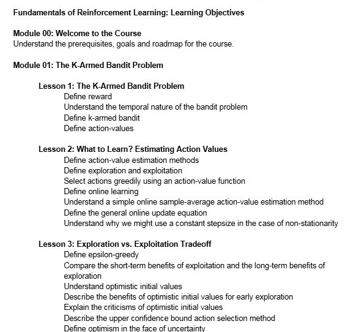
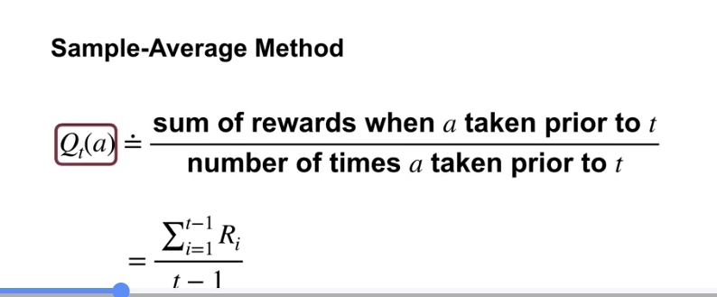
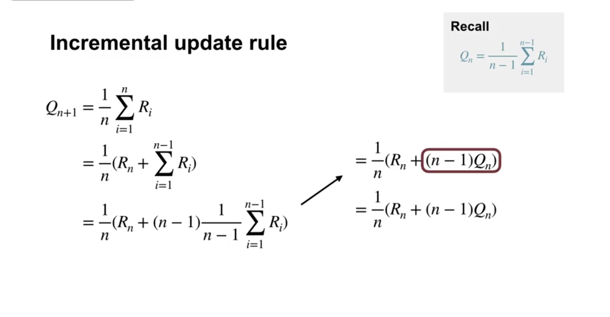
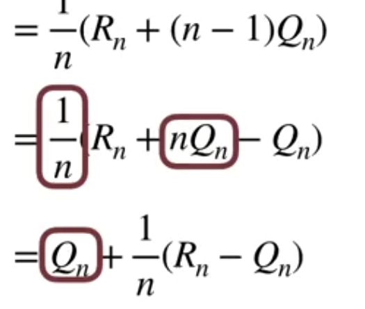
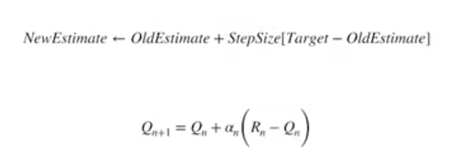
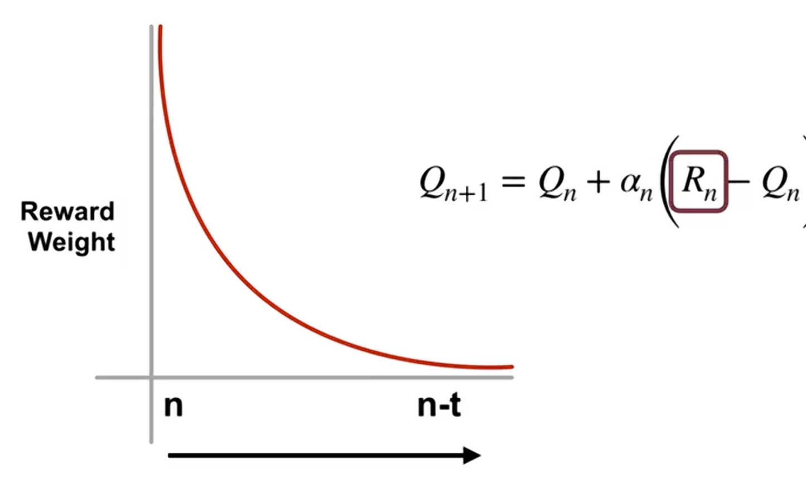
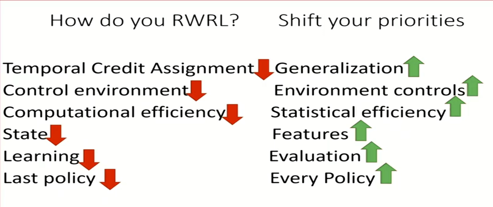

**Contents**

Mobule1 : 코스소계
---
**레슨 1: K-armed bandit 문제**

- 보상 정의하기
- 산적 문제의 시간적 특성 이해하기
- K-armed bandit 정의하기
- 행동 값 정의하기

**레슨 2: 무엇을 배울 것인가? 행동 값 추정하기**

- 행동값 추정 방법 정의하기
- 탐사 및 착취 정의하기
- 액션 값 함수를 사용하여 탐욕스럽게 액션 선택하기
- 온라인 학습 정의하기
- 간단한 온라인 샘플 평균 액션 값 추정 방법 이해하기
- 일반적인 온라인 업데이트 방정식 정의하기
- 비고정성의 경우 일정한 단계 크기를 사용하는 이유 이해하기

**레슨 3: 탐색 대 착취의 트레이드 오프**

- 엡실론 탐욕 정의하기
- 착취의 단기적 이점과 탐험의 장기적 이점 비교하기
- 낙관적인 초기 값 이해하기
- 초기 탐사를 위한 낙관적 초기 값의 이점 설명하기
- 낙관적 초기 값의 비판에 대해 설명하기
- 상위 신뢰 한계 조치 선택 방법 설명하기
- 불확실성에 직면했을 때 낙관주의 정의하기

https://www.notion.so/1-31b2db51f2f680ffa6dee5e1a44d3d51?source=copy_link#31b2db51f2f680f1a8bed8482dd0b95b

Mobule2 : 순차적 의사결정에 대한 소개 
---
- differences of k-armed bandit game and supervised learnig
    
    in shorts, supervised learnig is corrective : the model is trained on labeled data where it learns by compairing whith its predictions to the exact right answer.
    the bandit problem is evaluative : the algorithm only recieves a reward score for the action it took. never knowing if alternative action would have been better. This forces the bandit algorithm to balance exploration with explotation, a dilema absent in standard supervised learning
    
- learning action value
    
    he value of selecting an action Q star is the expected reward received after that action has been taken. Q star is not known to the agent, just like the doctor doesn't know the effectiveness of each treatment.

- incremental update rule 

    we're going to pull the current reward out of the sum. Now, the sum only goes until the previous reward. We write our next value estimate in terms of our previous value estimate. To do so, we multiply and divide the current sum by N minus one. By multiplying and dividing by the same thing, we are effectively multiplying by one. The circle term should look familiar to you.
    This is just our definition of Q_n, the current value estimate. We can simplify this equation a little further. We distribute Q_n to get this form. Finally, we pull nQ_n out of the sum and multiply by one over n. Now, we have an incremental update rule for estimating values.
    
    

- 점진적으로 reward 값 추정하기 

    this graph shows the amounts of weight the most recent award receives versus the reward received t times steps ago. 
    the weighting fades exponentially with time.

**exploration 과 exploitation 의 트레이드 오프**
- 차이점은 무엇인가?

 Exploration allows the agent to improve his knowledge about each action.

when we explore, we get more accurate estimates of our values. When we exploit, we might get more reward. We cannot however choose to do both simultaneously.

그래서 우리는 epsilone greedy action 방법을 사용한다. 랜덤한 확율에 explore 과 exploit을 섞어서 사용한다.

많은 독립시행을 수행한 후 평균을 내야 알고리즘을 공정하게 비교할 수 있다는 예시가 10 -armed testbed 이다. 

- Optimstic initial values

we can see that using optimistic initial values encourages exploration early in learning. An optimistic agent may have already settled on a particular action, and will not notice that a different action is better now.

We described how optimistic initial values encourage early exploration, and we demonstrated this through a couple of examples. We finally briefly described some of the limitations of optimistic initial values.

- 점진적 작업값 추정

- 상한 신뢰구간 (UCB) 액션 선택

we will select the action that has the highest estimated value plus our upper-confidence bound exploration term. The upper-bound term can be broken into three parts as we will see in the next slide.
The C parameter as a user-specified parameter that controls the amount of exploration. We can clearly see here how UCB combines exploration and exploitation. The first term in the sum represents the exploitation part, and the second term represents the exploration part.

upper-confidence bound action selection, which uses uncertainty in the value estimates to balance exploration and exploitation. 

- Real RL for contexted bandits

