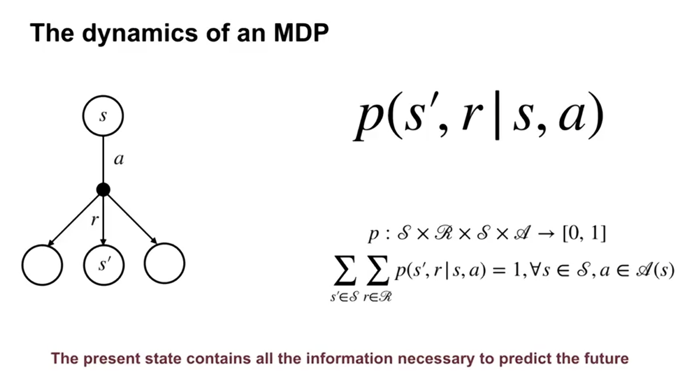
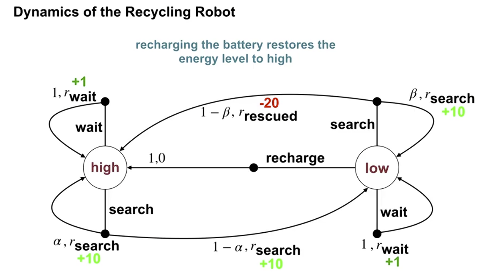
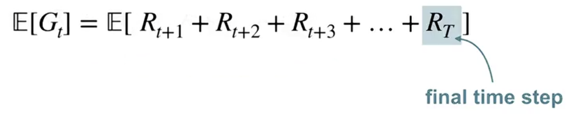

Mobule3 : 마르코프 의사결정 프로세스 
---
 실제 문제가 주어졌을 때 가장 중요한 펏번째 단계는 해당 문제를 (MDP) 즉, 마르코프 의사결정 프로세스로 변환하는 것 이다. 솔루션의 품질은 이 번역이 얼마나 잘 수행 하느냐에 따라 크게 달라진다. 
 모듈 3에서는 MDP의 정의를 정리하고, 목표 지향적 행동과 스칼라 보상을 최대화하여 이를 얻을 수 있는 방법을 이해하며, 에피소드형 작업과 지속형 작업의 차이점을 이해해 본다. 
 평가에서는 MDP 프레임 워크에 맞는 세가지 예시 과제를 직접 만들어 볼 예정이다. 

## 1. MDP(마르코프 의사 결정 프로세스) 소개
- MDP
지난 수업에세 다뤘던 k-armed Bandit 과 다르게 MDP는 상황에 따라 필요한 행동을 다르게 할 수 있다. 
다음 왼쪽 또는 오른쪽으로 갈 수 있는 토끼가 브로콜리로 가면 3점, 당근으로 가면 10점, 호랑이를 만난다면 -100의 포인트를 정산한다고 할때, 토끼가 오른쪽으로 가는제 당장 포인트를 모을수는 있어도, 다음 상황에서는 호랑이를 만나게 될 것이다. 
이럴때 상황에 따른 필요한 행동을 다르게 할 필요가 있다. 

이런 상황의 상호작용을 일반적인 MDP 프레임 워크로 정의 할 수 있다. 
에이전트는 개별 타임스크립트를 통해 환경과 상호작용하게 된다. 
매 시간 에이전트의 상태는 S_t. 행동은 A(S_t) 보상은 R_t+1 으로 정의 될 수 있다. 

- MDP의 역학적 묘사의 정의 

확률전이 함수 P는 다음상태의 확률적 상황을 묘사한다. 상태 s 와 행동 a가 주어진다면, 다음 상태 S와 보상이 함께 나올 확률을 알려준다. 이 과정에서 일반적으로  상태, 액션, 보상 집합은 유한하다고 가정된다. 
P는 확률분포의 특성을 가지고 있으며, 확률의 합은 1이다. 
또한 미래 상태와 보상은 현재 상태와 행동에 따라서만 달라진다. 이는 마르코프 프로퍼티라고 한다. -> 이는 현재 상태로도 미래를 예측하기 충분하다는 점을 시사한다. 

- MDP의 그래픽 표현 

다음의 재활용 로봇 문제를 MDP로 어떻게 표현하느냐를 통해 실제상황을 상태, 행동, 보상, 전이확률로 나눠서 수학적으로 정의해 보겠다. 
    1. 문제상황 : 로봇은 빈캔을 찾아고, 집어 들고, 재활용함에 가져다 놓는 상황이다. 로봇은 충적식 배터리를 사용하고, 목표는 가능한 많은 캔을 모으는 것이다. 
    2. 상태 : 상태는 배터리 수준 두가지이다. low, high
    3. 행동 : search, wait, recharge(low상태일때만 가능)
    4. 전이 : 행동을 하면 상태가 어떻게 바뀌는지에 대한 확룰 표현. 그림의 화살표.

- MDP 프레임 워크의 관점에서 다양한 프로세스 작성 
위 예시는 MDP가 “현실의 결정을 수학적으로 깔끔하게 표현하는 틀”이라는 점을 시사한다. 상태가 꼭 로봇 배터리처럼 단순할 필요도 없고, 행동도 꼭 물리적인 동작일 필요도 없다.

## 2. 강화 학습의 목표 
- 보상이 에이전트 목표와 어떻게 관련되는지 설명하기 
강화학습에서 에이전트의 목표는 즉시 보상이 아니라, 미래까지 포함한 총보상(return)의 기대값을 최대화하는 것이다.
Return G_t 는 시간 t 이후에 받는 보상들의 합이다.
​    - 미래 보상 전체를 합친 값이라고 생각하면 된다.
    - 환경이 확률적이기 때문에, 같은 상태에서 시작해도 결과가 달라질 수 있다.
    - 그래서 return도 하나의 확률변수로 본다.

"그래서 우리는 expected return, 즉 기대 총보상을 최대화한다"

- 에피소드 이해 및 에피소드형 작업 식별하기 

episodic task는 에이전트-환경 상호작용이 에피소드 단위로 끝나는 문제다.

## 3. Continuing Tasks
- 할인을 사용하여 contonuing tasks에 대한 보상 공식화하기 
→ 종료가 없는 과제에서는, 할인 인자(γ)를 써서 “총 보상(리턴)”을 수식으로 정의

- 연속적인 시간 단계에서의 보상이 서로 어떻게 관련되어 있는지 설명하기 
→ 시간 t, t+1에서의 리턴 Gₜ, Gₜ₊₁가 어떤 관계식으로 연결되는지 설명

- 언제 작업을 에피소드형 또는  continuing tasks로 공식화해야 하는지 이해하기 
→ 어떤 문제를 에피소드형(에피소드가 끝나는 문제)으로 볼지, 계속형(끝이 없다고 보는 문제)으로 볼지 구분