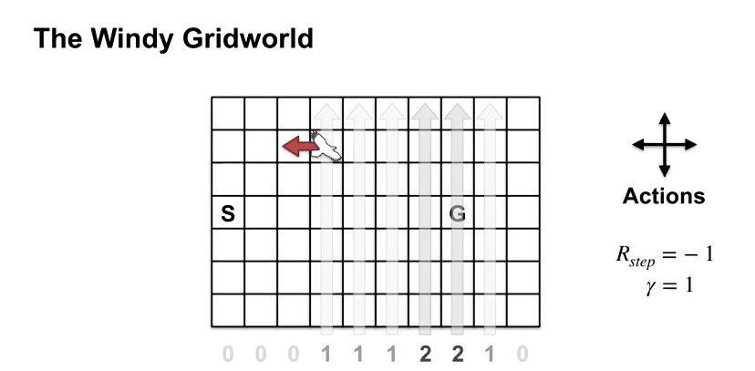
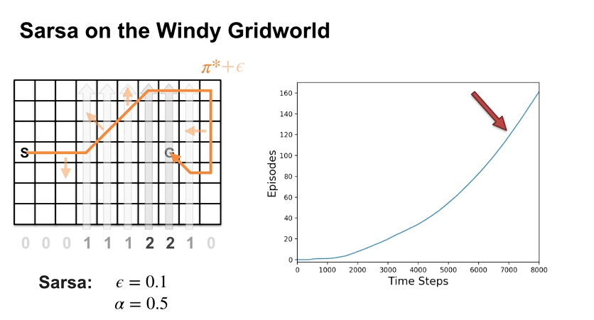
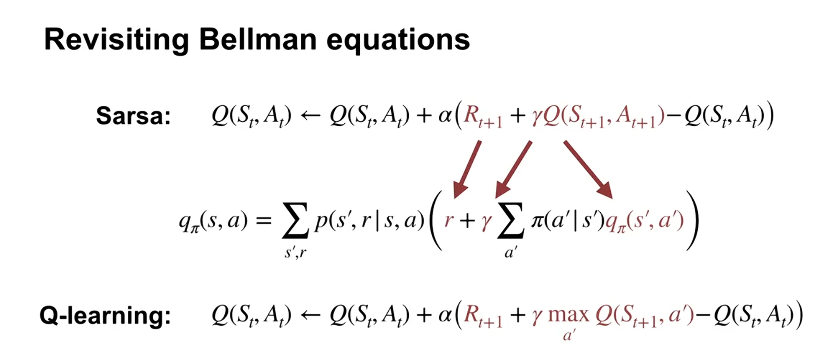
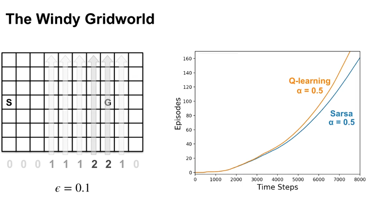
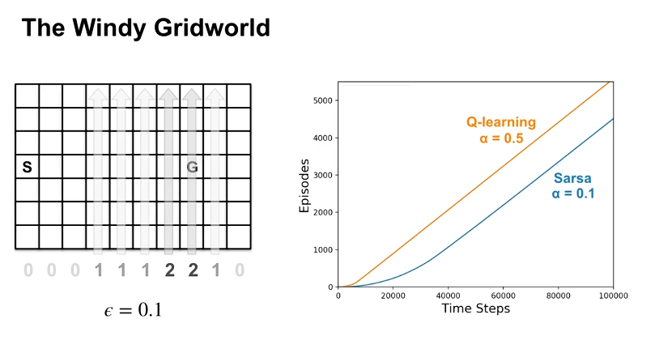
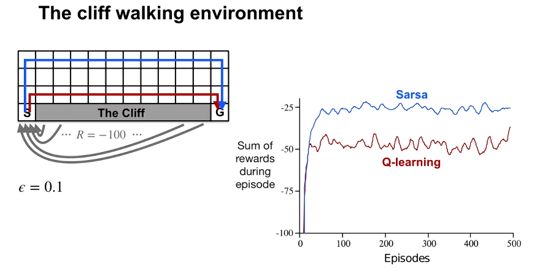
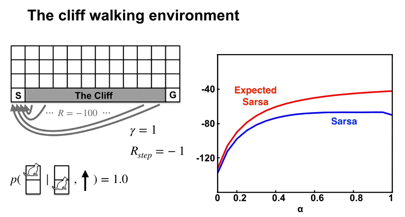
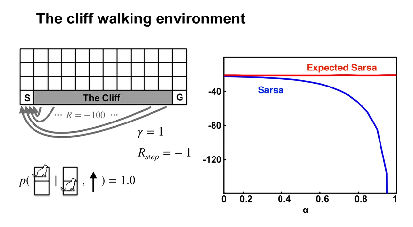

# TD for control 
### Sarsa: GPI with TD

---

## 한 줄 요약

TD를 GPI의 정책 평가 단계에 적용하면 **매 스텝마다** 행동 가치를 업데이트하고 정책을 개선하는 Sarsa 알고리즘이 됩니다.

---

## 핵심 개념 정리

### GPI 발전 흐름

| 알고리즘 | 정책 평가 방식 | 정책 개선 시점 |
| :--- | :--- | :--- |
| Policy Iteration | DP, 완전 수렴까지 | 수렴 후 |
| MC with ES | Monte Carlo, 에피소드 단위 | 에피소드마다 |
| **Sarsa** | TD, 매 스텝 | **매 스텝마다** |

개선 주기가 점점 짧아지는 방향으로 발전해왔습니다.

---

### Sarsa가 V(s) 대신 Q(s,a)를 학습하는 이유

TD로 V(s)를 학습하면 정책 개선 시 환경 모델 p가 필요합니다. 모델 없이 greedy 개선을 하려면 **Q(s,a)를 직접 학습**해야 합니다. 상태 간 전이가 아니라 상태-행동 쌍 간 전이를 추적하는 이유입니다.

---

### Sarsa 업데이트

Sarsa라는 이름은 업데이트에 사용하는 데이터 구조에서 왔습니다.

$$S_t, A_t, R_{t+1}, S_{t+1}, A_{t+1}$$

업데이트 수식:

$$Q(S_t, A_t) \leftarrow Q(S_t, A_t) + \alpha \left[ R_{t+1} + \gamma Q(S_{t+1}, A_{t+1}) - Q(S_t, A_t) \right]$$

TD의 V(s) 업데이트 수식과 구조가 동일하고, $V(S)$가 $Q(S,A)$로 바뀐 것뿐입니다.

> 한 가지 주의할 점은 다음 행동 $A_{t+1}$을 업데이트 전에 미리 결정해야 한다는 것입니다. 현재 정책으로 $A_{t+1}$을 샘플링한 뒤 업데이트하기 때문에, Sarsa는 **자신이 실제로 따르는 정책의 행동 가치를 학습**합니다. 이것이 on-policy 특성입니다.

---

### Sarsa Control 알고리즘 흐름

```
1. S, A 초기화 (ε-greedy로 첫 행동 선택)

2. 매 스텝:
   a. A를 실행 → R, S' 관측
   b. S'에서 ε-greedy로 A' 선택
   c. Q(S,A) 업데이트 (Sarsa 수식)
   d. S ← S', A ← A'

3. 종료 조건까지 반복
```

에피소드가 끝날 때까지 기다리지 않고, 매 스텝에서 평가와 개선이 동시에 일어납니다.
---
---

### Sarsa in the Windy Grid World

---

## 한 줄 요약

바람이 부는 그리드월드에서 Sarsa를 실행하며, 알고리즘의 **실제 학습 과정과 Monte Carlo 대비 장점**을 확인합니다.

---

## 핵심 개념 정리

### Windy Gridworld 환경 설정

- **보상**: 매 스텝 -1 (빨리 탈출할수록 유리)
- **할인율**: $\gamma = 1$ (에피소딕 태스크)
- **핵심 요소**: 열(column)마다 다른 강도의 바람이 위쪽으로 작용

예를 들어 바람 강도 1인 열에서 왼쪽 행동을 취하면, 실제 이동은 왼쪽 + 위쪽 한 칸이 됩니다. 경계에 부딪히면 이동 없음.

---

### 실험 설정

- $\epsilon = 0.1$ (10번 중 1번 무작위 행동)
- $\alpha = 0.5$
- 초기 Q값: 0 (낙관적 초기화 → 방문 안 한 상태를 탐험하도록 유도)
- 100번 독립 실행 평균

---

### 학습 곡선 분석

x축은 총 스텝 수, y축은 완료된 에피소드 수입니다.

- **초반**: 첫 몇 에피소드가 수천 스텝 소요. 곡선이 완만함
- **중반**: 학습이 진행되며 에피소드를 빠르게 완료. 곡선 기울기 증가
- **7,000 스텝 이후**: 곡선 기울기가 일정해짐 → greedy 정책이 최적에 수렴

$\epsilon = 0.1$이기 때문에 완전한 최적 정책에는 도달하지 못하고, 최적 근방에서 맴돕니다.

---

### 이 환경에서 Monte Carlo가 적합하지 않은 이유

> Monte Carlo는 에피소드가 종료되어야 학습합니다. 그런데 Windy Gridworld에서는 일부 결정론적 정책이 종료 상태에 도달하지 못하고 무한 루프에 빠질 수 있습니다. 예를 들어 시작 상태에서 계속 왼쪽으로 가는 정책은 절대 종료되지 않습니다. Monte Carlo는 이 상황에서 아무것도 학습하지 못합니다.

Sarsa는 에피소드 중간에 매 스텝마다 업데이트하기 때문에, 나쁜 정책임을 **에피소드가 끝나기 전에 감지**하고 다른 행동으로 전환할 수 있습니다. 종료 보장이 없는 환경에서 TD 계열이 MC보다 훨씬 강건한 이유입니다.
---

### What is Q-learning?

---

## 한 줄 요약

Q-learning은 Sarsa와 달리 **벨만 최적 방정식**을 직접 샘플로 푸는 알고리즘으로, 정책 평가와 개선 단계를 분리하지 않고 매 스텝에서 최적 행동 가치를 향해 직접 수렴합니다.

---

## 핵심 개념 정리

### Q-learning 업데이트 수식

$$Q(S_t, A_t) \leftarrow Q(S_t, A_t) + \alpha \left[ R_{t+1} + \gamma \max_{a} Q(S_{t+1}, a) - Q(S_t, A_t) \right]$$

Sarsa와의 유일한 차이는 타겟입니다.

| 알고리즘 | 타겟 | 기반 방정식 |
| :--- | :--- | :--- |
| Sarsa | $R_{t+1} + \gamma Q(S_{t+1}, A_{t+1})$ | 벨만 방정식 (고정 정책) |
| Q-learning | $R_{t+1} + \gamma \max_a Q(S_{t+1}, a)$ | 벨만 **최적** 방정식 |

Sarsa는 다음에 실제로 선택할 행동 $A_{t+1}$의 가치를 타겟으로 씁니다. Q-learning은 다음 상태에서 가장 좋은 행동의 가치, 즉 $\max_a Q$를 타겟으로 씁니다.

---

### 왜 max를 쓰는가 — DP와의 연결

Module 1에서 배운 벨만 최적 방정식을 떠올리면 연결이 명확합니다.

$$Q^*(s,a) = \sum_{s',r} p(s',r|s,a)\left[r + \gamma \max_{a'} Q^*(s',a')\right]$$

Q-learning은 이 방정식을 환경 모델 p 없이 샘플로 푸는 알고리즘입니다. $\max_a Q$를 타겟으로 쓰는 것은 벨만 최적 방정식의 구조를 그대로 따른 것입니다.

> Sarsa는 policy iteration의 샘플 버전, Q-learning은 value iteration의 샘플 버전입니다. 둘 다 벨만 방정식을 풀지만, 어떤 벨만 방정식을 푸느냐가 다릅니다.

---

### Q-learning이 Q*에 직접 수렴하는 이유

벨만 최적 방정식을 반복 적용하면 가치 함수가 단조적으로 개선되고, 결국 최적해에 수렴합니다. Value iteration이 이 성질을 이용했고, Q-learning도 동일한 이유로 수렴합니다.

조건은 하나입니다. 에이전트가 모든 (s, a)를 충분히 탐험해야 합니다. 탐험만 보장되면, 정책 개선 단계를 명시적으로 수행하지 않아도 Q-learning은 자동으로 $Q^*$로 수렴합니다.v
---

### Q-learning in the Windy Grid World

---

## 한 줄 요약

같은 Windy Gridworld에서 Q-learning과 Sarsa를 비교하면, Q-learning이 더 나은 최종 정책에 도달하는 것처럼 보이지만 **파라미터 조정 시 Sarsa도 동일한 정책에 수렴**합니다.

---

## 핵심 개념 정리

### 실험 결과 요약

동일 파라미터($\epsilon = 0.1$, $\alpha = 0.5$) 조건에서:

- **초반**: 두 알고리즘이 비슷한 속도로 학습
- **후반**: Q-learning이 더 나은 최종 정책에 도달

---

### Q-learning이 더 잘 된 이유 (가설)

확실한 원인은 추가 실험 없이 단정할 수 없지만, 타겟의 안정성 차이에서 힌트를 얻을 수 있습니다.

| 알고리즘 | 타겟 변화 시점 |
| :--- | :--- |
| Q-learning | 어떤 행동이 다른 것보다 낫다는 걸 알게 될 때만 변화 ($\max_a Q$) |
| Sarsa | 탐험적 행동을 취할 때마다 변화 ($Q(S', A')$) |

Sarsa는 $\epsilon$-greedy 탐험 중 무작위 행동을 취할 때마다 타겟이 흔들립니다. $\alpha = 0.5$처럼 학습률이 높으면 이 노이즈가 업데이트에 크게 반영됩니다.

> Q-learning의 $\max_a Q$ 타겟은 탐험 행동의 영향을 받지 않습니다. 실제로 어떤 행동을 선택했든, 타겟은 항상 다음 상태의 최선 행동 가치를 씁니다. 이 안정성이 높은 $\alpha$에서 유리하게 작용했을 가능성이 있습니다.


---

### Sarsa의 $\alpha$를 낮추면?

$\alpha = 0.01$로 낮춘 실험 결과:

- Sarsa가 더 천천히 학습하지만, **최종적으로 Q-learning과 동일한 정책에 수렴**
- 두 곡선의 기울기가 같아짐 → 에피소드 완료 속도가 동일 → 동일한 정책에 도달했다는 의미


---

### 이 실험이 주는 교훈

알고리즘 성능 비교에서 파라미터의 영향을 분리하지 않으면, 알고리즘 자체의 차이가 아닌 파라미터 차이를 보게 됩니다.

$\alpha$, $\epsilon$, 초기값, 실험 길이 모두 최종 결과에 영향을 줍니다. 알고리즘을 공정하게 비교하려면 파라미터를 체계적으로 조정하는 실험 설계가 필요합니다.

---

### How is Q-learning Off-Policy?

---

## 한 줄 요약

Q-learning은 importance sampling 없이도 off-policy입니다. target policy가 greedy이기 때문에 $\max_a Q$가 곧 target policy 하의 기댓값과 동일해지기 때문입니다.

---

## 핵심 개념 정리

### Sarsa vs Q-learning의 on/off-policy 구분

| 알고리즘 | Behavior Policy | Target Policy | 분류 |
| :--- | :--- | :--- | :--- |
| Sarsa | $\epsilon$-greedy | $\epsilon$-greedy (동일) | on-policy |
| Q-learning | $\epsilon$-greedy (또는 임의) | greedy w.r.t. Q | off-policy |

Sarsa는 다음에 실제로 취할 행동 $A_{t+1}$을 타겟에 씁니다. 이 행동은 behavior policy에서 샘플링된 것이므로 on-policy입니다.

Q-learning은 $\max_a Q(S_{t+1}, a)$를 타겟으로 씁니다. 이는 실제로 선택한 행동이 아니라, greedy target policy 하의 최선 행동 가치입니다.

---

### Importance Sampling 없이 off-policy가 가능한 이유

off-policy 학습에서 일반적으로 importance sampling이 필요한 이유는, behavior policy로 수집한 샘플의 분포를 target policy 분포로 보정해야 하기 때문입니다.

그런데 Q-learning의 target policy는 greedy입니다. Greedy 정책에서는 최대값이 아닌 행동의 선택 확률이 0이므로, target policy 하의 기댓값이 자동으로 $\max_a Q$가 됩니다.

$$\mathbb{E}_\pi[Q(S', a)] = \max_a Q(S', a) \quad \text{(target policy가 greedy일 때)}$$

> 기댓값을 직접 계산할 수 있기 때문에 importance sampling ratio가 필요 없습니다. Q-learning은 샘플 분포 보정 없이 off-policy를 구현하는 특수한 케이스입니다.

---

### Cliff Walking: on/off-policy의 실전 차이

Cliff Walking은 절벽 아래로 떨어지면 -100 보상과 함께 시작 지점으로 돌아가는 환경입니다.

**Q-learning**: 최적 정책(절벽 바로 옆 경로)을 학습합니다. 그러나 $\epsilon$-greedy 탐험 중 가끔 절벽으로 떨어집니다. 최적 경로를 알지만 탐험 비용이 큽니다.

**Sarsa**: $\epsilon$-greedy 탐험의 영향을 가치 추정에 반영합니다. 절벽 옆 경로가 위험하다는 것을 학습하고, 더 안전한 우회 경로를 선택합니다.

결과적으로 **온라인 성능(실제 누적 보상)은 Sarsa가 높습니다.** 최적 정책을 학습하더라도 탐험 중 큰 패널티를 받으면 실제 성능은 떨어질 수 있습니다.

> Q-learning은 "이론적으로 최적인 정책"을 학습하고, Sarsa는 "현재 자신이 실제로 따르는 행동 방식에 최적인 정책"을 학습합니다. 어떤 것이 유리한지는 환경의 특성에 따라 달라집니다.

---

### How is Q-learning Off-Policy?

---

## 한 줄 요약

Q-learning은 importance sampling 없이도 off-policy입니다. target policy가 greedy이기 때문에 $\max_a Q$가 곧 target policy 하의 기댓값과 동일해지기 때문입니다.

---

## 핵심 개념 정리

### Sarsa vs Q-learning의 on/off-policy 구분

| 알고리즘 | Behavior Policy | Target Policy | 분류 |
| :--- | :--- | :--- | :--- |
| Sarsa | $\epsilon$-greedy | $\epsilon$-greedy (동일) | on-policy |
| Q-learning | $\epsilon$-greedy (또는 임의) | greedy w.r.t. Q | off-policy |

Sarsa는 다음에 실제로 취할 행동 $A_{t+1}$을 타겟에 씁니다. 이 행동은 behavior policy에서 샘플링된 것이므로 on-policy입니다.

Q-learning은 $\max_a Q(S_{t+1}, a)$를 타겟으로 씁니다. 이는 실제로 선택한 행동이 아니라, greedy target policy 하의 최선 행동 가치입니다.

---

### Importance Sampling 없이 off-policy가 가능한 이유

off-policy 학습에서 일반적으로 importance sampling이 필요한 이유는, behavior policy로 수집한 샘플의 분포를 target policy 분포로 보정해야 하기 때문입니다.

그런데 Q-learning의 target policy는 greedy입니다. Greedy 정책에서는 최대값이 아닌 행동의 선택 확률이 0이므로, target policy 하의 기댓값이 자동으로 $\max_a Q$가 됩니다.

$$\mathbb{E}_\pi[Q(S', a)] = \max_a Q(S', a) \quad \text{(target policy가 greedy일 때)}$$

> 기댓값을 직접 계산할 수 있기 때문에 importance sampling ratio가 필요 없습니다. Q-learning은 샘플 분포 보정 없이 off-policy를 구현하는 특수한 케이스입니다.

---

### Cliff Walking: on/off-policy의 실전 차이


Cliff Walking은 절벽 아래로 떨어지면 -100 보상과 함께 시작 지점으로 돌아가는 환경입니다.

**Q-learning**: 최적 정책(절벽 바로 옆 경로)을 학습합니다. 그러나 $\epsilon$-greedy 탐험 중 가끔 절벽으로 떨어집니다. 최적 경로를 알지만 탐험 비용이 큽니다.

**Sarsa**: $\epsilon$-greedy 탐험의 영향을 가치 추정에 반영합니다. 절벽 옆 경로가 위험하다는 것을 학습하고, 더 안전한 우회 경로를 선택합니다.

결과적으로 **온라인 성능(실제 누적 보상)은 Sarsa가 높습니다.** 최적 정책을 학습하더라도 탐험 중 큰 패널티를 받으면 실제 성능은 떨어질 수 있습니다.

> Q-learning은 "이론적으로 최적인 정책"을 학습하고, Sarsa는 "현재 자신이 실제로 따르는 행동 방식에 최적인 정책"을 학습합니다. 어떤 것이 유리한지는 환경의 특성에 따라 달라집니다.
---

### Expected Sarsa

---

## 한 줄 요약

Sarsa가 다음 행동을 **샘플링**해서 타겟을 만든다면, Expected Sarsa는 다음 행동의 기댓값을 **직접 계산**해서 타겟의 분산을 줄입니다.

---

## 핵심 개념 정리

### 왜 샘플링 대신 직접 계산하는가

Sarsa의 업데이트 타겟은 다음과 같습니다.

$$R_{t+1} + \gamma Q(S_{t+1}, A_{t+1}), \quad A_{t+1} \sim \pi$$

다음 행동 $A_{t+1}$을 정책에서 샘플링합니다. 그런데 에이전트는 이미 자신의 정책을 알고 있습니다. 굳이 샘플링할 필요 없이 기댓값을 직접 계산할 수 있습니다.

$$R_{t+1} + \gamma \sum_a \pi(a|S_{t+1}) Q(S_{t+1}, a)$$

이것이 Expected Sarsa의 타겟입니다.

---

### 세 알고리즘 타겟 비교

| 알고리즘 | 타겟 | 특성 |
| :--- | :--- | :--- |
| Sarsa | $R + \gamma Q(S', A')$, $A' \sim \pi$ | 샘플링, 분산 있음 |
| Expected Sarsa | $R + \gamma \sum_a \pi(a\|S') Q(S', a)$ | 직접 계산, 분산 낮음 |
| Q-learning | $R + \gamma \max_a Q(S', a)$ | greedy target policy의 특수 케이스 |

> Q-learning은 Expected Sarsa의 특수한 경우입니다. Target policy가 greedy이면 $\sum_a \pi(a|S') Q(S', a) = \max_a Q(S', a)$가 됩니다. Expected Sarsa는 Sarsa와 Q-learning을 모두 포괄하는 더 일반적인 알고리즘입니다.

---

### 분산 감소의 효과와 비용

**장점**: Sarsa는 탐험적 행동을 샘플링할 때마다 타겟이 흔들립니다. 이상적인 조건에서도 업데이트 방향이 틀릴 수 있고, 여러 번의 업데이트가 쌓여야 올바른 방향으로 수렴합니다. Expected Sarsa는 매 스텝 타겟이 정확하기 때문에 업데이트가 항상 올바른 방향을 가리킵니다.

**단점**: 매 스텝마다 모든 행동에 대해 $\pi(a|S') \cdot Q(S', a)$를 합산해야 합니다. 행동 공간이 커질수록 이 계산 비용이 선형으로 증가합니다.

분산을 줄이는 대가로 스텝당 계산량이 늘어나는 트레이드오프입니다.


---

### Expected Sarsa in the Cliff World

---

## 한 줄 요약

Cliff World 실험에서 Expected Sarsa는 거의 모든 $\alpha$ 값에서 Sarsa를 앞질렀으며, 특히 **큰 학습률에서도 안정적으로 수렴**하는 강건함을 보였습니다.

---

## 핵심 개념 정리

### 실험 설계

- 환경: Cliff World (결정론적, 에피소딕)
- $\epsilon = 0.1$
- 다양한 $\alpha$ 값에서 각 알고리즘 테스트
- 100 에피소드 / 50,000번 독립 실행 평균

---

### 단기 성능 (100 에피소드)

x축을 $\alpha$ 값으로, y축을 에피소드당 평균 return으로 비교했을 때:

- **Sarsa**: $\alpha$가 커질수록 성능 향상, 최적은 $\alpha = 0.9$ 근방. 그 이상에서는 오히려 감소
- **Expected Sarsa**: 거의 모든 $\alpha$ 범위에서 Sarsa를 앞섬. 큰 $\alpha$도 효과적으로 활용

> Expected Sarsa가 큰 $\alpha$를 더 잘 활용하는 이유는 명확합니다. 이 환경은 결정론적이기 때문에, 타겟의 유일한 무작위성 원천은 Sarsa의 다음 행동 샘플링입니다. Expected Sarsa는 이 무작위성을 기댓값 계산으로 제거하므로, 업데이트가 매 스텝 결정론적입니다. 큰 $\alpha$로 빠르게 업데이트해도 타겟이 안정적이기 때문에 흔들리지 않습니다.


---

### 장기 성능 (100,000 에피소드)

충분히 학습한 후의 최종 성능 비교:

| 알고리즘 | $\alpha$ 민감도 | 장기 수렴 |
| :--- | :--- | :--- |
| Expected Sarsa | 거의 없음 | 안정적으로 수렴 |
| Sarsa | 큼 | 큰 $\alpha$에서 수렴 실패 |

Expected Sarsa에서 $\alpha$는 수렴 속도만 결정합니다. 타겟 자체가 결정론적이기 때문에, 얼마나 빠르게 타겟에 도달하느냐의 문제일 뿐 최종값은 달라지지 않습니다.

Sarsa는 $\alpha$가 작아질수록 Expected Sarsa의 장기 성능에 점근적으로 수렴합니다. 작은 $\alpha$가 샘플링 노이즈를 평균화하는 효과를 내기 때문입니다.


---

### Generality of Expected Sarsa

---

## 한 줄 요약

Expected Sarsa는 importance sampling 없이 off-policy 학습이 가능하며, target policy를 greedy로 설정하면 **Q-learning과 완전히 동일**해집니다.

---

## 핵심 개념 정리

### Expected Sarsa가 off-policy인 이유

Expected Sarsa의 타겟에서 다음 행동에 대한 기댓값은 **실제로 선택된 행동과 독립적으로 계산**됩니다.

$$R_{t+1} + \gamma \sum_a \pi(a|S_{t+1}) Q(S_{t+1}, a)$$

이 합산은 behavior policy가 어떤 행동을 선택했는지와 무관하게 target policy $\pi$만으로 계산됩니다. Q-learning과 동일한 이유로 importance sampling이 필요 없습니다.

---

### Q-learning은 Expected Sarsa의 특수 케이스

Target policy를 greedy로 설정하면:

$$\sum_a \pi(a|S') Q(S', a) = \max_a Q(S', a)$$

Greedy 정책에서 최대값이 아닌 행동의 확률이 0이므로, 기댓값이 자동으로 max 연산과 같아집니다. 이것이 정확히 Q-learning의 타겟입니다.

| Target Policy | 알고리즘 |
| :--- | :--- |
| $\epsilon$-greedy (behavior와 동일) | Expected Sarsa (on-policy) |
| 임의의 $\pi$ | Expected Sarsa (off-policy) |
| Greedy w.r.t. Q | **Q-learning** |

> Sarsa, Q-learning, Expected Sarsa 세 알고리즘은 모두 벨만 방정식의 샘플 기반 버전입니다. Expected Sarsa가 가장 일반적인 형태이고, Q-learning은 그 안에 포함됩니다.