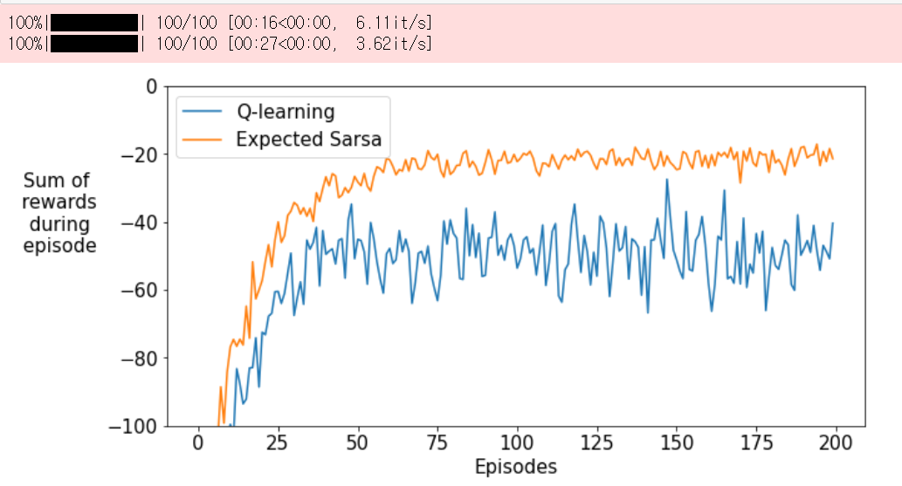
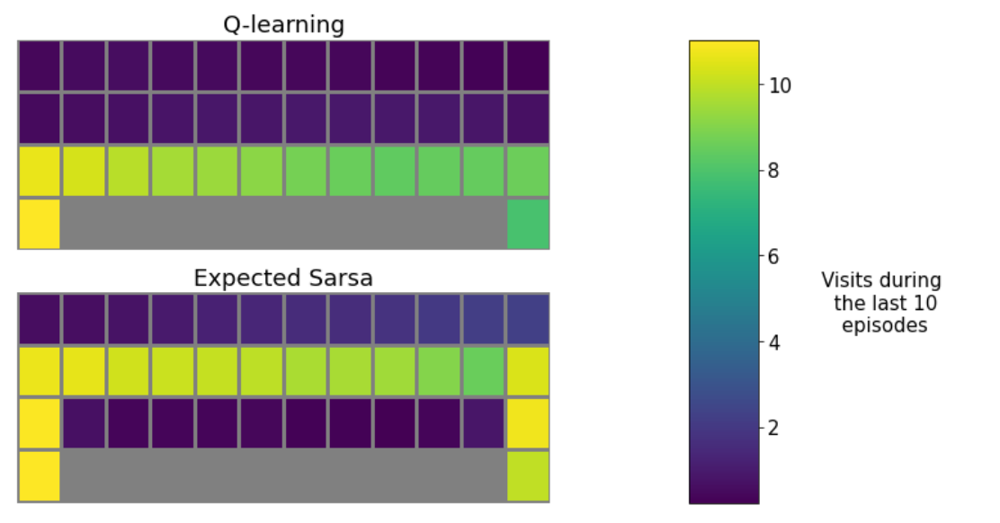
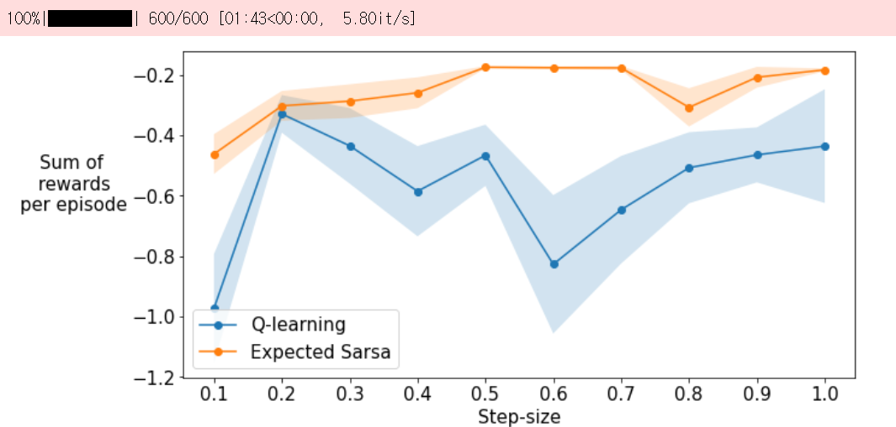

# Q-Learning & Expected SARSA — Cliff World 실험 회고

> **Course**: Reinforcement Learning Specialization, Course 2 (Sample-based Learning Methods), Module 3
> **Environment**: Cliff World (4×12 grid)
> **Algorithms**: Q-Learning (off-policy TD control), Expected SARSA (on-policy TD control)
> **Task**: 두 control 알고리즘을 직접 구현하고 Cliff World에서 비교

---

## 📌 TL;DR

- 지난 모듈은 **prediction**(주어진 정책의 V 추정)이었고, 이번엔 **control**(최적 정책 찾기)로 넘어왔다.
- 두 알고리즘의 차이는 **target 한 줄**에 있다: `max` vs `expected value under policy`.
- Cliff World에서 둘이 **다른 정책으로 수렴**하는데, 이게 단순한 성능 차이가 아니라 **"무엇을 평가하느냐"의 철학 차이**다.
- Q-learning은 "이상적인 greedy 정책의 가치"를 학습 → 절벽 위 최단 경로
- Expected SARSA는 "실제로 행동하는 ε-greedy 정책의 가치"를 학습 → 절벽에서 떨어져 우회
- 시뮬레이션 기반 캡스톤에서 **어떤 알고리즘 계열을 선택할 것인가**에 직접적인 영향을 주는 실험.

---

## 1. Prediction에서 Control로

지난 Module 2의 TD(0)는 정책 π가 **주어진 상태에서** V(s)를 추정하는 거였다. 이번엔 정책을 **직접 찾아내는** control 문제로 넘어온다.

핵심 변화는 두 가지:

| | Prediction (Module 2) | Control (Module 3) |
|---|---|---|
| 추정 대상 | $V(s)$ (state value) | $Q(s, a)$ (action value) |
| 정책 | 주어짐 | 데이터로부터 학습 |
| 업데이트 | $V$ 한 줄 | $Q$ 한 줄 + 행동 선택 |

**왜 V가 아니라 Q를 학습하는가?**
control에서는 "어떤 행동이 좋은가"를 알아야 하는데, $V(s)$만으로는 그걸 알 수 없다. $V(s)$를 알아도 어떤 행동이 어떤 다음 상태로 갈지 모르면(즉, p를 모르면) 행동을 선택할 수 없기 때문. $Q(s, a)$는 **이미 행동까지 포함된 가치**라서, $\arg\max_a Q(s, a)$만으로 정책을 만들 수 있다.

> 💡 5주차에 정리했던 벨만 최적 방정식에서 "Q\*를 알면 환경 동역학 p 없이도 바로 최적 행동을 선택할 수 있다"고 했는데, 그게 정확히 이 이유.

---

## 2. 두 알고리즘 — target 한 줄의 차이

### 2.1 Q-Learning (off-policy)

```python
best_next_q = np.max(self.q[state, :])
target = reward + self.discount * best_next_q
```

**핵심**: 다음 상태에서 **가능한 최대 Q값**을 사용한다.
"내가 실제로 어떤 행동을 했든, 만약 다음 상태에서 최선의 행동을 했다고 가정한다."

수식:
$$Q(S_t, A_t) \leftarrow Q(S_t, A_t) + \alpha\left[R_{t+1} + \gamma \max_a Q(S_{t+1}, a) - Q(S_t, A_t)\right]$$

**왜 off-policy인가?**
- 행동 정책 (behavior policy): ε-greedy (실제로 환경과 상호작용)
- 학습 정책 (target policy): greedy (max로 평가)
- → 두 정책이 다르다 → off-policy

---

### 2.2 Expected SARSA (on-policy)

```python
policy_probs = np.ones(self.num_actions) * (self.epsilon / self.num_actions)
max_q = np.max(q_next)
greedy_actions = np.where(q_next == max_q)[0]
policy_probs[greedy_actions] += (1.0 - self.epsilon) / len(greedy_actions)

expected_next_q = np.sum(policy_probs * q_next)
target = reward + self.discount * expected_next_q
```

**핵심**: 다음 상태에서 **현재 행동 정책(ε-greedy)으로 행동했을 때의 기대 Q값**을 사용한다.

수식:
$$Q(S_t, A_t) \leftarrow Q(S_t, A_t) + \alpha\left[R_{t+1} + \gamma \sum_a \pi(a|S_{t+1}) Q(S_{t+1}, a) - Q(S_t, A_t)\right]$$

여기서 $\pi(a|s)$는 ε-greedy policy이므로:

$$\pi(a|s) = \begin{cases} 1 - \varepsilon + \varepsilon/|\mathcal{A}| & \text{if } a = \arg\max Q(s,a) \\ \varepsilon/|\mathcal{A}| & \text{otherwise} \end{cases}$$

**왜 on-policy인가?**
- 행동 정책 = 학습 정책 = ε-greedy
- → 같은 정책 → on-policy

> 💡 구현 디테일: 동점 greedy action들에게 `(1-ε)`을 **균등 분배**한 부분이 인상적이었다. 실제로 argmax tie-breaking을 랜덤하게 하니까, policy probability도 그에 맞춰서 분배해야 일관성이 유지된다. 작은 디테일이지만 안 맞추면 미세한 bias가 생긴다.

---

### 2.3 비교 표

| 항목 | Q-Learning | Expected SARSA |
|---|---|---|
| Target | $\max_a Q(s', a)$ | $\sum_a \pi(a\|s') Q(s', a)$ |
| 평가하는 정책 | Greedy policy | ε-greedy policy (실제 행동 정책) |
| 분류 | Off-policy | On-policy |
| 계산 비용 | 낮음 (max 한 번) | 약간 더 높음 (모든 a 합) |
| 탐험 반영 | ❌ | ✅ |

---

## 3. Cliff World 실험 결과

**설정**: 4×12 grid, γ=1, ε=0.1, α=0.5, 200 episodes × 100 runs

> 📊 **[그래프 1: Episode별 reward 합 — Q-learning vs Expected SARSA 학습 곡선]**

### 3.1 무엇이 보였는가

- **두 알고리즘 모두 학습은 됨** — 시간이 지나면 reward 합이 개선됨
- 하지만 **수렴 후 평균 reward가 다름**:
  - Q-learning: 절벽 위 최단 경로 학습. 하지만 ε=0.1 확률로 가끔 절벽에 떨어짐 → 평균 reward 낮음
  - Expected SARSA: 약간 우회하지만 절벽에서 멀리 떨어진 경로 → 평균 reward 더 높음

> 📊 **[그래프 2: State visit heatmap — Q-learning은 절벽 위, Expected SARSA는 우회]**

이 heatmap이 가장 인상적이었다. **같은 환경에 같은 ε-greedy로 행동하는데도, 두 알고리즘이 완전히 다른 경로를 학습**한다. 코드 한 줄(target) 차이가 학습된 정책의 형태를 결정한다.

---

### 3.2 왜 이런 차이가 나는가

Cliff World의 reward 구조:
- 일반 step: -1
- 절벽 추락: -100 + start로 reset

**Q-learning의 시각:**
> "내가 절벽 위에 있을 때, **만약 내가 항상 최선의 행동을 한다면** 절벽에 안 떨어질 거야. 그러니까 절벽 위는 안전한 길이지."

이건 ε=0 (완전 greedy)일 때는 맞는 말이다. 하지만 실제 행동은 ε=0.1로 가끔 무작위로 움직인다. 그 무작위 행동 때문에 절벽으로 떨어지는데, **Q-learning은 이 사실을 학습에 반영하지 않는다.**

**Expected SARSA의 시각:**
> "내가 절벽 위에 있을 때, **내가 ε-greedy로 행동한다면** ε/4 확률로 아래로 떨어질 수 있어. 그 위험을 가치에 반영해야지."

→ 절벽 근처 상태의 Q값이 자연스럽게 깎임 → 우회 경로 선호.

---

### 3.3 Module 2 실습과의 연결

지난 모듈 Cliff Walking 실습에서 **Near-Optimal Stochastic Policy**의 가치함수를 봤을 때, 절벽 근처 상태의 가치가 크게 떨어지는 걸 관찰했다. 그때 정리했던 게:

> "10%의 무작위성이 절벽 근처 상태의 가치를 떨어뜨림 → risk가 가치함수에 자동 내재화"

**이번 실습이 바로 그 메커니즘이 control 알고리즘에 어떻게 들어가는지를 보여준 셈이다.**

- Expected SARSA는 자기가 ε-greedy로 행동한다는 사실을 알고 있고, 그걸 target에 반영 → 위험을 가치에 내재화
- Q-learning은 자기가 greedy로 행동한다고 가정하고 평가 → 위험을 무시

Module 2의 prediction 실험에서 본 직관이 Module 3의 control 알고리즘 선택에서 직접 결정 요인이 되는 흐름이 명확하게 보였다.

---

## 4. Step-size Sensitivity

> 📊 **[그래프 3: Step-size 0.1~1.0에 따른 평균 reward — Expected SARSA가 전 구간에서 우위]**

10가지 step-size (0.1 ~ 1.0)로 비교한 결과:

- **Expected SARSA가 거의 모든 step-size에서 Q-learning보다 높은 평균 reward 기록**
- 특히 큰 step-size (0.7~1.0)에서 차이가 더 벌어짐
- Q-learning은 step-size에 더 민감 (variance가 큼)

**왜 Expected SARSA가 step-size에 강건한가?**
Q-learning은 target에 `max`를 사용한다. max는 noisy estimate에 sensitive하다 — 하나의 outlier가 그대로 target에 반영됨.
Expected SARSA는 모든 action의 가중평균이므로 **noise가 평균화**됨 → variance 감소 → 큰 step-size에서도 안정적.

> 💡 이건 sample-average의 일반적인 원리와 같다. max는 unbiased지만 variance가 크고, 평균은 약간의 bias가 있더라도 variance가 낮다.

---

## 5. 캡스톤(Isaac Lab 시뮬레이션)으로 가져갈 직관들

### 5.1 알고리즘 선택의 1차 기준: "환경의 위험도 vs 탐험 필요도"

| 환경 특성 | 추천 알고리즘 계열 |
|---|---|
| 큰 페널티 영역 (절벽, 충돌) 존재 | On-policy (Expected SARSA, SARSA, PPO) |
| 안전하지만 탐험이 부족 | Off-policy (Q-learning, DQN) |
| 시뮬레이션이라 reset이 무료 | Off-policy도 OK |
| 실제 로봇 (sim-to-real 후) | On-policy가 더 안전 |

캡스톤에서 Isaac Lab navigation을 다룬다면, 학습 단계에서는 시뮬레이션이라 reset이 무료니까 Q-learning 계열도 가능. 하지만 **sim-to-real을 고려한다면 on-policy(특히 PPO)가 더 적합하다.** 이번 실습이 그 직관을 코드 레벨에서 보여줬다.

### 5.2 ε-greedy의 두 얼굴

같은 ε-greedy 행동 정책인데:
- Q-learning의 시각: "내 학습 정책은 어차피 greedy니까 ε은 그냥 데이터 수집 도구"
- Expected SARSA의 시각: "내가 실제로 ε-greedy로 행동하니까 그 위험을 가치에 반영해야 해"

→ **"학습되는 정책"과 "행동하는 정책"의 분리가 위험 평가에 어떻게 영향을 미치는가**가 알고리즘 선택의 핵심 기준이다.

캡스톤에서 reward shaping을 할 때, 충돌 페널티를 -100으로 줄지 -10으로 줄지를 결정하는 기준이 알고리즘 선택과도 엮인다. **Q-learning이면 같은 페널티여도 정책에 덜 반영**되고, **PPO 같은 on-policy면 같은 페널티가 정책에 더 강하게 반영**된다.

### 5.3 ⚠️ 함수 근사로 갈 때 주의할 점

이번 실습은 tabular라 깔끔하게 비교됐지만:

- **Q-learning + 신경망 = DQN** → 안정성 트릭 (target network, replay buffer) 필수
- **Expected SARSA + 신경망** → 거의 안 쓰임. 대신 PPO 같은 actor-critic on-policy 방법이 자리 잡음

이번 실습의 결과를 "Expected SARSA가 항상 더 좋다"로 일반화하면 안 된다. 함수 근사로 가면 algorithm landscape 자체가 달라진다. **이번 실습은 정확히 tabular 영역에서의 비교**임을 기억해야 함.

### 5.4 Step-size sensitivity가 시뮬에서 더 중요해진다

이번 실습에서 Q-learning이 큰 step-size에서 불안정해지는 걸 봤다. 시뮬레이션에서는:
- 학습 step이 많음 (수십만~수백만)
- 매번 hyperparameter tuning이 비싸지

→ **step-size에 강건한 알고리즘이 실험 비용을 줄여준다.** PPO가 hyperparameter sensitivity가 낮다고 평가받는 이유 중 하나가 이거.

---

## 6. 정리 — 한 줄씩

- Control 문제는 V가 아닌 Q를 학습한다 (행동 선택을 위해)
- Q-learning과 Expected SARSA의 차이는 target 한 줄 (`max` vs `expected`)
- Q-learning은 "이상적 greedy 정책"을, Expected SARSA는 "실제 ε-greedy 정책"을 평가
- Cliff World에서 둘이 다른 경로를 학습하는 게 이 철학 차이의 직접적 결과
- Expected SARSA가 step-size에 더 강건한 이유: max보다 평균이 noise에 강함
- 캡스톤에서 on-policy vs off-policy 선택 기준이 이번 실습에서 정립됨
- 단, tabular의 결과를 함수 근사 영역으로 일반화하면 안 됨

다음 모듈에서는 함수 근사로 넘어간다. Tabular Q-table이 신경망으로 바뀌면 어떤 새로운 문제가 생기고, 어떻게 해결하는지 보게 될 것.

---
