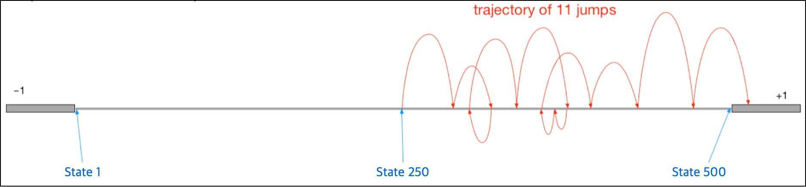
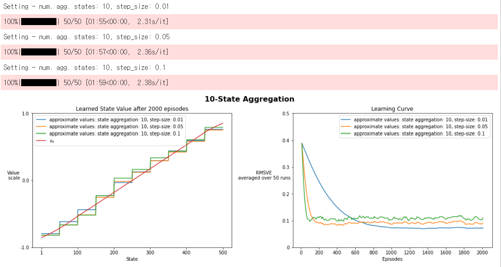
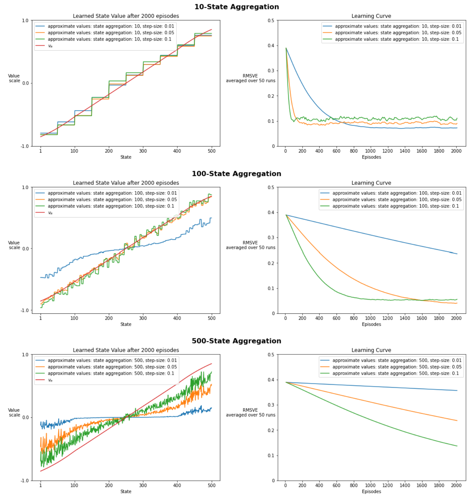

# State Aggregation 기반 Semi-gradient TD(0)의 가치함수 근사 성능 분석

## 1. Introduction and Background

본 실험은 500개의 비종단 상태를 가진 Random Walk 환경에서 고정된 정책의 상태 가치함수(state-value function)를 근사하는 것을 목표로 한다. 강화학습 문제는 크게 주어진 정책의 가치를 평가하는 prediction 문제와, 더 나은 행동 정책을 찾는 control 문제로 나눌 수 있다. 본 과제는 agent가 더 좋은 행동을 선택하도록 정책을 개선하는 control 문제가 아니라, 이미 주어진 무작위 정책을 따를 때 각 상태가 장기적으로 어느 정도의 기대 보상을 가지는지를 추정하는 policy evaluation 문제이다.

실험 환경은 500-State Random Walk이다. 비종단 상태는 1번부터 500번까지 존재하며, 양쪽 끝에는 episode가 종료되는 terminal state(좌측 state 0, 우측 state 501)가 있다. Agent는 중앙인 state 250에서 시작하고, 매 step마다 무작위 정책에 따라 좌우 중 한 방향을 같은 확률(0.5)로 선택한다. 방향이 정해지면 environment는 그 방향의 인접한 최대 100개 상태 중 하나로 균등하게 agent를 이동시킨다. 가장자리에서는 경계를 넘어가는 전이가 종단으로 처리되므로, terminal에 가까운 상태일수록 한 번에 종료될 확률이 높아진다. 왼쪽 terminal state(state 0)에 도달하면 보상 −1을, 오른쪽 terminal state(state 501)에 도달하면 보상 +1을 받는다. 따라서 각 상태의 가치는 단순히 현재 위치의 보상을 의미하는 것이 아니라, 해당 상태에서 시작했을 때 어느 terminal state에 도달할 가능성이 더 높은지를 반영한다. 왼쪽에 가까운 상태는 상대적으로 낮은 가치를, 오른쪽에 가까운 상태는 상대적으로 높은 가치를 가지며, 참 가치함수는 좌에서 우로 갈수록 −1에서 +1로 증가하는 매끄러운 곡선 형태를 띤다.

본 실험에서는 모든 상태의 가치를 table 형태로 개별 저장하는 tabular representation 대신, state aggregation 기반의 linear function approximation을 사용한다. 상태가 많아질수록 모든 상태의 가치를 개별적으로 학습하는 방식은 비효율적이며, 현실의 강화학습 문제에서는 상태공간이 매우 크거나 연속적인 경우가 많기 때문이다. Function approximation은 이러한 큰 상태공간에서 상태를 feature vector로 표현하고, 그 feature를 이용해 가치함수를 근사하는 방식이다. 본 과제에서는 가장 단순한 형태의 함수근사 방식 중 하나인 state aggregation을 사용하여 여러 상태가 하나의 weight를 공유하도록 구성하였다.

상태 가치함수의 근사는 다음과 같이 표현된다.

$$\hat{v}(s, \mathbf{w}) = \mathbf{w}^\top \mathbf{x}(s)$$

여기서 $\mathbf{x}(s)$는 상태 $s$의 feature vector이고, $\mathbf{w}$는 학습되는 weight vector이다. State aggregation에서는 여러 상태가 같은 group에 속하면 동일한 one-hot feature를 가지므로, 같은 group 내부의 상태들은 같은 weight를 공유한다. 이 구조는 하나의 경험이 여러 상태에 일반화될 수 있다는 장점을 가진다. 그러나 동시에 같은 group 내부의 세부적인 상태 차이를 표현할 수 없기 때문에 근사 오차(approximation error)가 발생할 수 있다. 즉 state aggregation은 학습 속도와 표현력 사이의 trade-off를 만드는 구조라고 볼 수 있다.

본 실험에서 사용한 학습 알고리즘은 Semi-gradient TD(0)이다. TD(0)는 에피소드가 끝날 때까지 기다리지 않고, 한 step 이후의 보상과 다음 상태의 가치 추정치를 이용해 현재 상태의 가치 추정치를 업데이트한다. TD error는 다음과 같이 정의된다.

$$\delta_t = R_{t+1} + \gamma \hat{v}(S_{t+1}, \mathbf{w}) - \hat{v}(S_t, \mathbf{w})$$

Semi-gradient TD(0)의 weight update는 다음과 같다.

$$\mathbf{w}_{t+1} = \mathbf{w}_t + \alpha \, \delta_t \, \mathbf{x}(S_t)$$

여기서 $\alpha$는 step-size이며, 업데이트의 크기를 조절한다. Semi-gradient라는 이름이 붙는 이유는 TD target인 $R_{t+1} + \gamma \hat{v}(S_{t+1}, \mathbf{w})$도 현재 weight $\mathbf{w}$에 의존하지만, 업데이트 시점에는 이를 고정된 목표값처럼 취급하고 현재 상태의 가치 추정치만 target 방향으로 조정하기 때문이다. 즉 target에 포함된 $\mathbf{w}$에 대한 gradient는 무시한다. 따라서 완전한 gradient descent는 아니지만, TD 학습에서 널리 사용되는 실용적이고 안정적인 업데이트 방식이다.

---

## 2. Method and Experimental Setup

본 구현에서는 먼저 각 상태를 aggregation group에 매핑하고, 해당 group만 1인 one-hot feature vector를 생성하였다. 예를 들어 전체 상태 수가 500이고 aggregation group 수가 10이면, 하나의 group에는 50개의 상태가 포함된다. 이 경우 1번부터 50번 상태는 첫 번째 weight를 공유하고, 51번부터 100번 상태는 두 번째 weight를 공유한다. 반대로 aggregation group 수가 500이면 각 group에 상태가 하나씩만 포함되어 모든 상태가 독립적인 weight를 가지며, 이는 사실상 tabular representation과 동치이다.

구현에서 주의할 부분은 상태 번호와 Python index의 차이를 처리하는 것이다. 환경의 상태 번호는 1부터 시작하지만, Python 배열 index는 0부터 시작하므로 feature matrix에서 특정 상태의 feature를 가져올 때는 `state - 1`을 사용하였다. 예를 들어 state 1의 feature는 `all_state_features[0]`에 저장되고, state 500의 feature는 `all_state_features[499]`에 저장된다.

Agent의 초기화 단계에서는 전체 상태에 대한 feature matrix와 group 수에 대응하는 weight vector를 생성하였다. Weight vector의 크기는 전체 상태 수가 아니라 aggregation group 수와 동일하다. 이는 state aggregation에서 각 weight가 하나의 group을 대표하기 때문이다. 따라서 `num_groups=10`이면 weight는 10개이고, `num_groups=500`이면 weight는 500개로 각 상태마다 하나씩 두는 셈이다. 모든 weight는 0으로 초기화하였다.

일반 step에서는 이전 상태 $S_t$에서 action을 수행한 뒤 reward와 다음 상태 $S_{t+1}$을 관찰한다. 이때 업데이트 대상은 새롭게 도착한 상태가 아니라 이전 상태 $S_t$의 가치 추정치이다. 따라서 TD error를 계산한 뒤, 이전 상태의 feature인 $\mathbf{x}(S_t)$ 방향으로 weight를 업데이트하였다. Feature가 one-hot vector이므로 실제로는 $S_t$가 속한 group의 weight 하나만 갱신된다. 반면 terminal state에 도달한 경우에는 다음 상태의 가치가 존재하지 않으므로, terminal update에서는 다음 상태 가치 항을 제외하고 TD error를 다음과 같이 계산하였다.

$$\delta_t = R_{t+1} - \hat{v}(S_t, \mathbf{w})$$

실험에서는 aggregation group 수와 step-size를 변화시키며 학습 결과를 비교하였다. 평가 지표로는 RMSVE(Root Mean Squared Value Error)를 사용하였다. RMSVE는 학습된 가치함수 $\hat{v}(s, \mathbf{w})$와 실제 가치함수 $v_\pi(s)$ 사이의 차이를 측정하는 지표이며, 값이 작을수록 학습된 가치함수가 true value에 더 가깝다는 것을 의미한다.

$$\text{RMSVE} = \sqrt{\sum_{s \in \mathcal{S}} \mu(s)\,[v_\pi(s) - \hat{v}(s, \mathbf{w})]^2}$$

여기서 $\mu(s)$는 정책을 따를 때의 상태 방문 분포(on-policy distribution)를 의미한다. 즉 RMSVE는 모든 상태의 오차를 단순 평균하는 것이 아니라, 정책을 따를 때 더 자주 방문되는 상태의 오차를 더 크게 반영한다. 본 실험에서는 true value $v_\pi(s)$와 분포 $\mu(s)$를 미리 계산된 값으로 제공받아 사용하였다.

실험 설정은 다음과 같다.

| 항목                   | 설정                                                 |
| -------------------- | -------------------------------------------------- |
| Environment          | 500-State Random Walk                              |
| Learning method      | Semi-gradient TD(0)                                |
| Value representation | State Aggregation 기반 Linear Function Approximation |
| Aggregation groups   | 10, 500 (tabular)                                  |
| Step-size            | 0.01, 0.05, 0.1                                    |
| Discount factor      | 1.0                                                |
| Episodes per run     | 2000                                               |
| Number of runs       | 50                                                 |
| Evaluation metric    | RMSVE                                              |

본 실험에서는 각 설정에 대해 50개의 run을 반복하여 랜덤성의 영향을 줄이고, episode가 진행됨에 따라 학습된 approximate value와 RMSVE가 어떻게 변화하는지 관찰하였다. RMSVE는 일정 episode 간격마다 평가하여 학습 곡선으로 기록하였다.

---

## 3. Results and Discussion

**Figure 1.** Semi-gradient TD(0)의 10-State Aggregation 결과. step-size 0.01, 0.05, 0.1을 비교하였다. 왼쪽 그래프는 학습된 approximate value와 true value($v_\pi$)를 비교한 것이며, 오른쪽 그래프는 episode 증가에 따른 RMSVE 변화를 나타낸다.

먼저 aggregation group 수를 10으로 설정한 경우, 학습된 value function은 넓은 계단형 형태로 나타났다. 이는 오류가 아니라 state aggregation 구조의 직접적인 결과이다. 전체 500개 상태를 10개의 group으로 나누면 하나의 group에는 50개의 상태가 포함된다. 따라서 같은 group 내부의 상태들은 모두 동일한 weight를 공유하고, 동일한 가치 추정치를 가지게 된다. 이 때문에 true value가 상태에 따라 비교적 매끄럽게 증가하는 형태를 보이더라도, 학습된 approximate value는 50개 상태 단위로 끊기는 계단형 함수로 표현된다.

이러한 낮은 해상도의 aggregation은 빠른 일반화에 유리하다. 하나의 상태에서 발생한 TD update가 해당 상태 하나에만 영향을 주는 것이 아니라, 같은 group에 속한 50개 상태의 대표 weight를 함께 수정하기 때문이다. 따라서 적은 episode 수에서도 넓은 상태 영역에 학습 효과가 빠르게 퍼질 수 있다. 그러나 같은 group 내부의 세부적인 상태 차이는 표현할 수 없으므로, 아무리 학습이 진행되더라도 true value와 완전히 일치하기는 어렵다. RMSVE 그래프에서도 초반에는 오차가 빠르게 감소하지만, 일정 수준 이후에는 더 이상 크게 줄어들지 않고 완만해지는 모습을 확인할 수 있다. 이는 state aggregation의 표현력 한계와, step-size를 0으로 감소시키지 않고 고정값으로 사용한 데 따른 후반부 잔여 변동이 함께 작용한 결과로 해석할 수 있다.

Step-size별 결과를 보면, learning curve에서 0.01(파란색)은 초기 감소가 가장 느리지만 episode가 진행되며 꾸준히 낮아져 2000 episodes 시점에서는 가장 낮은 RMSVE에 도달한다. 0.1(초록색)은 초반 RMSVE를 가장 빠르게 낮추지만 이후 비교적 높은 수준에서 정체하며 변동(노이즈)이 크다. 0.05(주황색)는 그 중간으로, 빠른 초기 감소와 낮은 최종 오차 사이에서 균형 잡힌 모습을 보인다. 즉 작은 step-size는 느리지만 점근적으로 더 정확하고, 큰 step-size는 빠르지만 점근 성능이 떨어지는 전형적인 trade-off가 나타난다. 다만 그래프만으로 단정하기보다, 보다 엄밀한 비교를 위해서는 학습 후반 일정 구간의 평균 RMSVE를 수치적으로 비교하는 것이 바람직하다.

**Figure 2.** Semi-gradient TD(0)의 500-State Aggregation(tabular) 결과. 그래프 구성은 Figure 1과 동일하다.

다음으로 aggregation group 수를 500으로 설정한 경우, 각 상태가 고유한 weight를 하나씩 가지게 된다. 이는 500개 상태를 500개 group으로 나눈 것으로, state aggregation을 통한 tabular representation에 해당한다. 더 이상 여러 상태가 weight를 공유하지 않으므로 상태 간 일반화가 일어나지 않는다. 따라서 이론적으로는 각 상태의 가치를 독립적으로 정확히 표현할 수 있어 표현력의 구조적 한계(approximation bias)는 사라지지만, 그 대가로 하나의 경험이 다른 상태로 전파되지 않는다.

왼쪽 그래프를 보면, learned value는 10개 group일 때와 같은 매끄러운 계단형이 아니라 상태마다 들쭉날쭉한, 노이즈가 큰 형태로 나타난다. 이는 각 상태의 weight가 오직 그 상태를 직접 방문했을 때만 갱신되기 때문이다. 무작위 정책에서는 중앙 부근 상태가 자주 방문되는 반면 양쪽 가장자리 상태는 거의 방문되지 않으므로, 2000 episodes 안에서는 가장자리 상태의 weight가 충분히 학습되지 못해 true value에서 크게 벗어난다. step-size 0.01(파란색)은 변화량이 작아 추정값이 초기값(0) 부근에 머물러 양 끝의 가파른 부분을 거의 학습하지 못했고, step-size 0.1(초록색)은 true value의 전반적인 기울기를 가장 잘 따라가지만 노이즈가 가장 크다.

RMSVE 학습 곡선에서도 이러한 특성이 드러난다. 일반화가 없는 tabular 구조에서는 자주 방문되는 상태를 빠르게 학습하는 것이 곧 RMSVE(방문 분포로 가중된 오차) 감소로 이어지므로, 큰 step-size일수록 오차가 더 빠르게 줄어 step-size 0.1이 가장 낮고 0.01이 가장 높게 나타난다. 그러나 같은 budget(2000 episodes) 안에서 도달한 오차 수준을 10개 group 설정과 비교하면, 500 해상도는 일반화가 없는 만큼 전체적으로 더 느리게 학습된다. 즉 tabular는 점근적으로는 true value를 정확히 학습할 수 있지만, 제한된 episode 수 안에서는 오히려 낮은 해상도의 함수근사보다 학습이 느리다.

본 실험의 핵심은 state aggregation 해상도가 만들어내는 trade-off이다. 낮은 해상도(10개 group)는 학습할 weight가 적고 하나의 update가 같은 group의 여러 상태에 공유되므로 빠르게 일반화되지만, 여러 상태를 하나의 값으로 표현하기 때문에 최종 정확도에 구조적 한계(approximation bias)가 있다. 반대로 가장 높은 해상도(500개 group, tabular)는 각 상태를 독립적으로 표현하여 점근적으로는 true value를 정확히 학습할 수 있지만, 일반화가 없어 모든 상태를 충분히 방문·갱신해야 하므로 학습이 느리고 sample efficiency가 낮다. 이 대비는 tabular 표현이 가능한 작은 문제에서도 함수근사를 사용하는 이유를 잘 보여준다.

Step-size 역시 중요한 역할을 한다. 작은 step-size는 업데이트가 안정적이고 점근적으로 더 정확하지만 학습이 느리고, 큰 step-size는 빠른 초기 학습을 가능하게 하지만 추정의 노이즈가 커지거나 점근 성능이 떨어질 수 있다. 특히 일반화가 없는 500 해상도에서는 이 효과가 두드러져, 제한된 episode 안에서는 큰 step-size가 더 낮은 RMSVE를 보였지만 learned value 자체는 더 거칠게 나타났다. 반면 10개 group에서는 작은 step-size(0.01)가 2000 episodes 시점에서 가장 낮은 오차에 도달하였다. 따라서 최적 step-size는 해상도와 episode 수에 따라 달라지며, 특정 값을 모든 설정의 최적으로 일반화하기는 어렵다.

---

## 4. Conclusion

본 과제는 500-State Random Walk 환경에서 Semi-gradient TD(0)를 이용해 상태 가치함수를 근사하고, state aggregation 해상도와 step-size가 학습 성능에 미치는 영향을 분석하였다. 실험 결과, state aggregation은 큰 상태공간에서 빠른 일반화를 가능하게 하지만, 같은 group에 속한 상태들을 동일한 가치로 표현하기 때문에 표현력 한계를 가진다는 점을 확인하였다.

Aggregation group 수가 10인 경우, 하나의 group이 많은 상태를 포함하므로 빠른 일반화가 가능했지만, learned value는 넓은 계단형 형태를 보였고 true value의 세밀한 변화를 충분히 표현하지 못했다. 반면 aggregation group 수가 500인 경우(tabular)는 각 상태가 독립적인 weight를 가져 표현력의 구조적 한계는 없지만, 상태 간 일반화가 사라져 learned value가 노이즈가 크고 가장자리 상태를 잘 학습하지 못했으며, 같은 episode 수 안에서는 10개 group보다 학습이 느렸다.

Step-size 비교에서는 작은 step-size가 안정적이고 점근적으로 더 정확했지만 초기 학습이 느렸고, 큰 step-size는 빠른 초기 감소를 보였으나 추정 노이즈가 크고 점근 성능이 떨어질 수 있음을 확인하였다. 또한 최적 step-size는 해상도에 따라 달랐는데, 10개 group에서는 작은 step-size(0.01)가 2000 episodes 시점에서 가장 낮은 RMSVE에 도달한 반면, 일반화가 없는 500 해상도에서는 제한된 episode 안에서 큰 step-size가 더 빠르게 오차를 줄였다. 따라서 특정 step-size를 모든 설정의 최적값으로 일반화하기는 어렵다.

결론적으로 본 실험은 함수근사 기반 TD 학습에서 표현 해상도, 학습률, episode 수를 함께 고려해야 함을 보여준다. 낮은 해상도는 빠른 일반화와 낮은 계산 부담을 제공하지만 최종 근사 성능에 한계가 있고, 높은 해상도는 더 정확한 표현을 가능하게 하지만 충분한 학습량을 요구한다. 따라서 Semi-gradient TD(0)의 성능은 단순히 알고리즘 자체만으로 결정되는 것이 아니라, 상태 표현 방식과 step-size 선택의 균형에 크게 의존한다.
