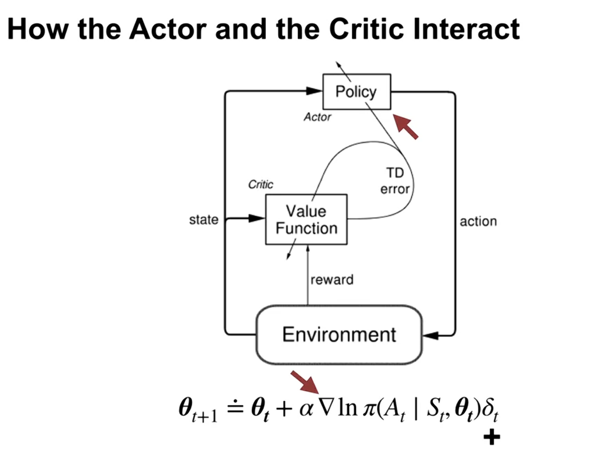
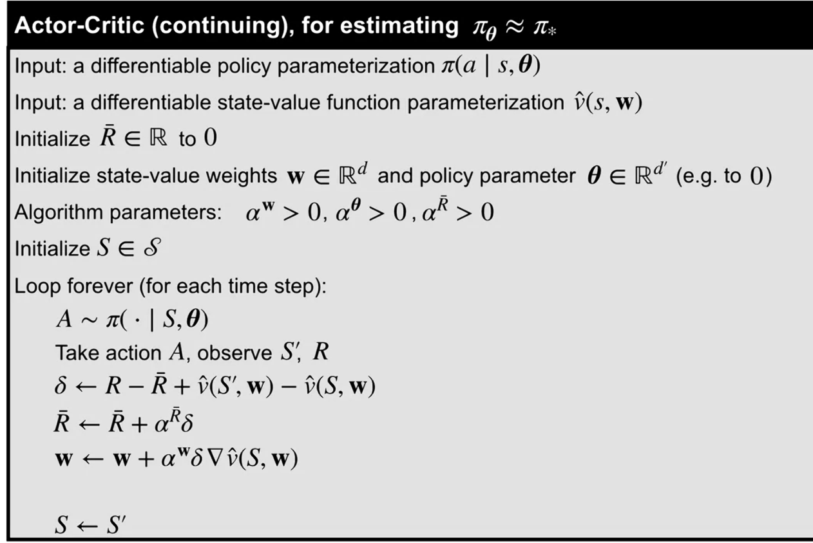

# Course 3 — Prediction and Control with Function Approximation
## Module 5: Policy Gradient

> **이 모듈을 한 문장으로**: 지금까지는 "각 행동이 얼마나 좋은가(가치)"를 먼저 배우고 거기서 정책을 *유도*했습니다. 이번 모듈은 그 중간 단계를 건너뛰고 **정책 그 자체를 학습 대상으로** 삼습니다. "이 상황에서 뭘 할까?"를 직접 배우는 것이죠.

---

# Part 1: Learning Parameterized Policies

---

### Learning Policies Directly

---

## 한 줄 요약

행동 가치를 거치지 않고 **정책 자체를 파라미터화**하는 새로운 방법을 도입합니다. Softmax 함수를 이용하면 유효한 확률 분포를 보장하는 정책 파라미터화가 가능합니다.

---

## 핵심 개념 정리

### 왜 정책을 "직접" 배우려 할까?

지금까지의 방식을 떠올려 봅시다. 행동 가치 $q(s,a)$를 학습한 뒤, "가장 가치가 높은 행동을 고른다(+가끔 탐험)"는 규칙으로 정책을 만들었습니다. 즉 **가치 → 정책** 순서였습니다.

이번에는 순서를 뒤집습니다. 가치를 거치지 않고 **정책을 곧장 함수로 표현**합니다. 마치 운전을 배울 때, "이 길의 모든 경우의 점수표를 외운 뒤 그중 최고점을 고르는" 대신, "이 상황에선 핸들을 이만큼 꺾는다"는 행동 규칙 자체를 몸에 익히는 것과 비슷합니다.

### 직접 정책 파라미터화

파라미터 벡터 $\theta$로 정책을 직접 표현합니다.

$$\pi(a \mid s, \theta) = \text{(상태 } s\text{에서 행동 } a\text{를 선택할 확률)}$$

표기 약속: 가치 함수의 파라미터는 $\mathbf{w}$, 정책의 파라미터는 $\theta$로 구분해서 씁니다. 앞으로 둘이 동시에 등장하므로 이 구분을 기억해 두면 헷갈리지 않습니다.

**유효한 정책이 되려면** 출력이 진짜 "확률"처럼 행동해야 합니다. 두 가지 조건이 필요합니다:

1. 모든 행동에 대해 $\pi(a \mid s, \theta) \geq 0$  (음수 확률은 말이 안 됨)
2. 각 상태에서 $\sum_a \pi(a \mid s, \theta) = 1$  (모든 선택지의 확률을 더하면 1)

> **왜 선형 함수를 정책으로 그냥 쓸 수 없을까요?**
> 선형 함수 $\mathbf{x}(s,a)^\top \theta$의 출력은 $-\infty$부터 $+\infty$까지 어떤 값이든 나올 수 있습니다. 음수도 나오고, 여러 행동의 출력을 더해도 1이 된다는 보장이 전혀 없습니다. 즉 선형 함수의 날것 출력은 위 두 조건을 만족하지 못합니다. 그래서 "출력을 확률로 변환해 주는 장치"가 한 겹 더 필요합니다 — 그게 바로 Softmax입니다.

---

### Softmax 정책 파라미터화

핵심 아이디어는 두 단계입니다. 먼저 각 행동에 **행동 선호도(Action Preference)** $h(s, a, \theta)$라는 "점수"를 매기고, 그다음 Softmax로 이 점수들을 확률로 변환합니다.

$$\pi(a \mid s, \theta) = \frac{e^{h(s, a, \theta)}}{\sum_{a'} e^{h(s, a', \theta)}}$$

Softmax가 위의 두 조건을 어떻게 자동으로 보장하는지 보면 깔끔합니다:

- **지수 함수 $e^{(\cdot)}$** → 어떤 점수를 넣어도 결과는 항상 양수. 조건 1 해결.
- **분모로 전체 합을 나눔(정규화)** → 모든 행동 확률의 합이 정확히 1. 조건 2 해결.
- $h(s, a, \theta)$ 자체는 선형 함수든 신경망이든 **어떤 형태든** 가능. 점수만 뱉어 주면 Softmax가 나머지를 처리합니다.

> **직관적 비유**: Softmax는 "득표수를 득표율로 바꾸는 개표 방식"입니다. 각 후보(행동)가 받은 점수 $h$를 지수로 부풀린 뒤, 전체로 나눠 백분율(확률)을 만듭니다. 점수가 높을수록 더 큰 몫을 가져가되, 0%나 음수는 절대 나오지 않습니다.

**행동 선호도는 행동 가치와 다릅니다.** 이 점이 중요합니다. 가치 $q(s,a)$는 "그 행동의 실제 기대 보상"이라는 절대적 의미가 있지만, 선호도 $h$는 **상대적 차이만** 의미가 있습니다. 모든 행동의 선호도에 똑같이 +100을 더해도 확률은 하나도 변하지 않습니다 (분자·분모에서 $e^{100}$이 약분되어 사라지기 때문입니다). 즉 Softmax가 보는 것은 "누가 누구보다 얼마나 더 높은가"이지, 점수의 절대 크기가 아닙니다.

---

### ε-greedy vs Softmax 비교

| 특성 | ε-greedy | Softmax |
| :--- | :--- | :--- |
| 최선 행동 선택 확률 | $1-\epsilon+\epsilon/\|A\|$ | $\propto e^{h_{\max}}$ |
| 나쁜 행동 선택 확률 | $\epsilon/\|A\|$ (고정) | $\propto e^{h_{\min}}$ (매우 작아질 수 있음) |
| 탐험 제어 | $\epsilon$ 수동 조정 | 선호도 차이로 자연스럽게 조정 |

이 차이를 한 장면으로 그려 보면 이렇습니다. 어떤 행동이 **명백히 끔찍하다**는 걸 충분히 배웠다고 합시다.

- **ε-greedy**: 그래도 $\epsilon$ 확률(예: 10%)로는 그 끔찍한 행동을 *계속* 고릅니다. 절벽에서 뛰어내리는 게 나쁜 줄 알면서도 정해진 확률만큼 자꾸 시도하는 셈입니다. 탐험의 양이 행동의 좋고 나쁨과 무관하게 고정되어 있습니다.
- **Softmax**: 끔찍한 행동의 선호도 $h$가 낮게 학습되면, 그 확률이 자연스럽게 0에 가까워집니다. 반면 좋고 나쁨이 애매한 행동들 사이에서는 여전히 골고루 시도합니다. **확신이 생긴 만큼만 탐험을 줄이는** 똑똑한 방식입니다.

---

## 이전 내용과의 연결 / 다음으로 이어지는 흐름

정책을 직접 파라미터화하는 도구(Softmax)를 손에 넣었습니다. 그런데 "할 수 있다"와 "할 가치가 있다"는 다른 문제죠. 다음 영상에서는 이 방식이 행동 가치 방식과 비교해 **구체적으로 어떤 점에서 유리한지** 세 가지 장점으로 따져 봅니다.

---

### Advantages of Policy Parameterization

---

## 한 줄 요약

파라미터화된 정책은 **자율적 탐험 감소**, **확률적 최적 정책 표현**, **단순한 정책 구조 활용** 세 가지 면에서 행동 가치 방식보다 유리할 수 있습니다.

---

## 핵심 개념 정리

### 장점 1: 탐험을 스스로 줄인다

ε-greedy의 약점은 "언제 탐험을 줄여야 하는가"를 사람이 외부에서 정해 줘야 한다는 점입니다. 학습 초반엔 많이 탐험하고 후반엔 줄이고 싶은데, 에이전트는 자기가 지금 초반인지 후반인지 스스로 판단하기 어렵습니다. 그래서 보통 "$\epsilon$을 점점 줄이는 스케줄"을 손으로 짜 줍니다.

파라미터화된 정책은 이걸 알아서 합니다. 학습이 잘 진행될수록 좋은 행동의 선호도 $h$가 다른 행동보다 점점 더 커지고, Softmax 확률이 자연스럽게 한 행동 쪽으로 쏠립니다 — 즉 점점 결정론적(확신에 찬) 정책에 가까워집니다. **확신이 쌓이는 만큼 탐험이 저절로 줄어드는** 것이죠. 별도의 스케줄이 필요 없습니다.

---

### 장점 2: 확률적 정책이 "정답"일 때가 있다

테이블 방식(상태마다 값을 따로 저장)에서는 항상 결정론적 최적 정책이 존재합니다. 하지만 **함수 근사를 쓰면, 일부러 동전을 던지는(확률적) 정책이 최선**일 수 있습니다. 직관에 어긋나 보이니 예시로 짚어 봅시다.

**복도(corridor) 예시** — 세 칸짜리 좁은 복도를 상상하세요 (왼쪽 칸·중간 칸·오른쪽 칸). 출구는 오른쪽 끝에 있습니다.

- 함정은, **함수 근사가 세 칸을 똑같이 생긴 것으로 본다**는 점입니다. 에이전트는 자기가 어느 칸에 있는지 구별하지 못하고, 세 칸 모두에서 똑같은 확률로 행동해야 합니다.
- 게다가 중간 칸에서는 좌우 행동의 효과가 뒤바뀌어 있습니다 (오른쪽을 누르면 왼쪽으로 가는 식의 함정).
- **항상 왼쪽**으로만 가는 결정론적 정책 → 출구에서 영영 멀어져 시작 칸에 갇힘.
- **항상 오른쪽**으로만 가는 정책 → 중간 칸의 함정 때문에 중간 칸과 시작 칸 사이를 무한히 왕복.
- 두 경우 모두 탈출 불가, 기대 리턴 $= -\infty$.
- 그런데 **확률적 정책(오른쪽 59%, 왼쪽 41%)**: 매번 주사위를 굴리듯 움직이면, 운 좋게 함정을 빠져나오는 경로가 결국 만들어집니다. 기대 리턴 $\approx -11.6$ → 두 결정론적 정책보다 압도적으로 좋습니다.

> **직관적 비유**: 눈을 가린 채 똑같이 생긴 방 세 개를 헤매는 상황입니다. 어느 방이든 "무조건 같은 방향"으로 고집하면 막다른 패턴에 갇힙니다. 반면 매번 동전을 던지면, 갇힐 패턴이 깨지면서 결국 출구로 빠져나올 수 있습니다. ε-greedy 위에 얹힌 가치 방식은 "최선의 한 행동 + 균일한 잡음"만 표현하지만, 정책 파라미터화는 **임의의 확률 배합(59:41 같은)**을 직접 표현할 수 있어 이런 미묘한 최적해를 잡아냅니다.

---

### 장점 3: 정책이 가치 함수보다 단순할 수 있다

때로는 "각 행동이 정확히 얼마나 좋은가"를 다 아는 것보다, "무엇을 할지"가 훨씬 단순합니다.

**Mountain Car 예시**: 골짜기에 갇힌 자동차가 언덕을 오르는 과제입니다. 여기서 최적 정책은 거의 한 줄로 요약됩니다 — **"지금 움직이는 방향으로 계속 가속하라"** (그래야 진자처럼 반동을 키워 언덕을 넘습니다). 반면 가치 함수 $v(s)$는 위치·속도에 따라 출렁이는 복잡한 곡면입니다.

즉 *어떻게 행동할지(정책)*는 단순한데 *각 상태가 얼마나 좋은지(가치)*는 복잡한 상황입니다. 이럴 땐 복잡한 가치 함수를 굳이 정확히 학습하느라 애쓰지 말고, 단순한 정책을 직접 배우는 편이 훨씬 빠르고 효율적입니다.

---

## 비교 / 정리 표

| 항목 | 행동 가치 방식 | 파라미터화된 정책 방식 |
| :--- | :--- | :--- |
| 탐험 감소 | 수동 ($\epsilon$ 조정) | 자동 (학습으로) |
| 확률적 최적 정책 | 표현 어려움 | 자연스럽게 표현 가능 |
| 정책이 단순할 때 | 복잡한 가치 함수 필요 | 직접 학습 가능 |

---

## 이전 내용과의 연결 / 다음으로 이어지는 흐름

정책을 직접 배우는 게 *왜* 좋은지 납득했습니다. 이제 남은 질문은 "그래서 **무엇을 기준으로** 정책이 좋다/나쁘다를 판단하고 개선할 것인가?"입니다. 다음 영상에서는 그 기준, 즉 **목적 함수**를 평균 보상 설정에서 정의합니다.

---

# Part 2: Policy Gradient for Continuing Tasks

---

### The Objective for Learning Policies

---

## 한 줄 요약

정책 파라미터 $\theta$를 최적화할 목적 함수로 **평균 보상** $\bar{r}(\pi)$를 사용합니다. 핵심 도전은 $\mu$가 $\pi$에 의존하므로 그래디언트 계산이 복잡하다는 것입니다.

---

## 핵심 개념 정리

### 목적 함수: 평균 보상

무언가를 "최적화"하려면 먼저 **점수표**가 있어야 합니다. 정책의 점수표로 무엇을 쓸까요? 끝이 없는 연속 과제(continuing task)에서는 "총 보상의 합"이 무한대로 발산해 버리므로 쓸 수 없습니다. 대신 **시간당 평균적으로 얼마나 보상을 받는가**, 즉 평균 보상을 점수로 씁니다.

$$\bar{r}(\pi) = \sum_s \mu(s) \sum_a \pi(a \mid s, \theta) \sum_{s', r} p(s', r \mid s, a) \cdot r$$

수식이 길지만, **밖에서 안으로 읽으면** "평균의 평균의 평균"이라는 구조가 보입니다:

- 가장 안쪽 $\sum_{s', r} p(\cdot)\, r$ : 상태 $s$에서 행동 $a$를 했을 때 받는 **기대 보상** (환경의 무작위성에 대한 평균).
- 중간 $\sum_a \pi(a\mid s,\theta)[\cdots]$ : 그 상태에서 **정책이 행동을 고르는 비율로 가중평균**. "이 상태에 있다면 평균 얼마를 받는가."
- 바깥 $\sum_s \mu(s)[\cdots]$ : 각 상태에 **실제로 얼마나 자주 머무는지($\mu$)로 가중평균**.

> **$\mu(s)$가 뭔가요?** 정책 $\pi$를 따라 오래 돌아다녔을 때, 전체 시간 중 상태 $s$에 머무는 비율입니다 (정상 상태 분포, stationary distribution). 자주 방문하는 상태의 보상이 평균에 더 크게 반영되는 게 당연하므로, 이 가중치가 들어갑니다.

---

### 최적화 전략: 경사 "상승"법

목표는 $\bar{r}(\pi)$를 **최대화**하는 것입니다 (보상은 클수록 좋으니까요). 손실을 줄이는 경사 하강법과 달리, 점수를 키워야 하므로 **경사 상승법(gradient ascent)** — 그래디언트 *방향으로* 한 걸음씩 올라갑니다.

$$\theta \leftarrow \theta + \alpha \nabla_\theta \bar{r}(\pi)$$

부호가 $+$인 데 주목하세요. 산을 내려가는 게 아니라 올라가는 중입니다.

---

### 핵심 도전: $\mu$가 $\pi$에 의존한다

여기서 진짜 어려움이 등장합니다. 그래디언트 $\nabla_\theta \bar{r}$를 구하려면 위 식을 $\theta$로 미분해야 하는데, 식 안에 $\theta$가 **두 군데** 숨어 있습니다.

- $\pi(a\mid s,\theta)$ — 당연히 $\theta$에 의존 (이건 다루기 쉽습니다).
- $\mu(s)$ — **이것도 $\theta$에 의존합니다.** 정책을 바꾸면 돌아다니는 경로가 바뀌고, 그러면 각 상태에 머무는 비율 $\mu$도 통째로 바뀌기 때문입니다.

가치 함수 근사 때(Module 2)는 정책이 고정이라 $\mu$가 상수였기에 신경 쓸 필요가 없었습니다. 하지만 지금은 우리가 바꾸려는 대상($\theta$)이 $\mu$까지 흔들어 놓습니다.

> **비유**: 강물의 흐름($\pi$)을 바꾸면 강바닥의 모래가 쌓이는 위치($\mu$)도 바뀝니다. "흐름을 이렇게 바꾸면 보상이 얼마나 늘까?"를 계산하려는데, 그 변화가 강바닥 지형까지 동시에 바꿔 버리니 계산이 꼬입니다. $\nabla_\theta \mu$(강바닥이 어떻게 변하는지)를 추정하는 일은 매우 어렵습니다.

다행히 다음 영상의 **정책 그래디언트 정리**가 이 $\nabla_\theta \mu$ 문제를 마법처럼 제거해 줍니다.

---

## 이전 내용과의 연결 / 다음으로 이어지는 흐름

점수표(목적 함수)는 정의했지만, 그 점수를 올리는 방향($\nabla_\theta \bar{r}$)을 계산하는 데 $\mu$ 때문에 막혔습니다. 다음 영상의 **정책 그래디언트 정리**가 이 매듭을 풉니다.

---

### The Policy Gradient Theorem

---

## 한 줄 요약

**정책 그래디언트 정리**는 $\nabla_\theta \bar{r}$를 $\nabla_\theta \mu$가 포함되지 않는 단순한 형태로 재표현합니다. 이 덕분에 에이전트 경험에서 그래디언트를 직접 추정할 수 있습니다.

---

## 핵심 개념 정리

### 정책 그래디언트 정리

$$\nabla_\theta \bar{r}(\pi) \propto \sum_s \mu(s) \sum_a \nabla_\theta \pi(a \mid s, \theta) \cdot q_\pi(s, a)$$

이 식의 아름다움은 **무엇이 사라졌는가**에 있습니다.

- 앞 영상에서 골칫거리였던 $\nabla_\theta \mu$가 **완전히 사라졌습니다.** $\mu(s)$는 여전히 가중치로 등장하지만, 더 이상 미분할 필요가 없습니다. 이게 정리의 핵심이자 전부입니다.
- 남은 것은 우리가 다룰 수 있는 두 조각의 곱입니다: **정책의 그래디언트** $\nabla_\theta \pi$ × **행동 가치** $q_\pi(s,a)$.

> 기호 $\propto$(비례)는 "정확히 같진 않지만 양의 상수배"라는 뜻입니다. 그래디언트 상승법에서는 방향만 맞으면 되고 크기는 학습률 $\alpha$가 흡수하므로, 비례 상수는 무시해도 괜찮습니다.

---

### 직관적 이해: "좋은 행동을 더 자주"

식을 행동 하나 단위로 뜯어보면 의미가 선명해집니다. 각 행동마다 두 항이 곱해집니다:

- $\nabla_\theta \pi(a \mid s, \theta)$ — **방향**: 파라미터를 어느 쪽으로 밀어야 이 행동의 확률이 커지는가.
- $q_\pi(s, a)$ — **가중치(부호 포함)**: 그 행동이 실제로 얼마나 좋은가.

두 항의 곱을 모든 상태·행동에 대해 합치면, 전체 효과는 한마디로 **"좋은 행동($q>0$)의 확률은 키우고, 나쁜 행동($q<0$)의 확률은 줄이는 방향"**입니다. 가치가 클수록 더 세게 밀어 줍니다.

**그리드 월드 예시** (오른쪽 아래 모서리에 보상 칸이 있다고 합시다):

- 위·왼쪽으로 가는 행동 → 보상에서 멀어짐 → $q$가 음수 → 그 확률을 **줄이는** 방향으로 파라미터를 민다.
- 아래·오른쪽으로 가는 행동 → 보상에 가까워짐 → $q$가 양수 → 그 확률을 **키우는** 방향으로 민다.

> **비유**: 코치가 선수의 모든 동작을 지켜보다가, 좋은 동작(높은 $q$)에는 "그거야, 더 자주 해!"라며 그 행동 확률을 끌어올리고, 나쁜 동작에는 "그건 줄여"라며 확률을 낮춥니다. 끌어당기는 힘의 세기가 바로 $q$ 값입니다.

> 정리의 엄밀한 증명은 교재를 참고하세요. 우리에게 중요한 건 결론입니다 — 이 정리 덕분에 에이전트가 **직접 겪은 상태·행동 샘플만으로** 그래디언트를 추정할 길이 열렸습니다.

---

## 이전 내용과의 연결 / 다음으로 이어지는 흐름

깔끔한 그래디언트 표현식을 얻었습니다. 하지만 식에는 여전히 "모든 상태에 대한 합 $\sum_s$"과 "모든 행동에 대한 합 $\sum_a$", 그리고 우리가 모르는 $q_\pi$가 들어 있습니다. 다음 영상에서는 이걸 **에이전트의 실제 경험 한 스텝으로** 어떻게 추정하는지 유도합니다.

---

# Part 3: Actor-Critic for Continuing Tasks

---

### Estimating the Policy Gradient

---

## 한 줄 요약

정책 그래디언트 정리의 표현식을 상태·행동 샘플 하나로 추정하는 **확률적 경사 상승법** 업데이트를 유도합니다. 로그 확률의 그래디언트($\nabla \log \pi$) 트릭을 이용해 표현을 단순화합니다.

---

## 핵심 개념 정리

### 큰 합($\sum$)을 샘플 하나로 바꾸는 마법

정리의 식에는 "모든 상태의 합"과 "모든 행동의 합"이 들어 있어, 그대로는 계산할 수 없습니다 (상태가 무수히 많으니까요). 핵심 아이디어는 **"합 = 기댓값 = 샘플 평균"**이라는 통계의 다리를 건너는 것입니다. 한 번에 하나씩 바꿔 봅시다.

**1단계 — 상태 합 없애기.** $\sum_s \mu(s)[\cdots]$는 정의상 "$\mu$를 따라 상태를 뽑았을 때의 기댓값"입니다. 그런데 에이전트가 정책을 따라 돌아다니면, 자연히 방문하는 상태 $S_t$가 바로 $\mu$에서 뽑은 샘플입니다. 그러니 합을 통째로 지우고, **지금 내가 있는 상태 $S_t$** 하나로 대체합니다:

$$\nabla_\theta \bar{r} \approx \sum_a \nabla_\theta \pi(a \mid S_t, \theta) \cdot q_\pi(S_t, a)$$

**2단계 — 행동 합 없애기 (영리한 1 곱하기).** 남은 $\sum_a$도 기댓값으로 바꾸고 싶은데, 모양이 $\mathbb{E}_\pi$(정책을 따라 뽑은 행동의 평균)가 아닙니다. 여기서 트릭은 **$\frac{\pi}{\pi}=1$을 곱하는 것**입니다 (값은 안 변하죠):

$$\sum_a \nabla_\theta \pi \cdot q_\pi = \sum_a \pi(a\mid S_t,\theta)\cdot\frac{\nabla_\theta \pi}{\pi}\cdot q_\pi = \mathbb{E}_\pi\left[ \frac{\nabla_\theta \pi(A \mid S_t, \theta)}{\pi(A \mid S_t, \theta)} \cdot q_\pi(S_t, A) \right]$$

이제 앞에 $\pi(a\mid S_t,\theta)$가 붙으면서 "정책으로 가중한 평균", 즉 $\mathbb{E}_\pi$ 모양이 됐습니다.

**3단계 — 행동도 샘플 하나로.** 정책을 따라 실제로 고른 행동 $A_t$가 바로 이 기댓값의 샘플입니다. 기댓값 기호를 떼고 $A_t$를 넣으면 끝납니다.

> **요약**: "모든 상태×행동에 대한 합"이라는 거대한 계산을, **"내가 방금 지나온 한 상태, 한 행동"** 하나로 추정해 냈습니다. 이것이 확률적 경사 상승법(SGD의 상승 버전)의 핵심입니다.

---

### 로그 확률 그래디언트 트릭

2단계에서 생긴 $\dfrac{\nabla_\theta \pi}{\pi}$라는 조각은, 미적분의 한 공식 덕분에 더 예쁘게 정리됩니다:

$$\frac{\nabla_\theta \pi(a \mid s, \theta)}{\pi(a \mid s, \theta)} = \nabla_\theta \ln \pi(a \mid s, \theta)$$

이건 로그의 미분 공식 $\dfrac{d}{dx}\ln f = \dfrac{f'}{f}$를 그대로 읽은 것입니다. 덕분에 업데이트 규칙이 깔끔해집니다:

$$\theta \leftarrow \theta + \alpha \cdot \nabla_\theta \ln \pi(A_t \mid S_t, \theta) \cdot q_\pi(S_t, A_t)$$

> **왜 굳이 로그로 바꾸나요?** 두 가지 이득이 있습니다. 첫째, 분수($\nabla\pi/\pi$)를 직접 다루는 것보다 $\ln\pi$를 미분하는 편이 Softmax·Gaussian 같은 실제 분포에서 식이 훨씬 간단해집니다 (지수가 로그를 만나 상쇄되거든요). 둘째, 곱셈이 덧셈으로 풀려 계산이 안정적입니다. 값은 그대로이고 형태만 다루기 쉽게 바꾼 **수학적 트릭**일 뿐, 본질은 동일합니다.

남은 문제는 하나입니다 — 식 안의 $q_\pi(S_t, A_t)$를 우리는 아직 모릅니다. **이걸 어떻게 추정하느냐**가 다음 영상의 주제입니다 (스포일러: TD 오차를 씁니다).

---

## 이전 내용과의 연결 / 다음으로 이어지는 흐름

정책을 업데이트하는 규칙(Actor의 학습 규칙)을 완성했습니다. 이제 그 규칙에 필요한 $q_\pi$를 채워 줄 조력자가 필요합니다. 다음 영상에서 가치를 TD로 추정하는 **비평가(Critic)**를 도입해, 완전한 Actor-Critic 알고리즘을 만듭니다.

---

### Actor-Critic Algorithm

---

## 한 줄 요약

**Actor (정책)** 와 **Critic (가치 함수)** 가 동시에 학습합니다. Critic이 제공하는 TD 오차를 기저선(baseline) 차감과 함께 Actor 업데이트에 사용하면, 기댓값을 바꾸지 않으면서도 분산을 줄일 수 있습니다.

---

## 핵심 개념 정리

### 두 주인공: 배우와 비평가

이름이 모든 걸 말해 줍니다.

- **Actor(배우, $\theta$)**: 실제로 행동을 결정하는 정책. "무엇을 할까"를 담당.
- **Critic(비평가, $\mathbf{w}$)**: 그 행동이 좋았는지 평가하는 가치 함수. "방금 그거 잘했어/못했어"를 담당.

> **비유**: 무대 위 배우(Actor)가 연기를 하고, 객석의 비평가(Critic)가 점수를 매깁니다. 배우는 비평가의 평가를 듣고 연기를 다듬고, 비평가는 실제 공연 결과를 보며 자기 안목을 갈고닦습니다. 둘이 함께 성장합니다.

### Critic: 차동 가치 함수 학습

앞 영상에서 비워 둔 $q_\pi$를 Critic이 채웁니다. 다만 $q$를 통째로 배우는 대신, TD(시간차 학습)로 **한 스텝 앞을 내다본 부트스트랩 추정**을 씁니다:

$$U_t = R_{t+1} - \bar{R} + \hat{v}(S_{t+1}, \mathbf{w})$$

- $\hat{v}$ : **차동 가치 함수(differential value)** — 평균 보상 설정에서 쓰는 가치입니다. "이 상태가 *평균보다* 얼마나 좋은가"를 재는 값이라, 식에 $-\bar{R}$(평균 보상 빼기)가 들어갑니다.
- Critic은 이 $\hat{v}$를 평균 보상 버전의 Semi-gradient TD로 학습하며 $\mathbf{w}$를 갱신합니다.

---

### 기저선 차감 (Baseline Subtraction): 분산을 줄이는 비결

여기서 한 끗 차이의 개선이 등장합니다. Actor 업데이트에 $U_t$를 그대로 쓰는 대신, **현재 상태의 가치 $\hat{v}(S_t)$를 빼 줍니다.** 그 결과가 바로 익숙한 **TD 오차** $\delta_t$입니다:

$$\delta_t = R_{t+1} - \bar{R} + \hat{v}(S_{t+1}, \mathbf{w}) - \hat{v}(S_t, \mathbf{w})$$

**왜 빼도 되는가 (편향 없음).** 빼는 항 $\hat{v}(S_t)$는 *상태*에만 의존하고 *어떤 행동을 골랐는지*와는 무관합니다. 그런 항은 정책 그래디언트의 기댓값에서 정확히 0으로 상쇄됩니다:

$$\mathbb{E}_\pi\left[ \nabla_\theta \ln \pi(A_t \mid S_t, \theta) \cdot \hat{v}(S_t, \mathbf{w}) \right] = 0$$

즉 평균적으로는 아무것도 바꾸지 않습니다 — 업데이트의 *방향*은 그대로입니다.

**그런데 왜 빼는가 (분산 감소).** $U_t$를 그냥 쓰면 그 절댓값이 들쭉날쭉 큽니다. 반면 $\delta_t$는 "이 행동이 **Critic이 기대했던 것보다** 얼마나 더/덜 좋았나"라는 *상대 평가*입니다. 기대를 기준점으로 빼 주니 값의 출렁임(분산)이 확 줄고, 학습이 안정적이고 빨라집니다.

> **비유**: 시험 점수 70점을 받았을 때, "70점"이라는 절대 점수만 보면 좋은 건지 알 수 없습니다. 하지만 "**반 평균보다 +15점**"이라고 하면 정보가 또렷합니다. 기저선($\hat{v}(S_t)$)을 빼는 건 *평균 대비 얼마나 잘했는가*로 바꿔 보는 것 — 채점을 상대평가로 바꾸는 셈입니다. 평균을 빼도 등수(방향)는 안 바뀌지만, 점수의 변동 폭은 작아집니다.


---

### Actor 업데이트

이제 모르던 $q_\pi$ 자리에 Critic이 만든 $\delta_t$를 꽂으면, Actor의 학습 규칙이 완성됩니다:

$$\theta \leftarrow \theta + \alpha_\theta \cdot \delta_t \cdot \nabla_\theta \ln \pi(A_t \mid S_t, \theta)$$

부호 하나로 직관이 끝납니다:

- $\delta_t > 0$ → 고른 행동이 **기대 이상**이었다 → 그 행동의 확률을 **올린다**.
- $\delta_t < 0$ → 고른 행동이 **기대 이하**였다 → 그 행동의 확률을 **내린다**.

"기대보다 잘했으면 더 하고, 못했으면 줄인다." 이게 Actor-Critic 학습의 한 줄 정신입니다.

---

### 평균 보상 Actor-Critic 전체 알고리즘

```
초기화: R̄=0, w=0, θ=0, 스텝 크기 α_w, α_θ, α_R̄
S 초기화

루프 (영원히):
  A ~ π(·|S, θ) 선택                    # Actor가 행동 결정
  R, S' 관측                            # 환경 반응
  δ = R - R̄ + v̂(S', w) - v̂(S, w)     # TD 오차 = 평가 신호
  R̄ ← R̄ + α_R̄ · δ                      # 평균 보상 갱신
  w ← w + α_w · δ · ∇v̂(S, w)            # Critic 학습 (안목 다듬기)
  θ ← θ + α_θ · δ · ∇ln π(A|S, θ)      # Actor 학습 (연기 다듬기)
  S ← S'
```

주목할 점: **하나의 신호 $\delta$가 세 가지 업데이트(평균 보상·Critic·Actor)를 동시에 굴립니다.** 그래서 코드가 놀랄 만큼 짧습니다. 에피소드 종료 없이 무한히 돌면서 정책이 계속 개선됩니다.

---

## 비교 / 정리 표

| 구성 요소 | 역할 | 업데이트 |
| :--- | :--- | :--- |
| Actor ($\theta$) | 정책 결정 (무엇을 할까) | $\delta_t \cdot \nabla_\theta \ln \pi$ |
| Critic ($\mathbf{w}$) | 가치 평가 (잘했나) | $\delta_t \cdot \nabla_\mathbf{w} \hat{v}$ |
| 평균 보상 ($\bar{R}$) | 기준선 보정 | $\alpha_{\bar{R}} \cdot \delta_t$ |


---

## 이전 내용과의 연결 / 다음으로 이어지는 흐름

Actor-Critic의 골격을 완성했습니다. 다만 지금까지 $\pi$와 $\hat{v}$는 "어떤 함수"라고만 두었습니다. 다음 파트에서는 이걸 **구체적인 형태(Softmax, Gaussian)**로 채워 실제로 굴러가는 코드를 만듭니다.

---

# Part 4: Policy Parameterizations

---

### Actor-Critic with Softmax Policies

---

## 한 줄 요약

선형 행동 선호도 + Softmax 정책 파라미터화에서 Actor-Critic 업데이트를 구체화합니다. Actor의 그래디언트 = **선택한 행동의 특징 벡터 − 정책 가중 평균 특징 벡터**입니다.

---

## 핵심 개념 정리

### 구체적 파라미터화 선택

추상적이던 $\pi$와 $\hat{v}$에 실제 형태를 넣습니다. 가장 단순한 선형 버전으로:

- **Critic** ($\mathbf{w}$): 선형 가치 함수 $\hat{v}(s, \mathbf{w}) = \mathbf{x}(s)^\top \mathbf{w}$
- **Actor** ($\theta$): 선형 행동 선호도 + Softmax

$$h(s, a, \theta) = \mathbf{x}(s, a)^\top \theta, \qquad \pi(a \mid s, \theta) = \frac{e^{h(s,a,\theta)}}{\sum_{a'} e^{h(s,a',\theta)}}$$

여기서 미묘하지만 중요한 차이가 있습니다. Critic은 **상태**만 보면 되니 상태 특징 $\mathbf{x}(s)$를 쓰지만, Actor는 행동마다 다른 점수를 매겨야 하니 **상태-행동** 특징 $\mathbf{x}(s, a)$가 필요합니다.

> **Stacking이 뭔가요?** 상태 특징 $\mathbf{x}(s)$ 하나로 행동별 특징 $\mathbf{x}(s,a)$를 만드는 흔한 방법입니다. 행동이 3개라면, 길이 3배짜리 긴 벡터를 만들어 "해당 행동 자리에만 $\mathbf{x}(s)$를 넣고 나머지는 0으로" 채웁니다. 마치 객실 3개짜리 사물함에서 자기 칸에만 짐을 넣는 것과 같습니다. 그래서 $|\theta| = 3 \times |\mathbf{w}|$ (행동 3개 가정 시)가 됩니다.

---

### 업데이트 공식

**Critic 업데이트** (Semi-gradient TD): 선형이라 $\nabla \hat{v} = \mathbf{x}(S_t)$이므로 매우 간단합니다.

$$\mathbf{w} \leftarrow \mathbf{w} + \alpha_w \cdot \delta \cdot \mathbf{x}(S_t)$$

**Actor 업데이트** (Softmax 그래디언트): Softmax에 로그 트릭을 적용하면 그래디언트가 놀랍도록 깔끔한 형태로 떨어집니다 —

$$\nabla_\theta \ln \pi(A_t \mid S_t, \theta) = \mathbf{x}(S_t, A_t) - \sum_{a'} \pi(a' \mid S_t, \theta) \cdot \mathbf{x}(S_t, a')$$

$$\theta \leftarrow \theta + \alpha_\theta \cdot \delta \cdot \left[ \mathbf{x}(S_t, A_t) - \sum_{a'} \pi(a' \mid S_t, \theta) \cdot \mathbf{x}(S_t, a') \right]$$

> **직관**: 대괄호 안은 **"실제로 고른 행동의 특징"** 빼기 **"정책이 평균적으로 기대하던 특징"**입니다.
> - 앞 항 $\mathbf{x}(S_t, A_t)$: 내가 한 행동.
> - 뒤 항 $\sum_{a'}\pi\cdot\mathbf{x}$: 현재 정책이 "보통 이쯤 하겠지" 하고 기대하는 평균 행동.
>
> 만약 고른 행동이 평균과 똑같았다면 차이는 0 — 배울 게 없습니다. 평균과 다른 행동을 했고($\mathbf{x}(S_t,A_t)$가 튀고) 그 결과가 좋았다면($\delta>0$), 그쪽으로 파라미터를 밀어 "그 색다른 행동을 다음엔 더 자주" 하게 만듭니다. **"예상을 벗어난 시도가 통했으면 그 방향으로 굳힌다"**는 학습입니다.

---

## 이전 내용과의 연결 / 다음으로 이어지는 흐름

이산 행동에서 굴러가는 구체적 공식을 손에 넣었습니다. 다음 영상에서는 이 알고리즘을 **진자 세우기(pendulum swing-up)** 라는 실제 과제에 적용해, 정말 학습이 되는지 눈으로 확인합니다.

---

### Demonstration with Actor-Critic

---

## 한 줄 요약

진자 균형 과제(Pendulum Swing-Up)에 Softmax Actor-Critic을 적용합니다. Tile Coding 특징 설계와 스텝 크기 설정이 핵심이며, 에이전트는 에너지 축적 후 균형 유지를 빠르게 학습합니다.

---

## 핵심 개념 정리

### 환경 설정

| 항목 | 내용 |
| :--- | :--- |
| 상태 | (각도, 각속도) — 2차원 연속값 |
| 행동 | 시계방향 가속 / 반시계방향 가속 / 정지 (3개 이산) |
| 보상 | $-\|\theta_{\text{angle}}\|$ (수직에서 벗어난 각도만큼 매 스텝 벌점) |
| 제약 | 각속도 $[-2\pi, 2\pi]$ 초과 시 리셋 |
| 과제 유형 | 연속 과제 (에피소드 없음) |

보상이 "수직에서 벗어난 만큼 벌점"이므로, 진자를 똑바로 세워 둘수록 벌점이 0에 가까워집니다 — 그게 목표입니다.

**왜 어려운 과제일까요?** 엔진 힘이 약해서 **곧장 밀어 올릴 수 없습니다.** 그래서 그네를 타듯 반대 방향으로 먼저 흔들어 **에너지를 모은 뒤** 반동으로 올려야 합니다 (Mountain Car와 같은 원리). 게다가 꼭대기(수직)는 불안정한 위치라, 올린 뒤에도 끊임없이 미세 조정해 **균형을 유지**해야 합니다. "올리기"와 "버티기" 두 기술이 모두 필요합니다.

---

### 특징 설계

- **Tile Coding**: 32개 Tiling, 각 8×8 격자. (연속 상태를 격자로 잘게 나눠 표현하는 방법 — Module 3 복습)
- **크고 많은 타일의 조합**: 타일이 크면 초반에 넓게 일반화해 빨리 배우고, 타일이 많으면 나중에 세밀하게 구별합니다. 두 마리 토끼를 함께 잡는 설계입니다.
- **행동 처리**: 앞서 본 Stacking (행동 3개 × 상태 특징).

> **스텝 크기의 핵심 직관**: Critic이 Actor보다 빨라야 합니다. 비평가의 안목이 아직 엉망인데 배우가 그 평가만 믿고 연기를 바꾸면 엉뚱하게 학습됩니다. **Critic이 먼저 어느 정도 정확해져야** Actor의 행동을 제대로 평가할 수 있으므로, Critic의 학습률을 더 크게 잡는 경우가 많습니다.

---

### 학습 결과

- **초기**: 거의 무작위로 버둥댐.
- **곧**: 반동으로 에너지를 모아 수직 근처까지 올리는 법을 빠르게 터득.
- **견고성 확인**: 일부러 툭 건드려(perturbation) 넘어뜨려도 다시 세움 — 단순 암기가 아니라 **진짜 균형 잡는 정책**을 익혔다는 증거.
- **100회 실험 평균**: 평균 보상이 빠르게 올라 0 근처에서 안정 (벌점이 거의 0 = 수직 유지 성공).

---

## 이전 내용과의 연결 / 다음으로 이어지는 흐름

이산 행동(3개) 과제는 Softmax로 잘 풀렸습니다. 그런데 "정확히 이만큼의 힘"처럼 행동이 연속적이어야 한다면 어떻게 할까요? 다음 영상에서 연속 행동을 위한 **가우시안 정책**을 소개합니다.

---

### Gaussian Policies for Continuous Actions

---

## 한 줄 요약

연속 행동 공간에서는 Softmax 대신 **가우시안 분포**를 정책으로 사용합니다. 상태에 의존하는 평균 $\mu$와 표준편차 $\sigma$를 파라미터화해 Actor-Critic을 그대로 적용합니다.

---

## 핵심 개념 정리

### 연속 행동이 필요한 이유

Softmax는 행동을 미리 몇 개로 나눠 놔야 합니다. 하지만 세상엔 "딱 이만큼"이 중요한 일이 많습니다.

> **골프 퍼팅 예시**: 공을 굴리는 힘을 "약·중·강" 세 단계로만 칠 수 있다면, 홀에 정확히 붙이기 어렵습니다. 실제로는 3.7N, 4.1N처럼 **연속적인 미세 조정**이 필요하죠. 핸들 각도, 가속 페달, 로봇 관절 토크 모두 마찬가지입니다.

연속 행동의 정책은 확률"질량"(개별 행동마다 확률값)이 아니라 **확률 밀도 함수(PDF)**로 정의합니다. 가장 자연스러운 선택이 종 모양의 가우시안(정규분포)입니다:

$$\pi(a \mid s, \theta) = \frac{1}{\sigma(s, \theta)\sqrt{2\pi}} \exp\left(-\frac{(a - \mu(s, \theta))^2}{2\sigma(s, \theta)^2}\right)$$

---

### 파라미터화: 평균과 표준편차를 상태에 따라

가우시안은 **평균 $\mu$**(어디를 중심으로 행동할까)와 **표준편차 $\sigma$**(얼마나 퍼뜨려 탐험할까) 두 숫자로 정해집니다. 이 둘을 상태의 함수로 학습합니다:

| 파라미터 | 표현 | 이유 |
| :--- | :--- | :--- |
| 평균 $\mu(s, \theta_\mu)$ | 특징의 선형 함수 $\mathbf{x}(s)^\top \theta_\mu$ | 어떤 실수든 가능해야 하므로 제약 없음 |
| 표준편차 $\sigma(s, \theta_\sigma)$ | $\exp(\mathbf{x}(s)^\top \theta_\sigma)$ | **반드시 양수**여야 하므로 지수로 감쌈 |

> $\sigma$를 왜 $\exp(\cdots)$로 쌀까요? 표준편차는 음수가 될 수 없기 때문입니다 (Softmax에서 지수로 양수를 보장한 것과 같은 발상). 선형 출력이 음수가 나와도 $\exp$를 통과하면 항상 양수가 됩니다.

두 벡터를 합쳐 $\theta = [\theta_\mu, \theta_\sigma]$로 한꺼번에 관리합니다.

---

### 행동 선택과 자동 탐험 감소

상태 $s$에서 행동을 고르는 절차:

1. 현재 상태로 $\mu(s)$와 $\sigma(s)$를 계산.
2. 정규분포 $\mathcal{N}(\mu, \sigma^2)$에서 행동을 무작위로 하나 뽑음.

여기서 $\sigma$가 **탐험의 다이얼** 역할을 합니다.

- $\sigma$ 큼 → 종 모양이 넓게 퍼짐 → 평균에서 멀리 떨어진 다양한 행동까지 시도 (탐험 많음).
- $\sigma$ 작음 → 종 모양이 뾰족 → 평균 $\mu$ 근처에만 집중 (활용 위주).

학습이 진행되며 좋은 행동의 위치($\mu$)에 자신이 생기면, **$\sigma$가 저절로 줄어들어 탐험이 감소**합니다. Part 1에서 본 "자율적 탐험 감소"가 연속 행동에서도 똑같이 일어나는 셈입니다 (Softmax에서 한 행동의 선호도가 도드라지던 것과 짝을 이루는 현상).

---

### Actor 업데이트

좋은 소식은, **알고리즘의 뼈대가 하나도 안 바뀐다**는 것입니다. 가우시안 로그 정책의 그래디언트(유도는 생략)만 새 수식으로 갈아 끼우면, 업데이트 규칙은 그대로입니다:

$$\theta \leftarrow \theta + \alpha_\theta \cdot \delta_t \cdot \nabla_\theta \ln \pi(A_t \mid S_t, \theta)$$

Softmax 버전과 **구조가 완전히 동일**하고, 단지 $\nabla_\theta \ln\pi$를 계산하는 구체적 공식만 다릅니다. Actor-Critic이라는 틀이 이산·연속을 가리지 않고 작동한다는 점이 이 프레임워크의 강력함입니다.

---

### 연속 행동의 장점

- 가능한 행동을 일일이 나열할 필요가 없음 (무한히 많아도 OK).
- **가까운 행동끼리 자연스럽게 일반화**됨 — 4.0N이 좋았다면 4.1N도 좋으리란 정보가 가우시안의 연속성에 담김. (Softmax는 행동들을 서로 무관한 별개로 취급하므로 이런 일반화가 없습니다.)
- 이산 행동 집합이 지나치게 클 때는, 차라리 연속으로 근사하는 편이 파라미터도 적고 효율적.

---

## 이전 내용과의 연결 / 다음으로 이어지는 흐름

이산(Softmax)과 연속(Gaussian) 행동 공간 모두에서 Actor-Critic을 돌릴 수 있게 됐습니다. 이제 Module 5 전체를 한눈에 정리합니다.

---

### Week 4 Summary

---

## 이 모듈 전체 요약

Module 5는 Course 3의 완결점입니다. 행동 가치를 거치지 않고 **정책 자체를 파라미터화하고 직접 최적화**하는 새로운 패러다임을 완성했습니다. 큰 그림은 이렇습니다 — 정책을 함수로 표현하는 **도구**를 만들고(Softmax/Gaussian), 그 정책을 평가할 **점수표**를 정하고(평균 보상), 점수를 올릴 **방향**을 계산하고(정책 그래디언트 정리 + 로그 트릭), 그걸 **실제 경험으로 굴리는 엔진**(Actor-Critic)을 조립한 여정이었습니다.

---

## 핵심 내용 정리

### 흐름 요약

```
정책 파라미터화 필요성
  └─ Softmax: 이산 행동 → 유효한 확률 분포 보장
  └─ Gaussian: 연속 행동 → 연속 분포로 행동 샘플링

목적 함수: 평균 보상 r̄(π)
  └─ 문제: μ가 π에 의존 → ∇μ 계산이 까다로움

정책 그래디언트 정리
  └─ ∇r̄ ∝ Σ_s μ(s) Σ_a ∇π(a|s,θ) · q_π(s,a)
  └─ ∇μ가 사라짐! → 경험만으로 추정 가능

확률적 추정 + 로그 트릭
  └─ 거대한 합 Σ를 샘플 한 스텝으로
  └─ θ ← θ + α · δ · ∇ln π(A|S,θ)

Actor-Critic
  └─ Actor: 정책 파라미터 θ 업데이트 ("무엇을 할까")
  └─ Critic: 차동 가치 함수 w 업데이트 ("잘했나", Semi-gradient TD)
  └─ 기저선 차감 (TD 오차 δ 활용) → 편향 없이 분산만 감소
```

---

## Course 3 전체 위치

Course Map에서 Course 3는 우측 절반(함수 근사) 전체를 커버합니다. Module 2에서 4까지가 "가치를 근사하는" 길이었다면, Module 5는 "정책을 근사하는" 새 길을 열었습니다.

| 모듈 | 주제 | 핵심 방법 |
| :--- | :--- | :--- |
| Module 2 | On-policy Prediction | Gradient MC, Semi-gradient TD |
| Module 3 | Feature Construction | Coarse Coding, Tile Coding, Neural Network |
| Module 4 | Control with FA | Sarsa/Q-learning with FA, Average Reward |
| Module 5 | Policy Gradient | Softmax/Gaussian Policy, Actor-Critic |

---

## 이산 vs 연속 행동 공간

| 항목 | Softmax (이산) | Gaussian (연속) |
| :--- | :--- | :--- |
| 파라미터 | 행동 선호도 $h$ | 평균 $\mu$, 표준편차 $\sigma$ |
| 행동 선택 | Softmax 확률로 샘플 | 가우시안 분포에서 샘플 |
| 탐험 감소 | 한 행동의 선호도가 도드라짐 | $\sigma$가 줄어듦 |
| 행동 간 일반화 | 없음 (행동을 별개로 취급) | 있음 (연속성 덕분) |
| 공통점 | **둘 다 같은 Actor-Critic 틀**: $\theta \leftarrow \theta + \alpha\,\delta\,\nabla\ln\pi$ | (수식 형태만 다름) |

> Course 4에서는 이 모든 내용을 통합해 완전한 RL 시스템을 구현합니다.
