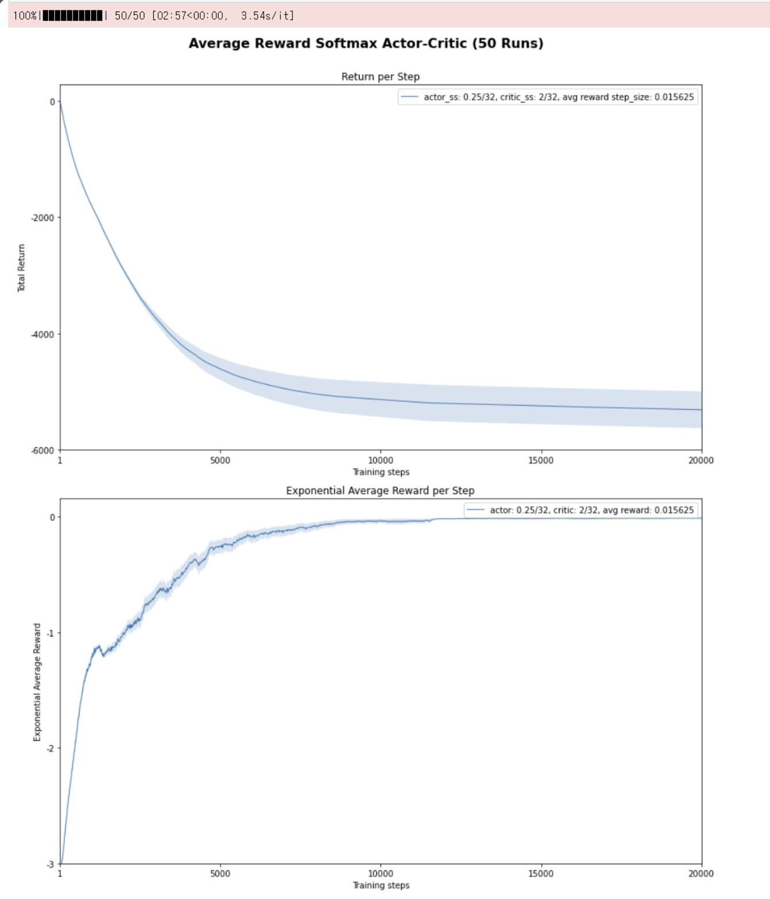

# Average Reward Softmax Actor-Critic 기반 Pendulum Swing-Up 학습 분석

## 1. Introduction and Background

본 실험은 앞선 과제들과 두 가지 점에서 구분된다. 첫째, 정책을 평가하는 prediction이 아니라 정책을 직접 학습하는 control 문제이며, 둘째, episode가 존재하는 문제가 아니라 끝이 없는 **continuing task**라는 점이다. 이러한 continuing task에서 정책을 학습하기 위해 본 과제는 **Average Reward Softmax Actor-Critic** 알고리즘을 구현하고, 이를 Pendulum Swing-Up 문제에 적용한다.

환경은 진자(pendulum) 세우기 문제이다. 진자는 360도 회전할 수 있고, agent는 회전축에 토크(각가속도)를 가해 진자를 제어한다. 목표는 아래로 늘어진 정지 상태에서 시작해 진자를 위쪽 수직 위치로 세우고, 그 상태를 가능한 한 오래 유지하는 것이다. 상태는 2차원으로, 수직 위치로부터의 각도 $\beta \in [-\pi, \pi]$와 각속도 $\dot{\beta} \in (-2\pi, 2\pi)$로 구성된다. 행동은 $a \in \{-1, 0, 1\}$의 세 가지 이산적 각가속도이다. 보상은 수직 위치로부터의 각도의 절댓값에 음수를 취한 값, 즉 $R_t = -|\beta_t|$이다. 진자가 위쪽에 가까울수록(각도가 0에 가까울수록) 보상이 0에 가까워지고, 아래로 내려갈수록 보상이 더 큰 음수가 된다. Mountain Car처럼 토크가 약해 한 번에 위로 올릴 수 없으므로, agent는 먼저 반대로 흔들어 운동량을 모은 뒤 세우고, 불안정한 위쪽 상태에서 계속 균형을 잡는 법까지 배워야 한다. 이 문제에는 종료(termination)나 episode가 없으므로 continuing task로 정식화된다.

이처럼 끝이 없는 문제에서는 미래 보상을 할인해 더하는 방식보다 **average reward** 정식화가 자연스럽다. average reward는 step당 평균 보상을 최대화하는 것을 목표로 하며, agent는 내부적으로 평균 보상 추정치 $\bar{R}$를 유지하고 이를 기준으로 각 행동이 평균보다 좋았는지를 평가한다.

학습 구조인 Actor-Critic은 두 부분으로 이루어진다. **Critic**은 상태가치 함수 $\hat{v}(s, \mathbf{w})$를 학습하여 현재 행동이 기대(평균)보다 좋았는지를 differential TD error로 평가하고, **Actor**는 그 신호를 받아 좋았던 행동의 선택 확률을 높이는 방향으로 정책을 개선한다. 행동이 이산적이므로 Actor는 행동 선호도(action-preference)를 지수화한 softmax 정책으로 표현된다.

$$\pi(a \mid s, \boldsymbol{\theta}) \doteq \frac{e^{h(s,a,\boldsymbol{\theta})}}{\sum_b e^{h(s,b,\boldsymbol{\theta})}}, \qquad h(s,a,\boldsymbol{\theta}) \doteq \boldsymbol{\theta}^\top \mathbf{x}_h(s,a)$$

---

## 2. Method and Experimental Setup

연속 상태공간을 다루기 위해 이전 과제와 같은 Tile Coding을 사용하되, 본 환경에서는 **wrap tile coder**를 사용하였다. 각도 $\beta$는 $-\pi$와 $+\pi$가 물리적으로 같은 상태인데, 일반적인 tile coding은 이 둘을 전혀 다른 상태로 취급해 버린다. 이를 막고 두 각도 사이에 일반화가 일어나도록, 각도 차원에 대해서만 경계를 감싸는(wrap) tile coder를 적용하였다(`tileswrap`의 `wrapwidths`를 각도에만 지정하고 각속도에는 지정하지 않음). 위치·속도를 각자의 범위로 정규화해 $[0, \text{num\_tiles}]$로 스케일한 뒤 활성 tile들을 얻는다.

Actor의 softmax 확률을 계산할 때는 수치적 overflow를 막기 위해 **exp-normalize trick**을 사용하였다. softmax는 모든 선호도에서 같은 상수를 빼도 값이 변하지 않으므로, 선호도의 최댓값 $c = \max_b h(s,b,\boldsymbol{\theta})$를 빼고 지수를 취한다. 즉 큰 수를 지수화하면서 생길 수 있는 overflow를 방지한다.

학습은 differential TD error를 중심으로 이루어진다. 평균 보상 $\bar{R}$를 기준으로 한 TD error는 다음과 같다.

$$\delta_t = R_{t+1} - \bar{R} + \hat{v}(S_{t+1}, \mathbf{w}) - \hat{v}(S_t, \mathbf{w}) \tag{1}$$

이 $\delta_t$를 이용해 평균 보상, Critic, Actor를 차례로 갱신한다.

$$\bar{R} \leftarrow \bar{R} + \alpha^{\bar{R}} \delta_t \tag{2}$$

$$\mathbf{w} \leftarrow \mathbf{w} + \alpha^{\mathbf{w}} \delta_t \nabla \hat{v}(S_t, \mathbf{w}) \tag{3}$$

$$\boldsymbol{\theta} \leftarrow \boldsymbol{\theta} + \alpha^{\boldsymbol{\theta}} \delta_t \nabla \ln \pi(A_t \mid S_t, \boldsymbol{\theta}) \tag{4}$$

선형 함수근사와 softmax 정책을 사용하므로 gradient가 단순해진다. Critic의 경우 tile feature가 이진 벡터이므로 $\nabla \hat{v}(s, \mathbf{w}) = \mathbf{x}(s)$가 되어 활성 tile의 weight만 갱신되고, Actor의 경우 $\nabla \ln \pi(A \mid S, \boldsymbol{\theta}) = \mathbf{x}_h(s,a) - \sum_b \pi(b \mid s, \boldsymbol{\theta}) \mathbf{x}_h(s,b)$로 정리된다. 구현에서는 실제로 선택한 행동의 weight에는 $\alpha^{\boldsymbol{\theta}} \delta (1 - \pi(a))$를, 나머지 행동에는 $\alpha^{\boldsymbol{\theta}} \delta (0 - \pi(a))$를 더한다. Actor와 Critic의 step-size는 tiling 수(32)로 나누어 사용하였다.

평가 지표로는 두 가지를 함께 사용하였다. 하나는 시간에 따른 **total return**이고, 다른 하나는 **exponential average reward**(초기 편향을 제거한, 실제 보상의 지수 가중 평균)이다. 메타파라미터는 넓은 sweep을 거쳐, 마지막 5000 step 동안의 exponential average reward가 가장 큰 설정을 선택하였다. 단순히 곡선 아래 면적(AUC)이 큰 설정을 고르면 초반에 빨리 배우지만 최종 정책이 더 나쁜 설정이 뽑힐 수 있어, 최종 정책의 품질을 기준으로 삼은 것이다.

실험 설정은 다음과 같다.

| 항목                   | 설정                                                       |
| -------------------- | -------------------------------------------------------- |
| Environment          | Pendulum Swing-Up (continuing task, 종료 없음)             |
| State                | 각도 β ∈ [−π, π], 각속도 β̇ ∈ (−2π, 2π)                     |
| Action               | 3개 이산 각가속도 {−1, 0, 1}                                |
| Reward               | $R_t = -\lvert\beta_t\rvert$                              |
| Learning method      | Average Reward Softmax Actor-Critic                      |
| Actor                | 행동 선호도 기반 softmax 정책                               |
| Critic               | average reward 버전 semi-gradient TD(0)                   |
| Feature              | Wrap Tile Coding (32 tilings, 8×8 tiles, iht_size 4096)  |
| Actor step-size      | 0.25 / 32                                                |
| Critic step-size     | 2 / 32                                                   |
| Avg reward step-size | 0.015625 (= 2⁻⁶)                                         |
| Max steps / Runs     | 20000 steps × 50 runs                                    |

---

## 3. Results and Discussion

**Figure 1.** 32 tilings × 8×8 tiles, 최적 메타파라미터(actor 0.25/32, critic 2/32, avg reward 0.015625) 설정에서의 학습 결과 (50 runs 평균). 위쪽은 학습 step에 따른 total return, 아래쪽은 exponential average reward이다.

위쪽 Return per Step 그래프를 보면, total return은 학습 step이 증가함에 따라 0에서 시작해 계속 감소하는(더 큰 음수가 되는) 형태를 보인다. 언뜻 보면 성능이 나빠지는 것처럼 보이지만, 이는 Pendulum 환경의 보상이 대부분 음수($R_t = -|\beta_t|$)로 정의되어 있기 때문에 나타나는 자연스러운 현상이다. agent가 매 step 음의 보상을 받는 한 누적 return은 계속 내려갈 수밖에 없다. 따라서 continuing task에서 "곡선이 내려간다 = 성능 악화"라고 단순히 해석해서는 안 된다. 중요한 것은 곡선의 기울기로, return의 감소 기울기가 점차 완만해져 후반부에는 거의 평탄해진다는 점이다. 이는 step당 받는 손실(음의 보상)이 줄어들어 정책이 좋은 수준으로 안정화되고 있음을 의미한다.

아래쪽 Exponential Average Reward 그래프는 학습 성공 여부를 훨씬 직관적으로 보여준다. step당 평균 보상은 초기 약 −3 수준에서 시작하여 학습이 진행될수록 빠르게 상승해 0에 가까워지고, 이후 0 부근에서 안정된다. 보상이 $-|\beta|$ 형태이므로 평균 보상이 0에 가까워진다는 것은 진자가 목표 위치인 위쪽 상태에 점점 가깝게 유지되고 있다는 뜻이다. 즉 정책이 거의 최적에 도달했음을 의미한다. 끝이 없는 continuing task에서는 누적 return의 기울기를 비교하기보다, 이처럼 step당 평균 보상이 0에 수렴하는지를 보는 편이 정책의 개선 여부를 판단하기에 훨씬 명확하다.

두 그래프를 종합하면 Actor-Critic 구조가 제대로 작동했음을 확인할 수 있다. Critic이 differential TD error로 현재 행동이 평균 기대보다 좋았는지를 평가하고, Actor가 그 신호를 이용해 좋은 행동의 선택 확률을 높인 결과, 진자를 흔들어 세우고 위쪽에서 균형을 유지하는 정책이 점점 형성되었다. wrap tile coding이 연속 상태(특히 $-\pi$와 $\pi$가 같은 각도)를 효과적으로 표현해 준 점도 안정적인 학습에 기여하였다.

추가로, 메타파라미터 민감도(parameter sensitivity) 곡선을 보면 세 step-size 모두에 대해 곡선이 완만하게 둥근 형태를 보인다. 이는 agent가 넓은 범위의 값에서 잘 작동하여 메타파라미터에 크게 민감하지 않음을 뜻한다. 특히 average reward step-size는 actor·critic step-size보다 성능 변화가 작아 덜 민감하였다. 또한 최적값이 sweep 범위의 가장자리가 아니라 중앙 부근에 위치한다는 점은, 탐색 범위가 충분히 넓어 더 좋은 값을 놓치지 않았음을 시사한다.

---

## 4. Conclusion

본 실험을 통해 연속 상태공간을 갖는 Pendulum Swing-Up 문제에서 Average Reward Softmax Actor-Critic agent가 학습에 성공하는 것을 확인하였다. total return은 학습 step이 증가함에 따라 계속 감소하는 형태를 보였으나, 이는 Pendulum 환경의 보상이 대부분 음수로 정의되어 있기 때문에 나타나는 자연스러운 현상이다. 중요한 점은 total return의 감소 기울기가 점차 완만해진다는 것이며, 이는 step당 손실이 줄어들고 있음을 의미한다. 보다 직접적인 성능 지표인 exponential average reward는 초기 약 −3 수준에서 시작하여 학습이 진행될수록 0에 가까워졌다. 보상 함수가 $-|\beta|$ 형태이므로 평균 보상이 0에 가까워진다는 것은 진자가 목표 위치인 위쪽 상태에 점점 가깝게 유지되고 있음을 의미한다. 따라서 Average Reward Softmax Actor-Critic 알고리즘은 tile coding을 통해 연속 상태를 효과적으로 표현하고, Critic의 TD error를 이용해 Actor의 정책을 개선하면서 Pendulum Swing-Up 문제를 안정적으로 학습한 것으로 해석할 수 있다.

이 실험에서 얻을 수 있는 교훈은 세 가지로 정리된다. 첫째, continuing task에서는 누적 return만으로 성능을 해석하면 헷갈릴 수 있다. 보상이 계속 음수이면 total return은 계속 내려가므로, 곡선이 내려간다는 사실만으로 성능 악화라고 판단해서는 안 되며 기울기의 변화를 함께 보아야 한다. 둘째, average reward 방식은 끝이 없는 문제에서 정책이 좋아지는지를 직관적으로 보여준다. step당 평균 보상이 0에 가까워지는지를 보면 학습 성공 여부를 훨씬 명확하게 판단할 수 있다. 셋째, Actor-Critic 구조가 의도대로 작동하였다. Critic의 평가(differential TD error)와 Actor의 정책 개선이 맞물려, 토크가 약한 진자를 세우고 유지하는 정책이 점진적으로 형성되었다.
