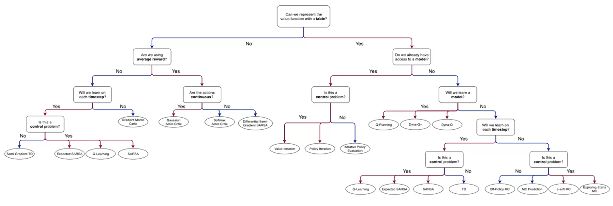
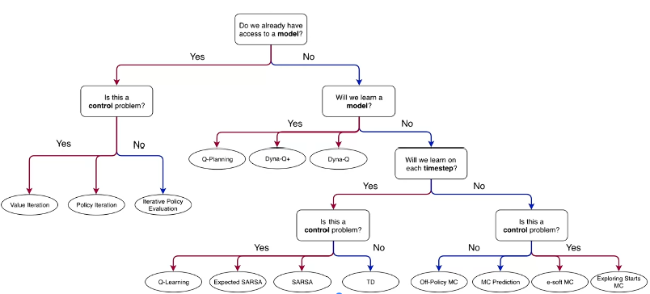
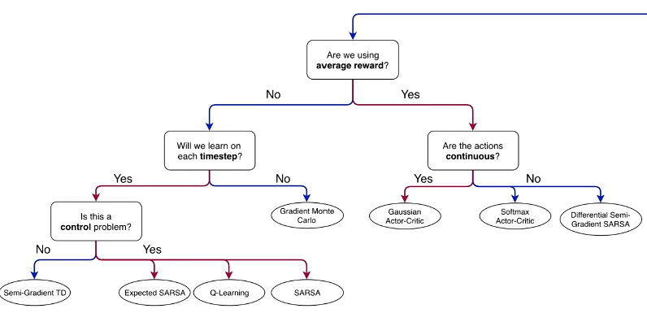

# 3. 함수 근사를 통한 예측과 제어 (Prediction and Control with Function Approximation)

> Coursera · University of Alberta · Reinforcement Learning Specialization **Course 3 / 4**

---

## 이 코스 한 줄 정의

Course 2까지는 모든 상태의 가치를 **테이블에 저장할 수 있다고 가정**했다.

Course 3은 그 가정을 버린다. 상태 공간이 너무 크거나, 같은 상태를 두 번 다시 보지 못할 수도 있는 현실에서, **파라미터화된 함수(신경망 등)로 가치 함수를 근사**하는 방법을 다룬다.

> Course 2 한계와의 연결: 테이블 방식은 상태 수가 많아지면 저장 자체가 불가능하다. 그리고 한 번도 방문하지 않은 상태에 대해선 아무것도 추정할 수 없다. 함수 근사는 이 두 문제를 **일반화(generalization)** 로 해결한다. 비슷한 상태끼리 가치 추정을 공유한다.

---

## 모듈 한눈에 보기

| Module | 주제 | 한 줄 요지 | 상태 |
| :--- | :--- | :--- | :---: |
| 1 | Welcome to the Course! | 코스 오버뷰 및 함수 근사 도입 배경 | ⬜ |
| 2 | On-policy Prediction with Approximation | 경사 하강법으로 가치 함수를 근사 (MC·TD) | ⬜ |
| 3 | Constructing Features for Prediction | Coarse Coding, 신경망 등 특징 설계 | ⬜ |
| 4 | Control with Approximation | Expected SARSA·Q-Learning + 평균 보상 | ⬜ |
| 5 | Policy Gradient | 가치 함수 없이 정책 자체를 파라미터화 | ⬜ |

---

## 이 코스를 관통하는 두 축

| 축 | 한쪽 | 다른 쪽 |
| :--- | :--- | :--- |
| **무엇을 근사하는가** | 가치 함수 근사 (Module 2–4) | 정책 직접 근사 (Module 5, Policy Gradient) |
| **목적함수 최적화 방향** | 오차를 줄이는 방향 (지도학습 유사) | 기대 보상을 높이는 방향 (Policy Gradient) |

추가로, Module 4에서는 에피소드가 끝나지 않는 **연속(continuing) 문제**를 다루기 위해 할인율 대신 **평균 보상(average reward)** 이라는 새로운 목적함수 정식화가 등장한다.

---

## Course 2와의 개념 대응

| Course 2 (Tabular) | Course 3 (Function Approximation) |
| :--- | :--- |
| Q-테이블 업데이트 | 경사 하강으로 가중치 w 업데이트 |
| 상태마다 독립적 가치 저장 | 파라미터 공유 → 일반화 가능 |
| 모든 상태 방문 보장 필요 | 방문 안 한 상태도 추정 가능 |
| SARSA / Q-Learning (tabular) | Expected SARSA / Q-Learning (w/ approximation) |
| 정책 = 가치 함수에서 greedy 선택 | 정책 = 파라미터화된 함수 자체 (Policy Gradient) |

---

## 디렉토리 구조

```
3. 함수 근사를 통한 예측과 제어/
├── README.md                  ← (현재 파일) 코스 진입점
│
├── Module2/                   — On-policy Prediction with Approximation
│   └── Module2.md             강의 내용 정리
│
├── Module3/                   — Constructing Features for Prediction
│   └── Module3.md             강의 내용 정리
│
├── Module4/                   — Control with Approximation
│   └── Module4.md             강의 내용 정리
│
└── Module5/                   — Policy Gradient
    └── Module5.md             강의 내용 정리
```

---


