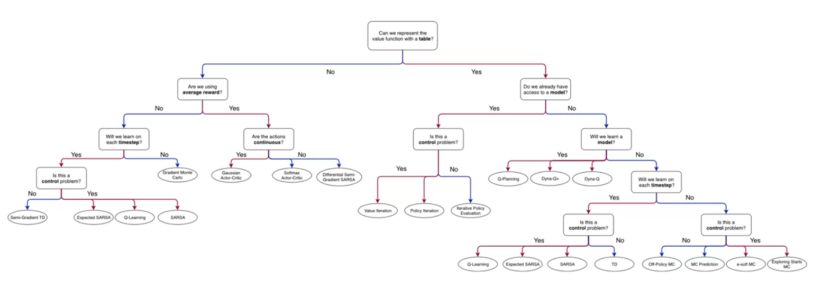

# 3. 함수 근사를 사용한 예측 및 제어 (Prediction and Control with Function Approximation)

University of Alberta Reinforcement Learning Specialization — **Course 3** 학습 정리 노트.

이 코스는 지금까지(Course 1·2)의 **표(table) 기반** 방법을 벗어나, 상태 공간이 너무 크거나 연속이어서 표를 쓸 수 없는 문제로 강화학습을 확장한다. 가치 함수를 파라미터화된 함수 $\hat{v}(s, \mathbf{w}) \approx v_\pi(s)$ 로 표현하고, 좋은 **특징(feature)** 을 설계하거나 신경망으로 자동 학습한 뒤, 그 위에서 **예측(prediction)** 과 **제어(control)**, 나아가 **정책을 직접 학습(policy gradient)** 하는 데까지 나아간다.

---

## 폴더 구조

```text
3. 함수 근사를 사용한 예측 및 제어/
├── README.md                  ← (현재 파일) 코스 진입점
│
├── Module2/                   — On-policy Prediction with Approximation
│   └── Module2.md             강의 내용 정리 (Ch. 9.1–9.4)
│
├── Module3/                   — Constructing Features for Prediction
│   └── Module3.md             강의 내용 정리 (Ch. 9.5, 9.7)
│
├── Module4/                   — Control with Approximation   (예정)
│   └── ...
│
└── Module5/                   — Policy Gradient              (예정)
    └── ...
```

> Module 1(Welcome)은 코스 안내 주차로 별도 정리하지 않으며, 실제 학습 콘텐츠는 Module 2부터 시작한다 (Course 2와 동일한 번호 체계).

---

## 모듈별 내용 요약

### Module 2 — On-policy Prediction with Approximation

| 파일 | 내용 |
| :--- | :--- |
| `Module2.md` | 함수 근사 도입. 파라미터화된 가치 함수 $\hat{v}(s,\mathbf{w})$, 일반화 vs 변별, 가치 추정의 지도 학습 프레이밍, 목적함수 $\overline{VE}$, SGD·Gradient MC·State Aggregation, Semi-gradient TD, 선형 방법과 TD 고정점 $\mathbf{w}_{TD}=\mathbf{A}^{-1}\mathbf{b}$ |

### Module 3 — Constructing Features for Prediction

| 파일 | 내용 |
| :--- | :--- |
| `Module3.md` | 특징 구성. Coarse Coding(초기 일반화는 수용 영역 크기, 변별력은 특징 총수), Tile Coding(다중 offset 타일링·일정한 active 특징 수·이진 효율), 비선형 근사 신경망(보편 근사, 역전파, dropout/batch norm/residual, CNN) |

### Module 4 — Control with Approximation *(예정)*

| 파일 | 내용 |
| :--- | :--- |
| *(예정)* | 함수 근사 기반 제어. Episodic Semi-gradient Sarsa / Expected Sarsa / Q-learning, Average Reward 설정, Differential Semi-gradient Sarsa (Ch. 10) |

### Module 5 — Policy Gradient *(예정)*

| 파일 | 내용 |
| :--- | :--- |
| *(예정)* | 가치 함수 없이 정책을 직접 매개·학습. Policy Gradient 정리, Actor-Critic, 연속 행동을 위한 Gaussian / Softmax 정책 (Ch. 13) |

---

## 핵심 학습 흐름

```text
표 기반의 한계 (상태 폭발 / 연속 상태)
→ 가치 함수를 파라미터화: v̂(s, w) ≈ v_π(s)   [Module 2: 예측]
→ 어떤 상태끼리 일반화할지 = 특징 설계         [Module 3: tile coding / 신경망]
→ 그 표현 위에서 최적 행동 학습                [Module 4: 제어]
→ 가치 함수를 거치지 않고 정책을 직접 학습      [Module 5: policy gradient]
```

Course 2가 "샘플 경험만으로 어떻게 학습할 것인가(MC·TD·Dyna)"였다면, Course 3는 "**상태를 어떻게 표현하고**, 그 위에서 **어떻게 예측·제어·정책 학습**을 할 것인가"에 초점이 있다. 이 코스를 마치면 tabular에서 함수 근사, 그리고 actor-critic까지 강화학습의 알고리즘 지형 전체를 연결할 수 있게 된다.

---

## 알고리즘 선택 지도 (직접 구성한 의사결정 트리)

[의사결정 트리 이미지 위치 표시]

Course 1~3의 주요 알고리즘을 "어떤 질문에 어떻게 답하느냐"로 분기한 의사결정 트리. 이 코스(Course 3)에서 트리의 좌측 가지 — 표로 표현 불가능한 경우(function approximation) — 가 채워진다.

| 분기 질문 | 도달하는 알고리즘 | 해당 모듈 |
| :--- | :--- | :--- |
| 표로 표현 불가 → 매 스텝 학습 → 제어 아님 | Semi-Gradient TD | Module 2 |
| 표로 표현 불가 → 매 스텝 학습 → 제어 | Expected Sarsa / Q-learning / Sarsa | Module 4 |
| 표로 표현 불가 → 에피소드 단위 | Gradient Monte Carlo | Module 2 |
| average reward → 연속 행동 | Gaussian / Softmax Actor-Critic | Module 5 |
| average reward → 이산 행동 | Differential Semi-Gradient Sarsa | Module 4 |

---

## 모듈별 학습 목표 (Learning Objectives)

> 코스 공식 학습 목표를 모듈·레슨별로 정리한 체크리스트. 노트 정리·복습 후 직접 점검용으로 사용한다.
>
> **번호 체계 주의**: 공식 학습목표 문서는 Welcome을 `Module 00`으로 두는 **0-기반** 번호를 쓴다. 본 저장소는 Coursera 화면 표시(Welcome = Module 1)를 따르므로 번호가 **1씩 차이**난다. (예: 공식 Module 01 = 본 저장소 Module 2)

### Module 2 — On-policy Prediction with Approximation ✅

**Lesson 1: 가치 함수 추정을 지도 학습으로**

- [ ] 파라미터화된 함수로 가치 함수를 근사하는 방법 이해
- [ ] 선형 가치 함수 근사(linear value function approximation)의 의미 설명
- [ ] tabular가 선형 근사의 특수 케이스임을 인식
- [ ] 근사 가치 함수를 매개하는 방식이 여럿임을 이해
- [ ] 일반화(generalization)와 변별(discrimination)의 의미 이해
- [ ] 일반화가 왜 이로운지 이해
- [ ] 일반화와 변별을 모두 원하는 이유 설명
- [ ] 가치 추정을 지도 학습 문제로 프레이밍하는 법 이해
- [ ] 모든 함수 근사 기법이 RL에 적합하지는 않음을 인식

**Lesson 2: On-policy 예측의 목적함수**

- [ ] 평균제곱 가치 오차($\overline{VE}$) 목적함수 이해
- [ ] 목적함수에서 상태 분포 $\mu$ 의 역할 설명
- [ ] 경사 하강(GD)·확률적 경사 하강(SGD) 아이디어 이해
- [ ] Gradient Monte Carlo 알고리즘 개요
- [ ] 상태 집합(state aggregation)으로 가치 함수 근사하는 법 이해
- [ ] Gradient MC + state aggregation 적용

**Lesson 3: TD의 목적함수**

- [ ] 함수 근사에서의 TD 업데이트 이해
- [ ] MC 대비 TD의 장점 강조
- [ ] Semi-gradient TD(0) 알고리즘 개요
- [ ] TD가 편향된(biased) 가치 추정으로 수렴함을 이해
- [ ] TD가 Gradient MC보다 훨씬 빠르게 수렴함을 이해

**Lesson 4: Linear TD**

- [ ] 선형 함수 근사에서 TD 업데이트 유도
- [ ] tabular TD(0)이 선형 semi-gradient TD(0)의 특수 케이스임을 이해
- [ ] 선형 vs 비선형 근사의 장점 강조
- [ ] 선형 TD 학습의 고정점(TD fixed point) 이해
- [ ] TD 고정점에서 $\overline{VE}$ 에 대한 이론적 보장 설명

### Module 3 — Constructing Features for Prediction ✅

**Lesson 1: 선형 방법을 위한 특징 구성**

- [ ] coarse coding과 tabular 표현의 차이 설명
- [ ] 표현 설계 시 변별 vs 일반화 트레이드오프 설명
- [ ] 서로 다른 coarse coding 방식이 표현 가능한 함수에 미치는 영향 이해
- [ ] tile coding이 coarse coding의 계산상 편리한 경우임을 설명
- [ ] 타일링 설계가 결과 표현에 미치는 영향 설명
- [ ] tile coding이 coarse coding의 효율적 구현임을 이해

**Lesson 2: 신경망**

- [ ] 신경망(neural network) 정의
- [ ] 활성화 함수(activation function) 정의
- [ ] 피드포워드(feedforward) 구조 정의
- [ ] 신경망이 특징 구성을 수행하는 방식 이해
- [ ] 신경망이 상태의 비선형 함수임을 이해
- [ ] 깊은 망이 계층의 합성(composition)임을 이해
- [ ] 더 깊은 망의 학습 용량 vs 학습 난이도 트레이드오프 이해

**Lesson 3: 신경망 학습**

- [ ] 단일 은닉층 신경망의 기울기 계산
- [ ] 임의 깊이 망의 기울기 계산 방법 이해
- [ ] 신경망 초기화의 중요성 이해
- [ ] 신경망 초기화 전략 설명
- [ ] 신경망 학습을 위한 최적화 기법 설명

### Module 4 — Control with Approximation 🔜

**Lesson 1: 함수 근사 기반 Episodic Sarsa**

- [ ] 함수 근사 Episodic Sarsa 업데이트 설명
- [ ] 특징 선택(행동을 특징에 전달 / 상태 특징 쌓기) 소개
- [ ] 가치 함수·학습 곡선 시각화
- [ ] Q-learning이 Expected Sarsa의 부분집합으로 쉽게 확장됨을 논의

**Lesson 2: 함수 근사에서의 탐험**

- [ ] 가치 함수 낙관적 초기화(optimistic initialization)를 탐험 방식으로 이해

**Lesson 3: Average Reward**

- [ ] 평균 보상(average reward) 설정 설명
- [ ] 평균 보상 최적 정책이 할인(discounted) 해와 다른 경우 설명
- [ ] 미분 가치 함수(differential value function)가 할인 가치 함수와 어떻게 다른지 이해

### Module 5 — Policy Gradient 🔜

**Lesson 1: 파라미터화된 정책 학습**

- [ ] 정책을 파라미터화된 함수로 정의하는 법 이해
- [ ] softmax 기반 파라미터화 정책 한 종류 정의
- [ ] action-value 기반 방법 대비 파라미터화 정책의 장점 이해

**Lesson 2: 연속 과제를 위한 Policy Gradient**

- [ ] policy gradient 알고리즘의 목적함수 설명
- [ ] policy gradient 정리(theorem)의 결과 설명
- [ ] policy gradient 정리의 중요성 이해

**Lesson 3: 연속 과제를 위한 Actor-Critic**

- [ ] 평균 보상 목적함수 기울기의 샘플 기반 추정 유도
- [ ] 함수 근사·연속 과제용 actor-critic 알고리즘 설명

**Lesson 4: 정책 파라미터화**

- [ ] 선형 행동 선호 softmax 정책의 actor-critic 업데이트 유도
- [ ] 해당 알고리즘 구현
- [ ] 평균 보상 actor-critic용 함수 근사기 설계
- [ ] 평균 보상 에이전트 성능 분석
- [ ] gaussian 정책의 actor-critic 업데이트 유도
- [ ] 연속 행동 과제에 평균 보상 actor-critic + gaussian 정책 적용


---

## 관련 링크

- 강의: [Prediction and Control with Function Approximation (Coursera)](https://www.coursera.org/learn/prediction-control-function-approximation)
- 교재: Sutton & Barto, *Reinforcement Learning: An Introduction* (2nd ed.) — Ch. 9, 10, 13
- 이전 코스: [`2. 샘플기반 학습 방법`](../2.%20샘플기반%20학습%20방법)
- 참고 키워드: Function Approximation, Semi-gradient, Tile Coding, Actor-Critic, Policy Gradient


