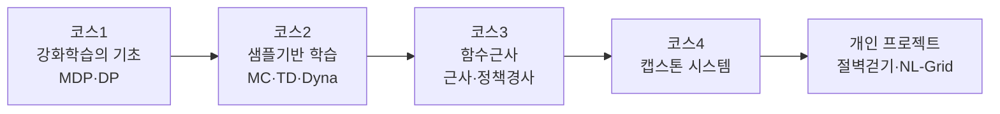

# 🏠 RL 학습 지도

> [!abstract] 이 보관소(Vault)는?
> Coursera **Reinforcement Learning Specialization**(4개 코스)을 수강하며 정리한 강의 노트·실습 회고·퀴즈·특강·논문 리뷰와, 직접 구현한 개인 RL 프로젝트를 모은 옵시디언 보관소입니다.

## 🗺️ 학습 흐름

## 📚 코스 지도

- [[🗂️ 코스1 지도]] — MDP·밴딧에서 동적 프로그래밍까지, 강화학습의 **이론적 토대**를 다지는 코스.
- [[🗂️ 코스2 지도]] — 환경 모델 없이 **경험만으로** 학습한다 — 몬테카를로·TD·TD제어·Dyna.
- [[🗂️ 코스3 지도]] — 테이블을 벗어나 **함수로 가치·정책을 근사** — 선형근사·신경망·정책경사.
- [[🗂️ 코스4 지도]] — 배운 모든 것을 종합하는 **캡스톤**. 현재 아래 개인 프로젝트로 이어지는 중.
- [[🗂️ 프로젝트 지도]] — 직접 구현·실험한 RL 프로젝트 — 절벽걷기, 자연어 조건부 Q러닝.

## 🔖 태그로 찾기

- **코스별**: `#rl/코스1-기초` `#rl/코스2-샘플기반` `#rl/코스3-함수근사` `#rl/코스4-캡스톤` `#rl/프로젝트`
- **유형별**: `#유형/강의노트` `#유형/요약` `#유형/실습` `#유형/퀴즈` `#유형/특강` `#유형/논문리뷰` `#유형/실험`
- **개념별**: `#개념/MDP` `#개념/TD학습` `#개념/Q러닝` `#개념/함수근사` `#개념/정책경사` `#개념/actor-critic` 등

> [!tip] 그래프 뷰로 보기
> 좌측 그래프 뷰(Graph view)를 열면 개념 간 연결이 한눈에 보입니다. 각 노트 하단의 **🔗 관련 노트**가 연결을 만들어 줍니다.

## 💻 실습 코드

노트북(`.ipynb`)·파이썬 소스는 원본 레포지토리 폴더에 그대로 있습니다 (`../1. 강화학습의 기초/`, `../rl-projects/` 등). 이 보관소는 학습 노트 중심입니다.
