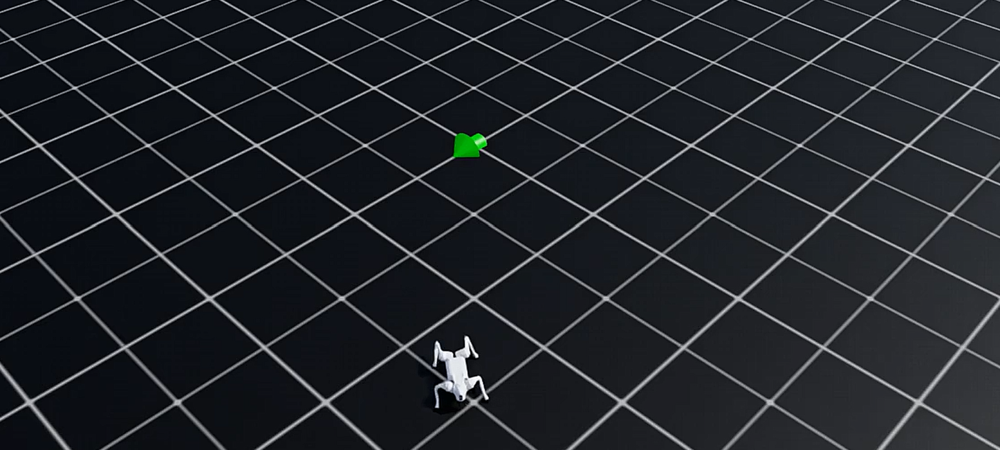

# 자연어 명령을 수행하는 사족보행 로봇 — 캡스톤 결과 보고서

> Coursera RL Specialization 캡스톤. `nl-conditioned-grid`(자연어→MDP 정찰)를 발전시켜,
> **자연어 명령을 Isaac Sim 위의 Unitree Go2 사족보행 로봇이 수행**하는 파이프라인을 구현하고
> 단일 시연으로 입증했다.

---

## 1. 한 줄 요약

자연어 한 문장("오른쪽 위 구석으로 가") → LLM 파서가 JSON 명세로 변환 → 고수준 계획·제어가
속도 명령 `(vx, vy, yaw_rate)`로 변환 → **강화학습(PPO)으로 학습된 Go2 보행 정책**이 그 명령을 실제 관절
제어로 수행 → 로봇이 목표 좌표까지 걸어가 정지. Isaac Sim에서 end-to-end로 동작함을 영상·로그로 확인했다.

핵심 설계 원칙은 정찰 프로젝트와 동일하다: **LLM은 정책을 만들지 않고 자연어를 명세로 해석만 한다.
실제 제어(보행)는 강화학습 정책이 맡는다.**

---

## 2. 시스템 아키텍처 (2층 계층)

자연어로 다리 관절을 직접 학습하는 것은 불가능에 가깝다. 그래서 **해석 계층**과 **제어 계층**을 분리했다.

```
자연어 1문장
   │  LLM 파서 (gpt 호환 게이트웨이, temperature=0)        ← 해석 계층 (학습 안 함)
JSON spec v2  (goal pose / forbidden / soft_avoid / clearance / speed / preference)
   │  spec → 2D occupancy grid → A* → waypoint
   │  go-to-goal 컨트롤러
velocity command (vx, vy, yaw_rate)
   │
Go2 locomotion 정책 (PPO velocity-tracking)              ← 제어 계층 (강화학습)
   │
12개 관절 목표각 → Isaac Sim 물리 → 보행
```

- **해석 계층**(이 프로젝트의 커스텀): 파서·스키마·플래너·컨트롤러. 순수 파이썬, 로컬 검증.
- **제어 계층**(기성 RL에 올라탐): Isaac Lab의 스톡 Go2 속도추종 태스크를 PPO로 학습.

---

## 3. 사용한 강화학습 (제어 계층) 해설

제어 계층은 Isaac Lab의 `Isaac-Velocity-Flat-Unitree-Go2-v0` 태스크를 **rsl_rl의 PPO**로 학습한
**속도추종(velocity-tracking) 정책**이다. 직접 학습시켜 체크포인트(`model_499.pt`)를 만들고 이후 freeze해 사용했다.

**MDP 구성 (실제 실행 로그 기준):**

- **관측 (48차원)**: `base_lin_vel(3)` · `base_ang_vel(3)` · `projected_gravity(3)` ·
  **`velocity_commands(3)`** · `joint_pos(12)` · `joint_vel(12)` · `last_actions(12)`
  → 정책은 자기 상태 + **명령받은 목표 속도**를 함께 본다. 이 `velocity_commands`가 통합 지점이다.
- **행동 (12차원)**: 12개 다리 관절(FL/FR/RL/RR × hip/thigh/calf)의 위치 목표값.
- **보상 (가중치)**: 명령 추종 보상 `track_lin_vel_xy_exp(+1.5)`, `track_ang_vel_z_exp(+0.75)` 을
  중심으로, 안정·효율 패널티 `lin_vel_z_l2(-2.0)`, `flat_orientation_l2(-2.5)`,
  `action_rate_l2(-0.01)`, `dof_torques_l2`, `dof_acc_l2` 등 10개 항목. `feet_air_time(+0.25)`로
  자연스러운 보행(발 들기)을 유도.
- **정책망**: MLP `48 → 128 → 128 → 128 → 12`, ELU 활성, Gaussian 정책 (actor-critic).
- **알고리즘**: PPO (on-policy), 4096개 병렬 환경, 도메인 랜덤화(질량/마찰/외력 push)로 강건성 확보.

즉 이 정책은 **(vx, vy, yaw_rate) 속도 명령을 받아 그대로 추종하도록 보상받은** 컨트롤러다. 우리 고수준
컨트롤러의 출력이 정확히 이 3차원 명령이므로, 둘을 맞물리는 것이 통합의 핵심이었다.

---

## 4. 해석 계층 (커스텀 구현)

### 4.1 자연어 파서 (`nl_parser.py`, `schemas/command_schema_v2.json`)
- 한국어 명령 → schema v2 JSON. 연속 2D 월드(미터), `goal pose`·`forbidden_regions`·
  `soft_avoid_regions`·`clearance`·`speed`·`preference`.
- 목표를 추론할 수 없으면 `goal=null`을 반환하고 **계획 단계에서 통제된 실패**로 중단(목표를 지어내지 않음).

### 4.2 계획·제어 (`planner.py`, `controller.py`)
- **플래너**: spec → 점유 격자 → 8방향 A* → line-of-sight 단순화로 waypoint. `forbidden`은 로봇 반경+
  clearance만큼 팽창, `preference=safe`면 `soft_avoid`를 우회 비용으로 반영.
- **컨트롤러**: go-to-goal. 목표 방향과 현재 헤딩 오차로 `(vx, vy, yaw_rate)` 생성.
  단, **항상 전진하며 조향**(제자리 회전 금지) — locomotion 정책의 학습 분포 안에 머물러 안정적.

### 4.3 실패 분류 (Failure Taxonomy)
목표가 불완전하면 시스템은 멈춘다. 5종을 증거 이미지와 함께 기록: `underspecified(goal=null)`,
`goal_in_obstacle`, `start_in_obstacle`, `no_path`, `start_equals_goal`.
(캡스톤에서 이 지점은 사용자 재질문 / 재계획 / 안전 모니터로 확장된다.)

---

## 5. Isaac Sim 통합 방법

`isaac/nlq_play.py`는 Isaac Lab의 `rsl_rl/play.py`를 복제하고 통합 훅만 외과수술로 삽입한 스크립트다.
env·체크포인트 로딩은 검증된 원본 경로를 그대로 둬 트러블슈팅을 최소화했다.

매 시뮬레이션 스텝:
1. 로봇 월드 pose `(x, y, yaw)`를 읽는다.
2. go-to-goal로 `(vx, vy, yaw_rate)`를 계산한다.
3. 이 명령을 `command_manager`의 `base_velocity` 항목에 주입한다.
4. 정책이 명령+상태로부터 관절 행동을 내고, 환경을 한 스텝 진행한다.

### 통합 중 해결한 3가지 (디버깅 기록)
1. **명령 주입 위치**: 관측 벡터 인덱스를 추측해 덮어쓰는 대신, 명령의 원본인 command manager 버퍼
   (`vel_command_b`)에 직접 쓰고 재샘플링·heading·standing을 비활성화 → env가 관측을 정확히 채움.
2. **헤딩 추출 버그**: 손수 짠 쿼터니언→yaw 수식이 성분 순서 불일치로 항상 ≈π를 반환 → 로봇이 목표를
   못 보고 **제자리에서 원만 그림**. Isaac Lab 공식 `euler_xyz_from_quat`로 교체해 해결.
3. **제자리 회전 회피**: 목표가 등 뒤일 때 `vx=0`(순수 회전)을 명령하면 정책이 불안정 →
   **항상 전진하며 조향**하도록 컨트롤러를 수정(정책 in-distribution).

---

## 6. 결과 / 증거

### 6.1 고수준 파이프라인 (2D 목업, GPU 불필요)
`run_experiments.py`로 오프라인 회귀 검증. 충돌 0·우회·실패처리 모두 확인.
- `results/preview_center_block.png` — 중앙 금지 박스를 우회해 목표 도달
- `results/preview_safe_detour.png` — `preference=safe`가 soft 위험원을 실제로 우회
- `results/preview_fail_*.png` — 5종 실패의 증거 이미지

### 6.2 Isaac Sim 보행 + 자연어 명령 수행 (핵심 시연)
freeze된 Go2 정책이 go-to-goal 명령을 받아 목표 좌표까지 보행. 실제 실행 로그:

| step | position | dist to goal |
|---|---|---|
| 0 | (0.23, −0.38) | 4.37 |
| 100 | (1.04, 0.62) | 3.08 |
| 200 | (1.94, 1.67) | 1.70 |
| 300 | (2.83, 2.75) | 0.30 |
| **301** | **(2.84, 2.76)** | **goal reached** |

도착 후 명령 `(0,0,0)`으로 정지, `gravz=−1`(직립 유지). 거리 단조 감소 = 정확한 조향.
- 영상: `go2_goto_3_3.mp4` (좌표 목표), `go2_nl_corner.mp4` ("오른쪽 위 구석으로 가" 자연어 명령)



*Isaac Sim 평지 환경에서 Unitree Go2가 "오른쪽 위 구석으로 가" 명령을 수행하고 정지한 순간.
중앙의 초록/파랑 화살표는 Isaac Lab의 속도명령 시각화(초록=현재 속도, 파랑=지령 속도)로,
도착해 정지하여 거의 0이다. 이는 본 시스템이 주입하는 `(vx, vy, yaw_rate)` 명령이 실제로
정책에 전달됨을 보여준다.*

---

## 7. 한계 및 향후 과제

- **보행 정책 학습량**: 데모용으로 ~500 iteration 짧게 학습. 더 학습하면 보행 품질·강건성 향상.
- **Isaac 씬 장애물**: 시간 제약상 Isaac 씬에 장애물 prim을 직접 배치하지 않음. 고수준 장애물 회피는
  2D 목업으로 검증했고, Isaac 통합은 NL→보행 사슬 입증에 집중. 다음 단계는 `forbidden_regions`를
  실제 prim으로 스폰해 A* 경로를 3D에서 따라가게 하는 것.
- **"안전하게"의 실효성**: 정찰 프로젝트의 발견 그대로 — soft 의도가 실제 reward/동작에 충분히
  반영됐는지는 별도 평가가 필요(거리/속도/충돌확률 같은 구체 MDP 요소로 분해).
- **고수준의 학습화**: 현재 go-to-goal은 스크립트. 향후 고수준 내비게이션도 RL로 대체 가능.

---

## 8. 실행 환경 / 재현

- **시뮬레이터**: Isaac Sim 6.0 + Isaac Lab 3.0-beta2, 로봇 Unitree Go2.
- **컴퓨팅**: AWS EC2 `g5.2xlarge` (NVIDIA A10G 24GB), us-east-1. NVIDIA 공식 **Isaac Automator**로
  배포(내부 Terraform+Ansible). `./stop`/`./destroy`로 비용 통제(총 GPU 비용 수십 달러 규모).
- **재현 절차**: `docs/00_setup_and_aws.md`(자격증명·비용), `docs/01_phase1_isaac_automator.md`(배포),
  `docs/02_phase2_go2_locomotion.md`(보행 학습), `isaac/nlq_play.py`(통합 실행).
- **하이브리드 비용 최적화**: GPU 불필요 작업(파싱·계획·제어·2D 목업·보고서)은 전부 로컬에서,
  GPU는 보행 학습+렌더링에만 사용.
