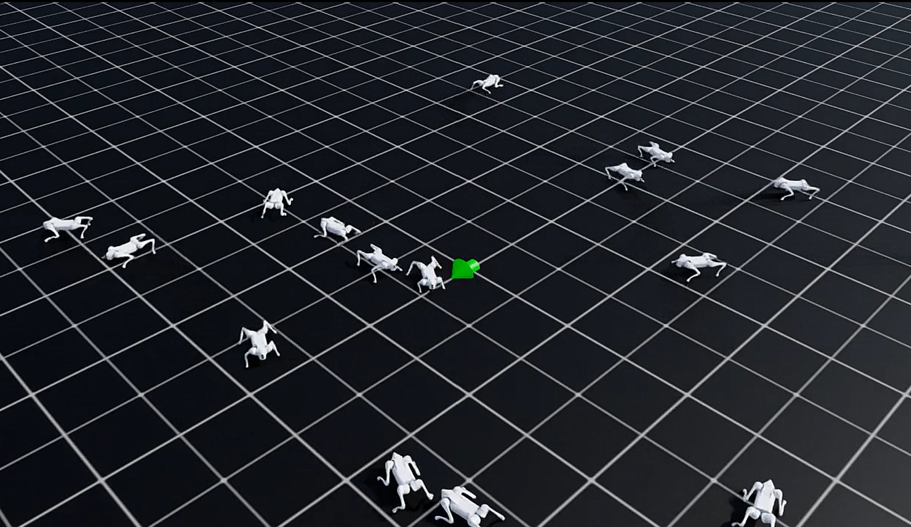

# 자연어 명령을 수행하는 사족보행 로봇 — 캡스톤 결과 보고서

> Coursera RL Specialization 캡스톤. `nl-conditioned-grid`(자연어→MDP 정찰)를 발전시켜,
> **자연어 명령을 Isaac Sim 위의 Unitree Go2 사족보행 로봇이 수행**하는 파이프라인을 구현하고
> 단일 시연으로 입증했다.

---

## 1. 한 줄 요약

자연어 한 문장("오른쪽 위 구석으로 가") → LLM 파서가 JSON 명세로 변환 → 고수준 계획·제어가
속도 명령 `(vx, vy, yaw_rate)`로 변환 → **강화학습(PPO)으로 학습된 Go2 보행 정책**이 그 명령을 실제 관절
제어로 수행 → 로봇이 목표 좌표까지 걸어가 정지. Isaac Sim에서 end-to-end로 동작함을 영상·로그로 확인했다.

핵심 설계 원칙은 정찰 프로젝트와 동일하다: **LLM은 정책을 만들지 않고 자연어를 명세로 해석만 한다.
실제 제어(보행)는 강화학습 정책이 맡는다.**

---

## 2. 시스템 아키텍처 (2층 계층)

자연어로 다리 관절을 직접 학습하는 것은 불가능에 가깝다. 그래서 **해석 계층**과 **제어 계층**을 분리했다.

```
자연어 1문장
   │  LLM 파서 (gpt 호환 게이트웨이, temperature=0)        ← 해석 계층 (학습 안 함)
JSON spec v2  (goal pose / forbidden / soft_avoid / clearance / speed / preference)
   │  spec → 2D occupancy grid → A* → waypoint
   │  go-to-goal 컨트롤러
velocity command (vx, vy, yaw_rate)
   │
Go2 locomotion 정책 (PPO velocity-tracking)              ← 제어 계층 (강화학습)
   │
12개 관절 목표각 → Isaac Sim 물리 → 보행
```

- **해석 계층**(이 프로젝트의 커스텀): 파서·스키마·플래너·컨트롤러. 순수 파이썬, 로컬 검증.
- **제어 계층**(기성 RL에 올라탐): Isaac Lab의 스톡 Go2 속도추종 태스크를 PPO로 학습.

---

## 3. 사용한 강화학습 (제어 계층) 해설

제어 계층은 Isaac Lab의 `Isaac-Velocity-Flat-Unitree-Go2-v0` 태스크를 **rsl_rl의 PPO**로 학습한
**속도추종(velocity-tracking) 정책**이다. 직접 학습시켜 체크포인트(`model_499.pt`)를 만들고 이후 freeze해 사용했다.

**MDP 구성 (실제 실행 로그 기준):**

- **관측 (48차원)**: `base_lin_vel(3)` · `base_ang_vel(3)` · `projected_gravity(3)` ·
  **`velocity_commands(3)`** · `joint_pos(12)` · `joint_vel(12)` · `last_actions(12)`
  → 정책은 자기 상태 + **명령받은 목표 속도**를 함께 본다. 이 `velocity_commands`가 통합 지점이다.
- **행동 (12차원)**: 12개 다리 관절(FL/FR/RL/RR × hip/thigh/calf)의 위치 목표값.
- **보상 (가중치)**: 명령 추종 보상 `track_lin_vel_xy_exp(+1.5)`, `track_ang_vel_z_exp(+0.75)` 을
  중심으로, 안정·효율 패널티 `lin_vel_z_l2(-2.0)`, `flat_orientation_l2(-2.5)`,
  `action_rate_l2(-0.01)`, `dof_torques_l2`, `dof_acc_l2` 등 10개 항목. `feet_air_time(+0.25)`로
  자연스러운 보행(발 들기)을 유도.
- **정책망**: MLP `48 → 128 → 128 → 128 → 12`, ELU 활성, Gaussian 정책 (actor-critic).
- **알고리즘**: PPO (on-policy), 4096개 병렬 환경, 도메인 랜덤화(질량/마찰/외력 push)로 강건성 확보.

즉 이 정책은 **(vx, vy, yaw_rate) 속도 명령을 받아 그대로 추종하도록 보상받은** 컨트롤러다. 우리 고수준
컨트롤러의 출력이 정확히 이 3차원 명령이므로, 둘을 맞물리는 것이 통합의 핵심이었다.



*Phase 2 — Isaac Lab에서 여러 Go2가 병렬 환경에서 동시에 속도추종 보행 정책을 수행하는 장면.
초록 화살표는 각 로봇에 주어진 속도명령 시각화. PPO는 이처럼 수천 개의 병렬 환경에서 경험을 모아
보행 정책을 학습한다 — 본 프로젝트는 이 정책을 학습시켜 freeze한 뒤 자연어 명령 수행에 사용했다.*

---

## 4. 해석 계층 (커스텀 구현)

### 4.1 자연어 파서 (`nl_parser.py`, `schemas/command_schema_v2.json`)
- 한국어 명령 → schema v2 JSON. 연속 2D 월드(미터), `goal pose`·`forbidden_regions`·
  `soft_avoid_regions`·`clearance`·`speed`·`preference`.
- 목표를 추론할 수 없으면 `goal=null`을 반환하고 **계획 단계에서 통제된 실패**로 중단(목표를 지어내지 않음).

### 4.2 계획·제어 (`planner.py`, `controller.py`)
- **플래너**: spec → 점유 격자 → 8방향 A* → line-of-sight 단순화로 waypoint. `forbidden`은 로봇 반경+
  clearance만큼 팽창, `preference=safe`면 `soft_avoid`를 우회 비용으로 반영.
- **컨트롤러**: go-to-goal. 목표 방향과 현재 헤딩 오차로 `(vx, vy, yaw_rate)` 생성.
  단, **항상 전진하며 조향**(제자리 회전 금지) — locomotion 정책의 학습 분포 안에 머물러 안정적.

### 4.3 실패 분류 (Failure Taxonomy)
목표가 불완전하면 시스템은 멈춘다. 5종을 증거 이미지와 함께 기록: `underspecified(goal=null)`,
`goal_in_obstacle`, `start_in_obstacle`, `no_path`, `start_equals_goal`.
(캡스톤에서 이 지점은 사용자 재질문 / 재계획 / 안전 모니터로 확장된다.)

### 4.4 파서 실험 결과 (T01–T10)

10개의 한국어 명령을 배치로 파싱(`run_parser_tests.py` → `results/parser_test_analysis.md`).
**전부 스키마 검증 통과(`parse=ok`)**, 모호·불완전 표현까지 의도대로 해석됐다.

| id | 명령 | goal | speed | pref | forb | soft |
|---|---|---|---|---|---|---|
| T01 | 오른쪽 위 구석으로 가 | [7.5, 7.5] | normal | default | 0 | 0 |
| T02 | 오른쪽 위 구석으로 가되 중앙은 절대 피해서 천천히 | [7.5, 7.5] | slow | default | 1 | 0 |
| T03 | (6,6)까지 안전하게 가, (3,3) 근처는 위험해 | [6.0, 6.0] | normal | safe | 0 | 1 |
| T04 | 빠르게 가 | **null** | fast | shortest | 0 | 0 |
| T05 | 왼쪽 위 구석으로 최대한 빨리 | [0.5, 7.5] | fast | shortest | 0 | 0 |
| T06 | 가운데로 가 | [4.0, 4.0] | normal | default | 0 | 0 |
| T07 | 오른쪽 아래 구석까지 가는데 중앙 구역은 조심해서 돌아가 | [7.5, 0.5] | normal | safe | 0 | 1 |
| T08 | (2,7)에서 출발해서 왼쪽 아래 구석까지 천천히 안전하게 | [0.5, 0.5] | slow | safe | 0 | 0 |
| T09 | 장애물 없이 목표까지 | **null** | normal | default | 0 | 0 |
| T10 | 왼쪽 벽은 절대 붙지 말고 오른쪽 끝 가운데로 가 | [7.5, 4.0] | normal | default | 1 | 0 |

이 결과가 보여주는 것:
- **공간 표현의 좌표화**: 구석/가운데/명시 좌표/출발점을 일관되게 변환 (T01·T05·T06·T08·T10).
  T08은 "(2,7)에서 출발"을 `start=[2,7]`로, "왼쪽 아래 구석"을 goal로 분리 해석.
- **hard vs soft 구분**: "절대 피해"·"벽 붙지 마"는 `forbidden_regions`(+clearance 0.3~0.5)로(T02·T10),
  "위험해"·"조심해서 돌아가"는 `soft_avoid_regions` + `preference=safe`로(T03·T07) — 동역학 제약과
  보상 제약을 자연어 어감에 따라 다르게 매핑.
- **속도·선호 부사**: 천천히→slow, 최대한 빨리→fast+shortest, 안전하게/조심→safe.
- **불완전 명령의 안전한 실패**: 목표가 없으면(T04 "빠르게 가", T09 "장애물 없이 목표까지")
  **목표를 지어내지 않고 `goal=null`** 반환 → 이후 계획 단계에서 통제된 실패로 이어짐.
  정찰 프로젝트의 핵심 교훈("hallucinated goal보다 controlled failure가 낫다")을 그대로 계승.

---

## 5. Isaac Sim 통합 방법

`isaac/nlq_play.py`는 Isaac Lab의 `rsl_rl/play.py`를 복제하고 통합 훅만 외과수술로 삽입한 스크립트다.
env·체크포인트 로딩은 검증된 원본 경로를 그대로 둬 트러블슈팅을 최소화했다.

매 시뮬레이션 스텝:
1. 로봇 월드 pose `(x, y, yaw)`를 읽는다.
2. go-to-goal로 `(vx, vy, yaw_rate)`를 계산한다.
3. 이 명령을 `command_manager`의 `base_velocity` 항목에 주입한다.
4. 정책이 명령+상태로부터 관절 행동을 내고, 환경을 한 스텝 진행한다.

### 통합 중 해결한 3가지 (디버깅 기록)
1. **명령 주입 위치**: 관측 벡터 인덱스를 추측해 덮어쓰는 대신, 명령의 원본인 command manager 버퍼
   (`vel_command_b`)에 직접 쓰고 재샘플링·heading·standing을 비활성화 → env가 관측을 정확히 채움.
2. **헤딩 추출 버그**: 손수 짠 쿼터니언→yaw 수식이 성분 순서 불일치로 항상 ≈π를 반환 → 로봇이 목표를
   못 보고 **제자리에서 원만 그림**. Isaac Lab 공식 `euler_xyz_from_quat`로 교체해 해결.
3. **제자리 회전 회피**: 목표가 등 뒤일 때 `vx=0`(순수 회전)을 명령하면 정책이 불안정 →
   **항상 전진하며 조향**하도록 컨트롤러를 수정(정책 in-distribution).

---

## 6. 결과 / 증거

### 6.1 고수준 파이프라인 (2D 목업, GPU 불필요, 비용 0)

`run_experiments.py`로 7개 spec을 plan→simulate→render까지 **결정론적으로** 검증
(`results/all_experiments.json`). 성공 케이스는 모두 forbidden **충돌 0**, 실패 케이스는 모두
**계획 단계에서 통제된 중단**. 핵심 불변식은 assert로 잠가 회귀를 방지한다.

| spec | 의도 | 결과 | waypoint | 경로(m) | 충돌 |
|---|---|---|---|---|---|
| center_block | 중앙 금지박스 회피 + 우상단 도달(천천히) | ✅ goal reached | 3 | 10.58 | 0 |
| safe_detour | (6,6)까지 안전하게, (3,3) 위험원 회피 | ✅ goal reached | 6 | 8.20 | 0 |
| underspecified | "빠르게 가" (목표 없음) | ⛔ planning_failed | — | — | — |
| fail_goal_in_obstacle | 목표가 금지영역 내부 | ⛔ planning_failed | — | — | — |
| fail_start_in_obstacle | 시작이 금지영역 내부 | ⛔ planning_failed | — | — | — |
| fail_no_path | 벽이 시작·목표를 분리 | ⛔ planning_failed | — | — | — |
| fail_start_equals_goal | 시작 == 목표 | ⛔ planning_failed | — | — | — |

**(1) 하드 장애물 회피** — `center_block` ([preview](results/preview_center_block.png)): 중앙
[3,3]~[5,5] 금지 박스를 (로봇 반경+clearance만큼 팽창시킨 뒤) 좌상단으로 우회. waypoint 3개로
효율적 경로, 최종 궤적의 forbidden 진입 **0회**.

**(2) 소프트 의도의 실효성** — `safe_detour` ([preview](results/preview_safe_detour.png)):
`preference=safe`일 때 (3,3) 위험원을 **실제로 우회**(waypoint 2→6, 경로 8.20m). 초기 구현은
line-of-sight 단순화가 soft 영역을 무시해 직선으로 관통했으나, safe일 때 단순화에서도 soft를 회피
대상에 포함하도록 수정해 해결. → **"안전하게"가 말뿐이 아니라 경로 차이로 드러남.**
(정찰 프로젝트에선 soft 대상이 비어 효과가 없었던 한계를, 여기선 구체 위험영역으로 분해해 개선.)

**(3) 통제된 실패 5종** — `results/failure_taxonomy.md`, `preview_fail_*.png`. 목표를 지어내지 않고
계획 단계에서 안전하게 멈추며, 각 케이스의 메시지를 분리 기록:

| 실패 케이스 | 메시지 |
|---|---|
| underspecified | Goal is underspecified (goal=null) |
| fail_goal_in_obstacle | Goal (4.0, 4.0) is inside an inflated forbidden region |
| fail_start_in_obstacle | Start (4.0, 4.0) is inside an inflated forbidden region |
| fail_no_path | No collision-free path from start to goal |
| fail_start_equals_goal | Start equals goal |

이 2D 검증으로 **두뇌(파싱·계획·제어)를 GPU 없이 먼저 확정**한 뒤 Isaac 통합에 들어갔고,
Isaac 측 커스텀 코드를 "속도명령 주입 래퍼 1개"로 최소화할 수 있었다.

### 6.2 Isaac Sim 보행 + 자연어 명령 수행 (핵심 시연)
freeze된 Go2 정책이 go-to-goal 명령을 받아 목표 좌표까지 보행. 실제 실행 로그:

| step | position | dist to goal |
|---|---|---|
| 0 | (0.23, −0.38) | 4.37 |
| 100 | (1.04, 0.62) | 3.08 |
| 200 | (1.94, 1.67) | 1.70 |
| 300 | (2.83, 2.75) | 0.30 |
| **301** | **(2.84, 2.76)** | **goal reached** |

도착 후 명령 `(0,0,0)`으로 정지, `gravz=−1`(직립 유지). 거리 단조 감소 = 정확한 조향.
- 영상: `go2_goto_3_3.mp4` (좌표 목표), `go2_nl_corner.mp4` ("오른쪽 위 구석으로 가" 자연어 명령)

![Go2가 자연어 명령을 수행하고 목표에 도착한 순간 (Isaac Sim)]

*Isaac Sim 평지 환경에서 Unitree Go2가 "오른쪽 위 구석으로 가" 명령을 수행하고 정지한 순간.
중앙의 초록/파랑 화살표는 Isaac Lab의 속도명령 시각화(초록=현재 속도, 파랑=지령 속도)로,
도착해 정지하여 거의 0이다. 이는 본 시스템이 주입하는 `(vx, vy, yaw_rate)` 명령이 실제로
정책에 전달됨을 보여준다.*

---

## 7. 진행 과정 (Phase 0–4)

비용·리스크 통제를 위해 **GPU 없이 되는 부분을 먼저 로컬에서 끝내고**, GPU는 보행 학습·렌더링에만 썼다.

### Phase 0 — 로컬 두뇌 구현·검증 (GPU 0, 비용 0)
- command schema v2 설계, 파서 v2(프롬프트+OpenAI 호환 게이트웨이), A* 플래너, go-to-goal 컨트롤러,
  matplotlib 2D 목업 구현.
- 파서 배치 테스트(T01–T10)와 오프라인 기하 회귀(7 spec, 통제된 실패 5종)로 두뇌 로직을 전부 검증(§4.4, §6.1).
- 산출물: `nl_parser.py`·`planner.py`·`controller.py`·`preview_2d.py`·`run_experiments.py`·
  `run_parser_tests.py`, 예제 spec, 결과 그림.

### Phase 1 — AWS GPU 환경 구축
- GPU 인스턴스 vCPU 쿼터 증액 요청.
- 인프라는 직접 Terraform 작성 대신 **NVIDIA 공식 Isaac Automator** 채택(내부적으로 Terraform+Ansible) —
  "시간 부족·트러블슈팅 최소화·오픈소스 최대 활용" 원칙에 따른 결정.
- `g5.2xlarge`(A10G 24GB)·`us-east-1` 배포. 진행 중 만난 이슈: 신규 계정의 Free 플랜 제한으로
  GPU 인스턴스 거부 → **Paid 플랜 전환**으로 해결, 보안그룹 ingress를 `myip`로 제한.
- `./stop`/`./destroy`로 작업할 때만 과금(총 GPU 비용 수십 달러 규모). 절차는 `docs/01_phase1_isaac_automator.md`.

### Phase 2 — Go2 보행 정책 학습 (제어 계층)
- Isaac Lab 스톡 태스크 `Isaac-Velocity-Flat-Unitree-Go2-v0`를 **rsl_rl PPO로 직접 학습**(체크포인트 `model_499.pt`).
- `play --video`로 보행 + 헤드리스 녹화 검증. 이 과정에서 정책 인터페이스(관측 48 / 행동 12 / 보상 10항목,
  명령 = `velocity_commands` 3차원)를 파악해 **Phase 3 통합 지점을 확정**(§3).
- 스톡 태스크·기본 config를 그대로 써서 버전 호환 디버깅을 회피. 절차는 `docs/02_phase2_go2_locomotion.md`.


### Phase 3 — 자연어 → 정책 통합
- `isaac/nlq_play.py`(공식 `play.py` 복제 + NLQ 훅)로 NL → go-to-goal → velocity command를 정책에 주입(§5).
- 통합 디버깅 3종 해결: ① 명령 주입 위치(command manager 버퍼) ② 헤딩 추출 버그(공식 `euler_xyz_from_quat`)
  ③ 제자리 회전 회피(forward-steering).
- 결과: 로봇이 목표 좌표까지 보행 후 정지(`goal reached`). **좌표 목표 + 자연어 명령** 둘 다 성공.

### Phase 4 — 시연 · 보고서
- 단일 인상 시연 렌더: 좌표 목표(`go2_goto_3_3`)와 자연어 명령(`go2_nl_corner`, "오른쪽 위 구석으로 가")
  보행 영상, 도착 스크린샷, dist 수렴 로그(§6.2).
- spec별 `interpretation_*.md`·`failure_taxonomy.md` 자동 생성으로 증거를 정리하고 본 보고서를 작성.
- 목표 시각 마커는 이 빌드의 Fabric 렌더 제약(sim play 이후 추가한 prim 미렌더)으로 생략 —
  도착은 dist 로그와 2D 그림으로 입증.

---

## 8. 한계 및 향후 과제

- **보행 정책 학습량**: 데모용으로 ~500 iteration 짧게 학습. 더 학습하면 보행 품질·강건성 향상.
- **Isaac 씬 장애물**: 시간 제약상 Isaac 씬에 장애물 prim을 직접 배치하지 않음. 고수준 장애물 회피는
  2D 목업으로 검증했고, Isaac 통합은 NL→보행 사슬 입증에 집중. 다음 단계는 `forbidden_regions`를
  실제 prim으로 스폰해 A* 경로를 3D에서 따라가게 하는 것.
- **"안전하게"의 실효성**: 정찰 프로젝트의 발견 그대로 — soft 의도가 실제 reward/동작에 충분히
  반영됐는지는 별도 평가가 필요(거리/속도/충돌확률 같은 구체 MDP 요소로 분해).
- **고수준의 학습화**: 현재 go-to-goal은 스크립트. 향후 고수준 내비게이션도 RL로 대체 가능.

---

## 9. 실행 환경 / 재현

- **시뮬레이터**: Isaac Sim 6.0 + Isaac Lab 3.0-beta2, 로봇 Unitree Go2.
- **컴퓨팅**: AWS EC2 `g5.2xlarge` (NVIDIA A10G 24GB), us-east-1. NVIDIA 공식 **Isaac Automator**로
  배포(내부 Terraform+Ansible). `./stop`/`./destroy`로 비용 통제(총 GPU 비용 수십 달러 규모).
- **재현 절차**: `docs/00_setup_and_aws.md`(자격증명·비용), `docs/01_phase1_isaac_automator.md`(배포),
  `docs/02_phase2_go2_locomotion.md`(보행 학습), `isaac/nlq_play.py`(통합 실행).
- **하이브리드 비용 최적화**: GPU 불필요 작업(파싱·계획·제어·2D 목업·보고서)은 전부 로컬에서,
  GPU는 보행 학습+렌더링에만 사용.
